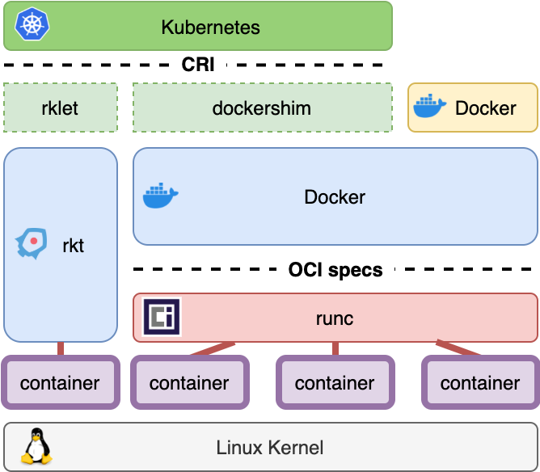

# 一体化云计算运维平台的架构和实现

## 注意 ⚠️

- _斜体表示引用_
- **未经允许，禁止转载**

## Prerequisite

- 熟悉 Linux 系统的基本配置和命令
- 熟悉 Python（或 Java / Golang） 编程语言
- 熟悉云平台（OpenStack / K8S / VMWare / 公有云）的基本操作
- 有虚拟化、容器、分布式或商用存储存储、云平台网络的配置经验更佳

## 课程内容

本课程涵盖云平台自动化运维相关的一般概念，包括：

1. 基础设施的选型、建设规划、最佳实践与常用技巧
2. 完整的一体化云平台运维实战，包括开发、设计、使用全流程。

概念和实战覆盖运维平台的基础功能：

1. CMDB
2. 运维 Agent
3. 监控
4. 脚本管理
5. 任务管理、任务流程编排
6. 数据可视化

关键词：Python，Linux，Docker，OpenStack，Kubernetes，Prometheus，Grafana

## 课程目标

- 较为深入完整地了解云平台运维技术栈
- 了解一体化云平台运维框架的设计和技术选型
- 掌握一体化云平台运维框架 Demo 的搭建、应用和扩展
- 了解云平台运维相关的前沿知识和发展趋势，理解 AIOps 的商业应用场景

## 课程目录

| 日程    | 时间 | 课程                                 | 内容                             |
| ----- | -- | ---------------------------------- | ------------------------------ |
| 第 1 天 | 上午 | [1. 一体化云平台运维架构](#1-一体化云平台运维架构)     | [1.1 基础设施云平台](#11-基础设施云平台)     |
|       |    |                                    | [1.2 云平台的建设规划](#12-云平台的建设规划)   |
|       |    |                                    | [1.3 开源运维平台工具](#13-开源运维平台工具)   |
|       | 下午 |                                    | [1.4 混合云运维平台设计](#14-混合云运维平台设计) |
|       |    | [2. 云运维平台实战](#2-云运维平台实战)           | [2.1 运维平台的整体架构](#21-运维平台的整体架构) |
| 第 2 天 | 上午 |                                    | [2.2 运维服务平台搭建](#22-运维服务平台搭建)   |
|       |    |                                    | [2.3 运维平台基础功能](#23-运维平台基础功能)   |
|       | 下午 |                                    | [2.4 任务管理](#24-任务管理)           |
|       |    |                                    | [2.5 监控和告警](#25-监控和告警)         |
|       |    | [3. 面向未来的云平台运维技术](#3-面向未来的云平台运维技术) | [3.1 AIOps](#31-aiops)         |

## 1. 一体化云平台运维架构

[返回目录](#课程目录)

### 1.1 基础设施云平台

[返回目录](#课程目录)

#### 1.1.1 云计算的上半场和下半场

计算和虚拟化的发展

1. 60-70 IBM，大型机：集中式计算
2. 80-90 VMWare，个人 PC：分布式计算
3. 2005-至今 Amazon，云计算+移动互联网：泛在计算。5G 边缘计算还在路上

云计算的分类

1. IaaS：是最为主流的云计算，以 AWS 为代表，是一种基于虚拟化技术的自助式服务平台
2. PaaS：GAE
3. SaaS：Office 365

云计算的上半场：

1. 百花齐放：开源云计算框架 + 开源生态，群雄逐鹿
2. 功能单一：IaaS 占绝大多数体量，PaaS / SaaS 在试水
3. 虚拟化 / 裸机 / 容器三者相对分离

云计算的下半场：

1. 公有云倾销私有云
   1. 公有云推本地化部署，称混合云（有哪些适用场景？），挤压私有云市场
   2. 开源云计算框架热度减退，也趋于稳定，**自主可控，开放原生，信创兼容，可定制**成为最主要卖点
2. 融合和统一
   1. 算力统一调度成为主流：VMWare 的传统优势和新变化
   2. 接口统一：Kubenetes API 成为主流
   3. 广泛的服务和中间件
3. 更智慧
   1. AI 的发展衍生了各类智慧类垂直领域云，GPU 渲染云，AI 平台云等
   2. 算力调度云边协同等
   3. AIOps

#### 1.1.2 虚拟化

虚拟化的目的：1. 资源隔离，2. 资源限制

虚拟化使得在一台物理服务器上可以跑多台虚拟机。

虚拟化共享物理机的 CPU、内存、IO 硬件资源，但逻辑上虚拟机之间是相互隔离的物理机我们一般称为宿主机（Host），宿主机上面的虚拟机称为客户机（Guest）Hypervisor 程序将 Host
的硬件虚拟化，并提供给 Guest 使用，分为：全虚拟化（一型虚拟化）和半虚拟化（二型虚拟化）。

全虚拟化 Hypervisor 是一个特殊定制的 Linux 系统，直接安装在物理机上。比如 Xen 和 VMWare 的 EXSi。全虚拟化一般对硬件虚拟化功能做了特别优化，性能更好。

半虚拟化先安装标准操作系统，Hypervisor 作为 OS 上的一个程序模块运行，并对虚拟机进行管理。比如 KVM，VirtualBox，VMWare WorkStation，VMWare
Player，VMWare Fusion 等。半虚拟化基于普通操作系统，比较灵活，比如支持虚拟机嵌套（在 KVM 虚拟机中再运行 KVM）。

#### 1.1.3 容器化

##### 1.1.3.1 普通容器

Docker 容器

容器技术栈

##### 1.1.3.3 安全容器

弹性容器实例（ECI）的功能项包括：

- 同时兼容原生容器和虚拟机的使用体验
- 比虚拟机轻量的资源分配能力，以方便资源快速申请、弹性
- 类似虚拟机的使用体验，可登陆，可任意安装组件
- 有固定 IP 地址，胖容器从创建到删除，IP 地址保持不变
- 可以通过 SSH 远程登陆系统。
- 严格的资源隔离，如 CPU、内存等

实现是一般是提供一个 Pod，Pod 中的容器可以是 OCI VM（比如 Kata），或者单纯容器。

哪些云厂商提供 ECI？

- [博云胖容器](https://mp.weixin.qq.com/s?__biz=MzIzNzA5NzM3Ng==&mid=2651860132&idx=1&sn=cb0eac52be444c162fb505ebbdef6c0f&chksm=f329546bc45edd7d4789aa85ae5edb8a9f8d8313dd1ca273946ef019e0997b39665d29e24c8c&scene=21#wechat_redirect)
- [Kata 和它的朋友们](kubernetes-best-practices.md#24-kata-和它的朋友们)
- [阿里云 ECI](https://eci.console.aliyun.com/#/eci/cn-shanghai/list)：[从 Docker Hub 拉取镜像创建实例](https://help.aliyun.com/document_detail/119093.html)

#### 1.1.4 基础设施云平台

##### 1.1.4.1 OpenStack

参考：OpenStack
Administration：[Github](https://github.com/99cloud/lab-openstack/blob/master/doc/class-01-OpenStack-Administration.md)
或
[Gitee](https://gitee.com/dev-99cloud/lab-openstack/blob/master/doc/class-01-OpenStack-Administration.md)

##### 1.1.4.2 K8S

K8S 的操作要记得参考：<https://kubernetes.io/>

[K8S 有哪些组件](https://kubernetes.io/zh/docs/concepts/architecture/#)？api-server、kube-scheduler、kube-controller、etcd、coredns、kubelete、kubeproxy

组件结构图

实验：K8S
基本操作：[Github](https://github.com/duicikeyihangaolou/lab-kubernetes/blob/master/doc/kubernetes-best-practices.md#3111-%E5%8D%95%E8%8A%82%E7%82%B9%E9%9B%86%E7%BE%A4%E9%83%A8%E7%BD%B2)
或
[Gitee](https://gitee.com/wu-wen-xiang/lab-kubernetes/blob/master/doc/kubernetes-best-practices.md#3111-%E5%8D%95%E8%8A%82%E7%82%B9%E9%9B%86%E7%BE%A4%E9%83%A8%E7%BD%B2)

实验：部署应用到 K8S
平台：[Github](https://github.com/99cloud/training-kubernetes/blob/master/doc/class-01-Kubernetes-Administration.md#29-%E5%90%AF%E5%8A%A8%E4%B8%80%E4%B8%AA-pod)
或
[Gitee](https://gitee.com/dev-99cloud/training-kubernetes/blob/master/doc/class-01-Kubernetes-Administration.md#29-%E5%90%AF%E5%8A%A8%E4%B8%80%E4%B8%AA-pod)

#### 1.1.5 云原生

什么是云原生？**把业务上云，然后只关注业务本身。**

云基座解决业务无关的问题：

- OpenStack：计算、存储（块存储、文件存储和对象存储）、网络（二层 SDN，三层，LB，VPN，FW，SDNC 和 SDWAN）
- K8S：算力、自动调度、自愈、快速扩缩容
- K8S：服务注册、服务发现、配置管理、后台任务管理
- 中间件：有状态服务，MQ、DB、Cache、对象存储、文件存储等
- 中间件：DevOps
- Istio（ASM）：故障注入、流量治理、灰度发布、熔断

云原生的 3 原则：

- **简单**
- **易于自动化**
- **易于发布**

与之对应的解决方案：**API + 微服务 + 容器化**

[云原生的十二要素法则](https://12factor.net)

1. 用同一份受版本控制的基准代码，进行多处部署
2. 显式声明依赖关系
3. 配置信息依赖应用环境存储（即配置管理），与代码分开
4. 后端服务视作附加资源（Web Service / DB / MQ）
5. 严格分离构建和运行步骤
6. 以一个或多个无状态进程运行应用
7. 通过端口绑定提供服务
8. 通过进程模型进行服务扩缩容
9. 确保快速启动和优雅中止来最大化健壮性
10. 尽可能保持开发、预发布、线上环境一致
11. 日志处理成事件流（方便后续统一处理）
12. 用一次性进程运行后台管理任务

如何判断你的技术栈和代码实现是否云原生？

1. 所做的任何事（编辑和编译工具、语言和框架）是否简单？
   - IDE 是否可选？强制性是不足取的，比如代码必须用特定的 IDE 才能生成或者编译。
   - 能否通过命令行（即能否自动化）构建和部署？
   - 团队新成员能否快速理解代码？
2. 是否测试驱动开发（本质上即是否有信心交付）？
   - 测试是 trade off 的艺术，编程人员只需要为他们认为不自信的代码编写单元测试
   - 单元测试只对程序员有意义，代码覆盖率是单元测试的客观指标，太低不合适，一般认为需要覆盖 60% 以上
   - 测试工程师需要为所有的 API 测试和功能测试、界面测试负责，尽可能自动化，测试工程师不考虑代码覆盖率，而是考虑测试用例覆盖率
   - 一个 bug 被研发自己发现，和被测试人员发现，和被现场使用者发现，cost 不可同日而语
3. 尽早发布、频繁发布
   - 代码应该少量提交，多次提交，每次提交应该涵盖一个完整的小功能或者 bug 修复
   - 尽早发布、频繁发布才能让产品研发不畏惧发布，减少发布风险
   - 只有足够的自动化测试，才能实现尽早发布、频繁发布
4. 一切能自动化的，都应自动化
   - 任何每天要做的事，都应该被自动化
   - 流程中任何时常重复的部分，如果不能被按钮或者脚本代替，那么就属于过于复杂、脆弱的设计
5. 一切事物都是服务，包括应用
   - 一切服务都是微服务，micro 的前缀完全没必要
   - 单体为什么不好？
     - 每次变更都需要全量发布整个应用程序，维护困难
     - 启动和停止速度慢
     - 依赖关系耦合紧密

     反之，如果应用恰好没有这三个问题，那么单体就是最好的设计，不需要硬拆微服务做过度设计。

### 1.2 云平台的建设规划

[返回目录](#课程目录)

#### 1.2.1 企业云的一般需求和技术选型

##### 1.2.1.1 虚拟化、容器和裸金属的混合调度

##### 1.2.1.2 Kubernetes as a Service（EKS/ACK）

K8S 作为一个整体的资源（类同 VM / 存储 / VPC）对外提供。公有云，私有云已广泛提供
EKS。比如：[阿里云容器服务 ACK](https://cs.console.aliyun.com/#/k8s/cluster/list)

##### 1.2.1.3 Kubernetes on Kubernetes (KoK)

##### 1.2.1.4 Istio & ASM

#### 1.2.2 企业云架构的注意事项

2. 信创兼容性考量：指令集、操作系统、数据库、其他中间件
3. 分布式存储：性能调优 & 高可靠
4. 网络方案选型 & 高可用
5. 认证和安全

### 1.3 开源运维平台工具

[返回目录](#课程目录)

1. 运维场景中的常用Python模块
2. 自动化框架：Ansible
3. Ansible 的云平台相关模块
4. 任务管理：Jenkins & Zuul
5. 云原生时代的任务管理
6. 监控：Prometheus & Grafana

### 1.4 混合云运维平台设计

[返回目录](#课程目录)

1. 自动化是运维的灵魂
2. 声明式定义和幂等性
3. GitOps
4. 审计日志和回溯
5. 分析报表和可视化

## 2. 云运维平台实战

[返回目录](#课程目录)

### 2.1 运维平台的整体架构

[返回目录](#课程目录)

1. 需求分析
2. 功能列表
3. 整体架构设计
4. 简单性和可扩展性

### 2.2 运维服务平台搭建

[返回目录](#课程目录)

1. FastAPI web service
2. 文档和 Swagger
3. Vue.js vs React

### 2.3 运维平台基础功能

[返回目录](#课程目录)

#### 2.3.1 CMDB

#### 2.3.2 脚本管理

#### 2.3.3 运维 agent

1. SSH & Shell
2. Docker
3. ansible in pod
4. remote kubectl

### 2.4 任务管理

[返回目录](#课程目录)

#### 2.4.1 任务管理

1. 任务管理
2. 任务流程编排：Drone
3. 云原生任务流程编排：Tekton/建木
4. Workflow
5. 工单和审批系统

#### 2.4.2 任务流程编排

1. Jenkins / Zuul / Drone
2. Tekton / AlgoCD / 建木

### 2.5 监控和告警

[返回目录](#课程目录)

#### 2.5.1 监控方案

1. Prometheus + Thanos
2. AlertManager + Notification Gateway：站内信、短信、邮件、企业微信、钉钉

#### 2.5.2 数据可视化

1. 日志可视化：Grafana+Fluentbeat+Loki vs EFK
2. 监控可视化：Prometheus + Grafana
3. 分析报表
4. 大屏展示（配屏）

## 3. 未来的运维技术

[返回目录](#课程目录)

### 3.1 AIOps

[返回目录](#课程目录)

1. 什么是 AIOps
2. AIOps 的实现原理
3. AIOps 的权责设计
