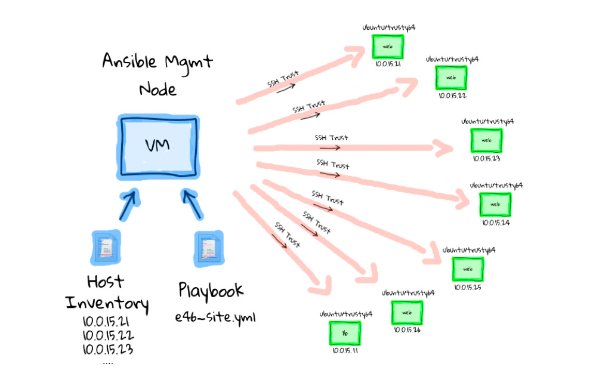

# 自动化运维在容器化场景中的最佳实践

## 注意 ⚠️

- _斜体表示引用_
- **未经允许，禁止转载**

## Prerequisite

- 熟悉 Linux 系统的基本配置和命令
- 了解或使用过 Python 更佳

## 课程目录

| 日程    | 时间 | 课程              | 内容                                     |
| ----- | -- | --------------- | -------------------------------------- |
| 第 1 天 | 上午 | [运维基础](#1-运维基础) | [1.1 自动化运维概述](#11-自动化运维概述)             |
|       |    |                 | [1.2 Python 和系统运维](#12-python-和系统运维)   |
|       | 下午 |                 | [1.3 容器技术和自动化运维](#13-容器技术和自动化运维)       |
| 第 2 天 | 上午 |                 | [1.4 K8S 和自动化运维](#14-k8s-和自动化运维)       |
|       |    | [配置管理](#2-配置管理) | [2.1 自动化运维框架](#21-自动化运维框架)             |
|       |    |                 | [2.2 Fabric](#22-fabric)               |
|       | 下午 |                 | [2.3 Ansible 基础](#23-ansible-基础)       |
|       |    |                 | [2.4 Ansible 和容器技术](#24-ansible-与容器技术) |
| 第 3 天 | 上午 |                 | [2.5 Ansible 与云平台](#25-ansible-与云平台)   |
|       |    | [任务管理](#3-任务管理) | [3.1 版本控制](#31-版本控制)                   |
|       |    |                 | [3.2 Jenkins+Zuul](#32-jenkinszuul)    |
|       | 下午 |                 | [3.3 Drone](#33-drone)                 |
|       |    |                 | [3.4 CI-CD](#34-ci-cd)                 |
| 第 4 天 | 上午 | [监控计量](#4-监控计量) | [4.1 监控框架对比](#41-监控框架对比)               |
|       |    |                 | [4.2 Promtheus](#42-prometheus)        |
|       |    |                 | [4.3 Alertmanager](#43-alertmanager)   |
|       |    |                 | [4.4 Grafana](#44-Grafana)             |
|       | 下午 | [日志分析](#5-日志分析) | [5.1 Fluentd](#51-Fluentd)             |
|       |    |                 | [5.2 ElasticSearch](#52-ElasticSearch) |
|       |    |                 | [5.3 Kibana](#53-Kibana)               |
|       |    |                 | [5.4 其它的日志收集和分析方案](#54-其它的日志收集和分析方案)   |

其它：[6. 问题排查案例](#6-问题排查案例)

## 1. 运维基础

[返回目录](#课程目录)

### 1.1 自动化运维概述

[返回目录](#课程目录)

当我们讨论“自动化运维”，我们在讨论什么？

- 数据中心自动化（DCA）？
- 开发运营一体化（DevOps）？

Redhat
对“自动化运维“的定义：[_the use of software to create repeatable instructions and processes to replace or
reduce human interaction with IT
systems._](https://www.redhat.com/en/topics/automation/whats-it-automation)
**使用软件创建可重复的指令和过程，以取代或减少与 IT 系统的人机交互。自动化软件在这些指令、工具和框架的限制下工作，以执行任务，几乎不需要人工干预**。

自动化运维包括：

- **自动化**
  - 应用的自愈
  - 资源的自动弹性缩放
  - 无人工干预下的安装部署
  - 不影响业务的升级和回滚
  - 自服务化的资源和权限获取
  - 基于机器学习的监控、日志分析、告警和预警
- **配置管理**
- **监控**

自动化应用于：

- **基础设施即代码**：通过自动化代码在各类基础设施平台（依据各类模版）管理资源
- **配置管理**：应用所需的配置（不同的设置、文件系统、端口、用户等等）
- **应用编排**：应用可能会被部署在不同的云平台上
- **IT 迁移**：数据或软件从一个系统（操作系统、云平台）转移到另一个系统
- **安全与合规**：流程标准化与审计

未来的自动化形态：

- _From bare metal to middleware, apps, security, updating, notifications, failover, predictive
  analytics, and decisions being made with no direct oversight._
  从裸机到中间件的自动化、应用程序、安全性、更新、通知、故障切换、预测分析，以及在没有直接监督的情况下做出的决策。
- _A security risk being automatically detected, reported, patched, tested, and deployed while your
  IT staff are asleep. Your system could self-heal, gather relevant information to discover if and
  where an attack came from, notify the correct people—all without losing uptime._ 在 IT
  员工睡觉时自动检测、报告、修补、测试和部署安全风险。您的系统可以自我修复，收集相关信息以发现攻击是否以及来自何处，并在不损失正常运行时间的情况下通知所有相关的人。

**自动化运维技术栈**：

- Linux 基础：bash / vim / systemd
- 企业级应用服务管理：文件服务 / Web 服务 / DNS 等
- 流程管理：版本控制 / review / 任务管理 / 工单系统 / 制品仓库
- 中间件服务：数据库、缓存、消息队列、LB、VIP、Cluster
- 云平台：OpenStack / KVM / EXSI / K8S / Docker
- 运维框架：Ansible / Fabric / Puppet / Chef
- 监控和日志： Zabbix / SkyWalking / GAP / EFK
- 编程：Python / Java / Web Service Framwork
- 数据分析和机器学习：Numpy / Pandas / Sklearn / TF / PyTorch

运维技术的判断标准：八荣八耻

- 以可配置为荣，以硬编码为耻
- 以互备为荣，以单点为耻
- 以随时重启为荣，以不能迁移为耻
- 以整体交付为荣，以部分交付为耻
- 以无状态为荣，以有状态为耻
- 以标准化为荣，以特殊化为耻
- 以自动化工具为荣，以手动和人肉为耻
- 以无人值守为荣，以人工介入为耻

### 1.2 Python 和系统运维

[返回目录](#课程目录)

#### 1.2.1 无处不在的 Bash

[返回目录](#课程目录)

[bash 编程快速入门](shell-quick-start.md)

- 作业：[字符串处理、流程控制、数值计算](/src/automation/automation.sh)

#### 1.2.2 简单强大的 Python

[返回目录](#课程目录)

##### 1.2.2.1 Windows 环境中 Python 安装和调试

[返回目录](#课程目录)

参考：[Python 安装](Installation-Python.md)

- 作业：部署完成 Python

  ```console
  $ python --version
  Python 3.9.7

  $ pip --version
  pip 22.0.3 from /usr/local/lib/python3.9/site-packages/pip (python 3.9)

  $ python
  Python 3.9.7 (default, Sep  3 2021, 12:37:55)
  [Clang 12.0.5 (clang-1205.0.22.9)] on darwin
  Type "help", "copyright", "credits" or "license" for more information.
  ```

  ```python
  >>> print(2**64)
  18446744073709551616

  >>> print('hello, world')
  hello, world

  >>> exit()
  ```

参考：[VSCode 部署](Installation-VSCode.md)

- 作业：VSCode 对 Python 程序进行断点调试

##### 1.2.2.2 Linux 环境中 Python 安装和调试

[返回目录](#课程目录)

**基础环境安装**，参考：[Github](https://github.com/duicikeyihangaolou/lab-kubernetes/blob/main/doc/kubernetes-best-practices.md#111-%E5%86%85%E6%A0%B8%E5%8D%87%E7%BA%A7)
或
[Gitee](https://gitee.com/duicikeyihangaolou/lab-kubernetes/blob/main/doc/kubernetes-best-practices.md#111-%E5%86%85%E6%A0%B8%E5%8D%87%E7%BA%A7)

- 作业：升级内核到 5.4
- 作业：升级 Python 到 3.8
- 作业：升级 Git 到 2 版本

**VSCode 安装 Remote 插件**

- 作业：VSCode 远程访问 Linux 服务器上的代码

[virtualenv 环境](https://pypi.org/project/virtualenv)

```bash
python3 -m pip install virtualenv
# python3 -m pip install -i https://pypi.tuna.tsinghua.edu.cn/simple virtualenv
```

```console
$ python3 -m virtualenv --version
virtualenv 20.7.0 from /usr/local/lib/python3.9/site-packages/virtualenv/__init__.py

$ python3 -m virtualenv .venv
created virtual environment CPython3.9.7.final.0-64 in 869ms
  creator CPython3Posix(dest=/Users/wuwenxiang/local/github-99cloud/lab-openstack/.venv, clear=False, no_vcs_ignore=False, global=False)
  seeder FromAppData(download=False, pip=bundle, setuptools=bundle, wheel=bundle, via=copy, app_data_dir=/Users/wuwenxiang/Library/Application Support/virtualenv)
    added seed packages: pip==22.1.2, setuptools==62.2.0, wheel==0.37.1
  activators BashActivator,CShellActivator,FishActivator,PowerShellActivator,PythonActivator

$ . .venv/bin/activate

(.venv) $ python3 --version
Python 3.9.7

(.venv) $ pip --version
pip 22.1.2 from /Users/wuwenxiang/local/github-99cloud/lab-openstack/.venv/lib/python3.9/site-packages/pip (python 3.9)
```

##### 1.2.2.3 Python 和自动化运维

[返回目录](#课程目录)

参考：[Python 入门](we-know-python.md)

对于自动化运维，你应该掌握的 Python 知识：

- 基础语法：分支结构、循环、函数、类、异常处理
- 基本对象类型和数据结构：变量和对象、数字、字符串（正则表达式）、元组、列表、集合、字典
- 与 Bash 交互：`-c`，`sys.argv`，`os.system`，`subprocess.check_output`，标准输入输出重定向
- 文件和目录：目录遍历、临时文件
- 数据库：SqlAlchemy
- Web 客户端：requests、json
- 其它客户端：mail / ssh / office 等
- 系统相关模块：psutil / IPy 等

作业：

1. [文件和字符串处理](python-exec-public.py#L628-666)
2. [数据库相关](python-exec-public.py#L1669-2010)
3. [Excel 处理](python-exec-public.py#L2377-2407)
4. [系统相关模块](python-exec-public.py#L2086-2375)
5. [文件目录、子进程、FTP、SSH](/src/automation/automation.py)
6. [XML 解析](python-exec-public.py#L2012-2074)
7. [结构化数据爬取](python-exec.py)
8. [非结构化数据爬取](python-exec-public.py#L1483-1511)
9. [科学计算和机器学习](python-exec-public.py#L2445-3195)

### 1.3 容器技术和自动化运维

[返回目录](#课程目录)

#### 1.3.1 Linux 容器和 Docker

[返回目录](#课程目录)

参考：[Github](https://github.com/duicikeyihangaolou/lab-kubernetes/blob/main/doc/kubernetes-best-practices.md#211-linux-%E5%AE%B9%E5%99%A8%E5%92%8C-docker)
或
[Gitee](https://gitee.com/duicikeyihangaolou/lab-kubernetes/blob/main/doc/kubernetes-best-practices.md#211-linux-%E5%AE%B9%E5%99%A8%E5%92%8C-docker)

- 作业：安装 Docker
- 作业：熟悉 Docker 命令

#### 1.3.2 Docker 和 Containerd

[返回目录](#课程目录)

参考
[Github](https://github.com/duicikeyihangaolou/lab-kubernetes/blob/main/doc/kubernetes-best-practices.md#22-containerd)
或
[Gitee](https://gitee.com/duicikeyihangaolou/lab-kubernetes/blob/main/doc/kubernetes-best-practices.md#22-containerd)

- 作业：安装 Containerd
- 作业：熟悉 crictl / ctr / nerdctr 命令

### 1.4 K8S 和自动化运维

[返回目录](#课程目录)

#### 1.4.1 K8S 部署

[返回目录](#课程目录)

组件和基本架构，参考：[Github](https://github.com/duicikeyihangaolou/lab-kubernetes/blob/main/doc/kubernetes-best-practices.md#3-k8s-%E7%94%9F%E5%91%BD%E5%91%A8%E6%9C%9F%E7%AE%A1%E7%90%86)
或
[Gitee](https://gitee.com/duicikeyihangaolou/lab-kubernetes/blob/main/doc/kubernetes-best-practices.md#3-k8s-%E7%94%9F%E5%91%BD%E5%91%A8%E6%9C%9F%E7%AE%A1%E7%90%86)

部署单节点
K8S，参考：[Github](https://github.com/duicikeyihangaolou/lab-kubernetes/blob/main/doc/kubernetes-best-practices.md#3111-%E5%8D%95%E8%8A%82%E7%82%B9%E9%9B%86%E7%BE%A4%E9%83%A8%E7%BD%B2)
或
[Gitee](https://gitee.com/duicikeyihangaolou/lab-kubernetes/blob/main/doc/kubernetes-best-practices.md#3111-%E5%8D%95%E8%8A%82%E7%82%B9%E9%9B%86%E7%BE%A4%E9%83%A8%E7%BD%B2)，注意：Containerd
如果已经部署好的话，前面部署 Containerd 的步骤可以跳过，直接部署 K8S 即可。

- 作业：完成 K8S 单节点部署

#### 1.4.2 将应用部署到 K8S

参考：[Github](http://github.com/99cloud/training-kubernetes/blob/master/doc/class-01-Kubernetes-Administration.md#29-%E5%90%AF%E5%8A%A8%E4%B8%80%E4%B8%AA-pod)
或
[Gitee](https://gitee.com/dev-99cloud/training-kubernetes/blob/master/doc/class-01-Kubernetes-Administration.md#29-%E5%90%AF%E5%8A%A8%E4%B8%80%E4%B8%AA-pod)

- 作业：完成 K8S 应用部署和发布

## 2. 配置管理

[返回目录](#课程目录)

### 2.1 自动化运维框架

[返回目录](#课程目录)

常见的自动化运维框架包括：

- [Ansible](https://docs.ansible.com/ansible/2.9/index.html)
- [Fabric](https://github.com/fabric/fabric)
- [SaltStack](https://docs.saltproject.io/en/getstarted/)
- [Chef](https://www.chef.io/solutions)
- [Puppet](https://puppet.com/)

| **对比维度** | **Ansible**      | **Puppet**              | **Chef**                 | **SaltStack**     | **Fabric**       |
| -------- | ---------------- | ----------------------- | ------------------------ | ----------------- | ---------------- |
| **架构**   | 无代理（SSH）         | 客户端 - 服务器（Agent-Server） | 客户端 - 服务器（Client-Server） | 混合架构（代理 / 无代理）    | 无架构（直接 SSH）      |
| **配置语言** | YAML（Playbook）   | Puppet DSL（特定领域语言）      | Ruby DSL（Recipe）         | YAML/Python       | Python 脚本        |
| **状态管理** | 支持（声明式）          | 强支持（状态驱动，自动修复）          | 支持（资源定义）                 | 支持（States）        | 不支持（仅执行命令）       |
| **学习曲线** | 低（YAML 易读，语法简单）  | 中高（DSL 需专门学习）           | 中（需懂 Ruby 基础）            | 中（模块多，概念稍复杂）      | 极低（Python 基础即可）  |
| **并发性能** | 中等（依赖 SSH 并发）    | 高（Agent 缓存机制）           | 中高（Client 本地执行）          | 极高（ZeroMQ 异步通信）   | 低（串行 / 简单并行）     |
| **适用规模** | 中小到大型（万级节点需优化）   | 大型（企业级，十万级节点）           | 中大型（开发主导的复杂环境）           | 超大型（实时监控 + 大规模部署） | 小型（临时任务 / 小规模节点） |
| **典型场景** | 配置管理、应用部署、容器集成   | 长期基础设施稳定管理（如 IDC）       | 开发与运维协同（CI/CD 流程）        | 实时操作、云平台管理、监控     | 临时脚本执行、批量命令      |
| **生态集成** | 强（容器、GitOps、云厂商） | 强（企业级工具链，如 Foreman）     | 强（开发工具链，如 Jenkins）       | 强（云、监控、网络设备）      | 弱（仅基础命令扩展）       |

如何选择？

**选 Ansible**：

- 团队追求 “低门槛”“快速上手”，无需维护客户端；
- 需结合容器（Docker/K8s）、GitOps 等现代运维场景；
- 场景以 “一次性任务编排” 或 “轻量级配置管理” 为主。

**选 Puppet**：

- 企业级大规模基础设施（如十万级服务器），需长期稳定的状态管理；
- 强调 “自动化修复”（如配置漂移后自动恢复）。

**选 Chef**：

- 团队以开发人员为主，熟悉 Ruby 语言；
- 场景需高度定制化逻辑（如复杂的应用部署流程）。

**选 SaltStack**：

- 需实时监控目标节点状态，或超大规模节点（如云计算数据中心）；
- 追求极致并发性能（如秒级操作上万节点）。

**选 Fabric**：

- 仅需执行简单批量命令（如日志收集、临时脚本）；
- 团队缺乏自动化工具经验，需快速落地小任务。

### 2.2 Fabric

[返回目录](#课程目录)

参考：[Github](http://github.com/99cloud/lab-openstack/blob/master/doc/class-02-OpenStack-API-and-Development.md#fabric-quick-start--catalog-)
或
[Gitee](https://gitee.com/dev-99cloud/lab-openstack/blob/master/doc/class-02-OpenStack-API-and-Development.md#fabric-quick-start--catalog-)

- 作业：SSH 免密登录配置
- 作业：Fabric 基本操作

### 2.3 Ansible 基础

[返回目录](#课程目录)

Ansible 的独特优势​：

1. 无代理架构：减少目标节点资源占用，避免 “客户端故障影响整体” 的风险；​
2. 语法友好：YAML 格式接近自然语言，运维、开发、产品均可参与编写；​
3. 生态灵活性：与容器（Docker/K8s）、云平台（AWS/Azure）、GitOps（GitLab CI）无缝集成，适配现代运维趋势；​
4. 模块丰富：内置数千模块（涵盖系统、网络、数据库等），且支持 Python 自定义模块，扩展成本低。​

综上，Ansible 凭借 “简单、灵活、易集成” 的特点，成为当前自动化运维的主流选择，尤其适合中小团队快速落地自动化流程。

Ansible 原理：



#### 2.3.1 关于 Ansible 你需要知道的二三事

Ansible
案例，参考：[Github](https://github.com/99cloud/lab-openstack/blob/master/doc/class-02-OpenStack-API-and-Development.md#ansible-as-a-plus--catalog-)
或
[Gitee](https://gitee.com/dev-99cloud/lab-openstack/blob/master/doc/class-02-OpenStack-API-and-Development.md#ansible-as-a-plus--catalog-)

Ansible = Ansible Core + Ansible 组件库

版本选择：[Ansible 发行和维护](https://docs.ansible.org.cn/ansible/latest/reference_appendices/release_and_maintenance.html)

#### 2.3.2 Ansible 安装

对 Ubuntu 22.04

```bash
apt update -y
apt install ansible
ansible --version
```

可以看到：

```console
ansible 2.10.8
  config file = None
  configured module search path = ['/root/.ansible/plugins/modules', '/usr/share/ansible/plugins/modules']
  ansible python module location = /usr/lib/python3/dist-packages/ansible
  executable location = /usr/bin/ansible
  python version = 3.10.12 (main, May 27 2025, 17:12:29) [GCC 11.4.0]
```

如果要指定版本，可以用 pip 安装

```console
# pip3 install virtualenv

# python3 -m virtualenv .venv
created virtual environment CPython3.10.12.final.0-64 in 1299ms
  creator CPython3Posix(dest=/root/.venv, clear=False, no_vcs_ignore=False, global=False)
  seeder FromAppData(download=False, pip=bundle, setuptools=bundle, via=copy, app_data_dir=/root/.local/share/virtualenv)
    added seed packages: pip==25.1.1, setuptools==80.9.0
  activators BashActivator,CShellActivator,FishActivator,NushellActivator,PowerShellActivator,PythonActivator

# . .venv/bin/activate

(.venv) ~# which python
/root/.venv/bin/python

(.venv) ~# which pip
/root/.venv/bin/pip

(.venv) ~# pip install "ansible==2.10.7" -i https://mirrors.aliyun.com/pypi/simple/
```

#### 2.3.2 配置 SSH

生成 SSH key

```console
root@devopslab020:~/.ssh# ls
authorized_keys  known_hosts

root@devopslab020:~/.ssh# ssh-keygen
Generating public/private rsa key pair.
Enter file in which to save the key (/root/.ssh/id_rsa):
Enter passphrase (empty for no passphrase):
Enter same passphrase again:
Your identification has been saved in /root/.ssh/id_rsa.
Your public key has been saved in /root/.ssh/id_rsa.pub.
The key fingerprint is:
SHA256:41njTMl+VNsh/gjSojuolLSGiKXA2lQPU/Ds6co3YFg root@devopslab020
The key's randomart image is:
+---[RSA 2048]----+
|    ...          |
|     +           |
|    + o      ... |
|.  .E= . ......o.|
|..o+  + So*o... .|
|==+ =. ..Ooo. o  |
|=..* .o.o + .. . |
|  o. oo..  .     |
|   .+. o.        |
+----[SHA256]-----+

root@devopslab020:~/.ssh# ls
authorized_keys  id_rsa  id_rsa.pub  known_hosts
```

注意：

1. public key -> server side authorized_keys
2. private key -> client side
3. [Generator for PuTTY on Windows](https://www.ssh.com/ssh/putty/windows/puttygen)

把 public key 写入服务端的 ~/.ssh/authorized_keys，确保 ssh 能够免密登陆

服务端的 SSH 配置

```console
# cat /etc/ssh/sshd_config | tail -n 5

UseDNS no
ClientAliveInterval 120
ClientAliveCountMax 720
GSSAPIAuthentication no

# systemctl restart ssh
```

客户端 SSH 配置

```conf
# cat ~/.ssh/config
Host *
    KexAlgorithms +diffie-hellman-group1-sha1
    HostKeyAlgorithms +ssh-rsa,ssh-dss
    PubkeyAcceptedKeyTypes +ssh-rsa,ssh-dss
    StrictHostKeyChecking no
    UserKnownHostsFile=/dev/null

Host test1
    HostName        localhost
    User            root

Host test2
    HostName        localhost
    User            root
```

补充：SSH Proxy

```
ProxyCommand    ssh fq -W %h:%p
ProxyCommand    bash -c 'h=%h;ssh bastion -W ${h##prefix-}:%p'
```

#### 2.3.3 Hello, Ansible

配置 hosts.ini

```ini
# cat hosts.ini
[webservers]
test1
test2
```

ping 这一组 webservers 服务器

```bash
ansible webservers -m ping -i hosts.ini
```

输出：

```console
# ansible webservers -m ping -i hosts.ini

test1 | SUCCESS => {
    "ansible_facts": {
        "discovered_interpreter_python": "/usr/bin/python3.12"
    },
    "changed": false,
    "ping": "pong"
}
test2 | SUCCESS => {
    "ansible_facts": {
        "discovered_interpreter_python": "/usr/bin/python3.12"
    },
    "changed": false,
    "ping": "pong"
}
```

最佳实践：

1. hosts.ini 还可以配置 ssh 相关的参数，但尽量不要，让 ssh 配置都放在 ~/.ssh/config 里，配置免密登陆后，ansible 会自动使用 ssh 登陆
2. 可以在 hosts.ini 里配置 ansible 相关的参数，如 ansible_python_interpreter 等，但尽量不要，越简单越好，尽量和 python 版本无关。
3. ping 是 ansible 内置的动作，用来测试连接是否正常，也可以用来测试 ansible 配置是否正确。大部分内置命令是幂等的，但也有些不是，比如 shell。
4. 这里直接运行 ansible，但实际更常用的是 ansible-playbook，把要执行的命令放在 playbook 里，playbook 是 ansible 的剧本文件，用 YAML
   格式编写。

#### 2.3.4 YAML

[YAML 基本语法](https://docs.ansible.com/ansible/2.9/reference_appendices/YAMLSyntax.html)

- YAML 是数据结构，包含字符串、数字、布尔、列表、字典五种类型
- YAML 和 JSON 可以对应互相转化

其它 YAML 的快速入门，参考：

- [w3cnote YAML 介绍](https://www.runoob.com/w3cnote/yaml-intro.html)
- [redhat what's YAML](https://www.redhat.com/en/topics/automation/what-is-yaml)

#### 2.3.5 Ansible 快速参考

**Ansible 核心命令**

| 命令                  | 功能描述                                                                 | 示例                                                                                            |
| ------------------- | -------------------------------------------------------------------- | --------------------------------------------------------------------------------------------- |
| `ansible`           | 执行临时命令，快速在远程主机上执行单一任务（如 ping、shell 命令）。                              | `ansible webservers -m pingansible dbservers -a "df -h"`                                      |
| `ansible-playbook`  | 执行 Playbook 文件，批量执行预定义的任务序列。                                         | `ansible-playbook deploy.yml -i hosts.ini`                                                    |
| `ansible-galaxy`    | 管理 Ansible 角色和集合，可从 [Galaxy](https://galaxy.ansible.com/) 下载或上传共享内容。 | `ansible-galaxy install geerlingguy.nginxansible-galaxy collection install community.general` |
| `ansible-doc`       | 查看模块文档和用法示例。                                                         | `ansible-doc fileansible-doc -s copy`（仅显示参数摘要）                                                |
| `ansible-vault`     | 加密 / 解密敏感数据（如密码、密钥），保护 Playbook 中的机密信息。                              | `ansible-vault encrypt group_vars/production/secrets.ymlansible-vault view secrets.yml`       |
| `ansible-inventory` | 查看或调试主机清单（inventory）的结构和变量。                                          | `ansible-inventory --list -i hosts.iniansible-inventory --graph`                              |

**常用模块（非完整列表）**

| 模块名               | 功能描述                                              | 适用场景                                                                                            |
| ----------------- | ------------------------------------------------- | ----------------------------------------------------------------------------------------------- |
| `ping`            | 测试与目标主机的连通性（基于 Python），验证 SSH 配置和 Python 环境。      | 检查主机是否可达：`ansible all -m ping`                                                                  |
| `shell`/`command` | 在远程主机执行 shell 命令（`shell` 支持管道和变量，`command` 直接执行）。 | 执行系统命令：`ansible web -m shell -a "ls -l /tmp"`                                                   |
| `copy`            | 将文件从控制节点复制到远程主机，支持权限和内容替换。                        | 分发配置文件：`ansible web -m copy -a "src=nginx.conf dest=/etc/nginx/"`                               |
| `file`            | 管理文件 / 目录属性（权限、所有者、状态等）。                          | 创建目录：`ansible all -m file -a "path=/data state=directory mode=0755"`                            |
| `template`        | 基于 Jinja2 模板生成配置文件，动态填充变量。                        | 生成个性化配置：`ansible web -m template -a "src=app.conf.j2 dest=/etc/app.conf"`                       |
| `yum`/`apt`       | 包管理模块，用于安装、升级或删除软件包（分别适用于 RHEL 和 Debian 系）。       | 安装 Nginx：`ansible web -m yum -a "name=nginx state=present"`                                     |
| `service`         | 管理系统服务（启动、停止、重启、设置开机自启）。                          | 重启服务：`ansible all -m service -a "name=httpd state=restarted enabled=yes"`                       |
| `user`/`group`    | 创建或管理用户和用户组。                                      | 创建 deploy 用户：`ansible all -m user -a "name=deploy groups=sudo append=yes"`                      |
| `git`             | 从 Git 仓库克隆或更新代码。                                  | 部署应用：`ansible app -m git -a "repo=https://github.com/example.git dest=/opt/app version=master"` |
| `uri`             | 发送 HTTP 请求，用于 API 调用或检查服务状态。                      | 检查网站状态：`ansible localhost -m uri -a "url=http://example.com return_content=yes"`                |
| `debug`           | 调试模块，打印变量值或临时信息。                                  | 输出变量：`ansible all -m debug -a "var=ansible_facts"`                                              |

**其他实用命令**

| 命令                | 功能描述                                     |
| ----------------- | ---------------------------------------- |
| `ansible-config`  | 查看或配置 Ansible 的运行参数（如并发数、SSH 超时）。        |
| `ansible-console` | 交互式执行命令，类似 shell 终端，但针对多主机批量操作。          |
| `ansible-pull`    | 在远程主机上直接拉取并执行 Playbook（反向操作，适用于无中心节点场景）。 |

**如何查找更多模块？**

**官方文档**：[Ansible Modules 文档](https://docs.ansible.com/ansible/latest/collections/index.html)

**命令行查询**：

```
ansible-doc -l  # 列出所有可用模块
ansible-doc <模块名>  # 查看特定模块的详细文档
```

建议结合具体场景选择合适的模块，并通过 `ansible-doc` 深入了解参数用法。

#### 2.3.6 动态 inventory

创建文件 dynamic_host.py

```python
#!/usr/bin/env python3
import json

# 模拟从CMDB获取的主机数据
def get_hosts_data():
    return {
        "webservers": {
            "hosts": ["test1", "test2"],
            "vars": {
                "http_port": 80,
                "env": "production"
            }
        },
        "dbservers": {
            "hosts": ["test2"],
            "vars": {
                "db_port": 5432,
                "engine": "postgresql"
            }
        },
    }

if __name__ == "__main__":
    print(json.dumps(get_hosts_data()))

# import json
# import requests

# class CMDBInventory:
#     def __init__(self):
#         self.api_url = "https://cmdb.example.com/api/servers"
#         self.token = "your_api_token"
#         self.inventory = {"_meta": {"hostvars": {}}}

#     def get_cmdb_data(self):
#         headers = {"Authorization": f"Bearer {self.token}"}
#         response = requests.get(self.api_url, headers=headers)
#         return response.json()

#     def parse_data(self, cmdb_data):
#         # 将CMDB数据转换为Ansible Inventory格式
#         for server in cmdb_data.get("servers", []):
#             hostname = server["hostname"]
#             groups = server["groups"]

#             # 添加到组
#             for group in groups:
#                 if group not in self.inventory:
#                     self.inventory[group] = {"hosts": []}
#                 self.inventory[group]["hosts"].append(hostname)

#             # 添加主机变量
#             self.inventory["_meta"]["hostvars"][hostname] = {
#                 "ansible_host": server["ip_address"],
#                 "os_family": server["os_family"],
#                 "env": server["environment"]
#             }

#     def run(self):
#         cmdb_data = self.get_cmdb_data()
#         self.parse_data(cmdb_data)
#         print(json.dumps(self.inventory, indent=2))

# if __name__ == "__main__":
#     CMDBInventory().run()
```

验证动态清单输出

```bash
# 加执行权限

chmod +x dynamic_host.py

# 执行脚本查看JSON输出
./dynamic_inventory.py --list

# 查看特定主机信息（需实现--host参数）
./dynamic_inventory.py --host web1.example.com
```

使用动态清单

```bash
# 使用动态清单脚本执行命令（需赋予执行权限）
ansible all -m ping -i ./dynamic_host.py
```

#### 2.3.7 版本兼容性

```yaml
# playbook.yml
- name: 安装Apache
  hosts: all
  tasks:
    - name: 在RHEL 7及以下使用yum
      yum:
        name: httpd
        state: present
      when: ansible_distribution_major_version|int <= 7

    - name: 在RHEL 8及以上使用dnf
      dnf:
        name: httpd
        state: present
      when: ansible_distribution_major_version|int >= 8
```

执行：

```bash
# 在Ansible 2.9下执行（yum模块为主）
ansible-playbook playbook.yml -i hosts.ini

# 在Ansible 2.16下执行（支持dnf模块）
ansible-playbook playbook.yml -i hosts.ini
```

类似的还有，ec2 模块变成 aws_ec2_instance 模块

```yaml
# compatible_playbook.yml
- name: 启动EC2实例
  hosts: localhost
  tasks:
    - name: 启动EC2（旧版）
      ec2:
        instance_type: t2.micro
        image: ami-123456
        region: us-east-1
        state: present
      when: ansible_version.full is version('2.10', '<')

    - name: 启动EC2（新版）
      aws_ec2_instance:
        instance_type: t2.micro
        image_id: ami-123456
        region: us-east-1
        state: running
      when: ansible_version.full is version('2.10', '>=')
```

#### 2.3.8 Playbook 语法基础

##### 2.3.8.1 变量、选择和循环

打印变量类型 & 长行字符串

```yaml
# quotes_demo.yml
- name: YAML引号测试
  hosts: localhost
  gather_facts: no
  vars:
    bool_1: yes       # 布尔值True
    bool_2: "yes"     # 字符串"yes"
    bool_3: 'yes'     # 字符串'yes'
    bool_4: "True"    # 字符串"True"
    bool_5: True      # 布尔值True
  tasks:
    - name: 打印变量类型和值
      debug:
        msg: |
          bool_1: {{ bool_1 }} (类型: {{ bool_1 | type_debug }})
          bool_2: {{ bool_2 }} (类型: {{ bool_2 | type_debug }})
          bool_3: {{ bool_3 }} (类型: {{ bool_3 | type_debug }})
          bool_4: {{ bool_4 }} (类型: {{ bool_4 | type_debug }})
          bool_5: {{ bool_5 }} (类型: {{ bool_5 | type_debug }})
```

```bash
ansible-playbook quotes_demo.yml

# 如果 hosts 用 inventory.ini 配置，需要指定 -i 参数
# ansible-playbook quotes_demo.yml -i inventory.ini
```

特殊字符串 & 遍历

```yaml
# special_chars.yml
- name: 特殊字符测试
  hosts: localhost
  gather_facts: no
  vars:
    path1: /data/logs   # 无需引号
    path2: /data/logs/  # 无需引号
    regex: '^[0-9]+$'   # 必须使用引号，避免YAML解析错误
    host: "server:port" # 包含冒号时需要引号
  tasks:
    - name: 打印变量
      debug:
        var: "{{ item }}"
      loop:
        - path1
        - path2
        - regex
        - host
```

条件执行

```yaml
# conditional_tasks.yml
- name: 条件执行测试
  hosts: localhost
  gather_facts: yes
  vars:
    deploy_env: "production"
    web_server: "nginx"

  tasks:
    - name: 在生产环境安装安全补丁
      yum:
        name: security-updates
        state: latest
      when: deploy_env == "production"

    - name: 安装Nginx
      yum:
        name: nginx
        state: present
      when: web_server == "nginx"

    - name: 安装Apache
      yum:
        name: httpd
        state: present
      when: web_server == "apache"
```

基于系统信息的条件执行

```yaml
# os_specific.yml
- name: 跨平台任务
  hosts: all
  gather_facts: yes

  tasks:
    - name: 在Debian系系统安装Python3
      apt:
        name: python3
        state: present
      when: ansible_os_family == "Debian"

    - name: 在RedHat系系统安装Python3
      yum:
        name: python3
        state: present
      when: ansible_os_family == "RedHat"

    - name: 在Windows系统启用远程桌面
      win_regedit:
        path: HKLM:\System\CurrentControlSet\Control\Terminal Server
        name: fDenyTSConnections
        data: 0
        type: dword
      when: ansible_os_family == "Windows"
```

复杂条件组合，when 列表是 and 关系

```yaml
# complex_conditions.yml
- name: 复杂条件测试
  hosts: localhost
  gather_facts: yes
  vars:
    min_ram: 2048  # MB
    required_disk: 10  # GB

  tasks:
    - name: 检查内存和磁盘空间
      debug:
        msg: "系统资源满足要求"
      when:
        - ansible_memtotal_mb >= min_ram
        - ansible_mounts[0].size_available / 1024 / 1024 >= required_disk
        - (ansible_distribution == "CentOS" and ansible_distribution_major_version|int >= 7)
          or ansible_distribution == "Ubuntu"
```

##### 2.3.8.2 任务的执行顺序

任务的执行顺序：pre_tasks、tasks、post_tasks

```yaml
# task_order.yml
- name: 任务执行顺序测试
  hosts: localhost
  gather_facts: yes

  pre_tasks:
    - name: 前置任务1
      debug:
        msg: "这是pre_tasks中的第一个任务"

    - name: 前置任务2
      debug:
        msg: "这是pre_tasks中的第二个任务"

  tasks:
    - name: 主任务1
      debug:
        msg: "这是主tasks中的第一个任务"

    - name: 主任务2
      debug:
        msg: "这是主tasks中的第二个任务"

  post_tasks:
    - name: 后置任务1
      debug:
        msg: "这是post_tasks中的第一个任务"

    - name: 后置任务2
      debug:
        msg: "这是post_tasks中的第二个任务"
```

##### 2.3.8.3 错误处理

```yaml
# error_handling.yml
- name: 异常处理测试
  hosts: localhost
  gather_facts: no

  pre_tasks:
    - name: 前置任务
      debug:
        msg: "执行前置任务"

  tasks:
    - name: 触发错误
      command: /bin/false
      ignore_errors: true

    - name: 继续执行
      debug:
        msg: "错误被忽略，继续执行"

  post_tasks:
    - name: 后置任务
      debug:
        msg: "执行后置任务"
```

##### 2.3.8.4 调试复杂的的嵌套 YAML 结构

```yaml
# nested_structure.yml
- name: 嵌套结构测试
  hosts: localhost
  gather_facts: no
  vars:
    # 多级字典嵌套
    users:
      admin:
        name: "系统管理员"
        groups:
          - sudo
          - wheel
        permissions:
          files:
            - /etc/hosts
            - /etc/sudoers
          commands:
            - /bin/systemctl
      developer:
        name: "开发人员"
        groups:
          - dev
          - docker
        permissions:
          files:
            - /var/www/html
          commands:
            - /usr/bin/git
            - /usr/bin/docker

  tasks:
    - name: 打印嵌套结构
      debug:
        var: users

    - name: 遍历用户和权限
      debug:
        msg: "用户 {{ item.key }} 属于组 {{ item.value.groups }}"
      loop: "{{ users.items() }}"
```

yaml-lint 工具

```bash
# 安装yaml-lint
pip install yamllint

# 检查YAML文件格式
yamllint nested_structure.yml
```

Ansible 内置调试方法

```yaml
# debug_nested.yml
- name: 嵌套结构调试
  hosts: localhost
  gather_facts: no
  vars:
    config:
      servers:
        - name: web1
          ip: 192.168.1.10
          ports:
            - 80
            - 443
        - name: db1
          ip: 192.168.1.20
          ports:
            - 5432

  tasks:
    - name: 调试输出
      debug:
        var: config.servers[0].ports[0]

    - name: 使用to_nice_yaml过滤器
      debug:
        msg: "{{ config | to_nice_yaml }}"
```

#### 2.3.9 Playbook 高级编写技巧

##### 2.3.9.1 变量优先级层级和覆盖顺序

```text
1. 命令行参数 (-e, --extra-vars)
2. 环境变量 (ANSIBLE_VAR_NAME)
3. playbook文件中定义的vars_prompt
4. playbook文件中定义的vars
5. 任务中定义的vars
6. include_vars模块引入的变量
7. 角色中的vars/main.yml
8. 块(Block)中定义的vars
9. 主机清单中定义的变量
10. 主机清单中组变量
11. 主机清单中继承的组变量
12. playbook文件中定义的vars_files
13. 角色中的defaults/main.yml
14. 命令行指定的-vault-password-file或--ask-vault-pass
15. 事实收集(facts)
16. 注册变量(registered variables)
17. 魔法变量(magic variables)
18. 内置变量(如ansible_version)
19. 角色依赖中的变量
20. 插件返回的变量
21. 缓存的事实(cached facts)
22. 清单组的组变量文件
23. 主机的主机变量文件
24. 全局配置文件中的变量
```

第 24 级，全局配置文件的加载顺序：

1. 环境变量 `ANSIBLE_CONFIG` 指定的路径（例如 `export ANSIBLE_CONFIG=/etc/ansible/my_ansible.cfg`）
2. 当前目录下的 ansible.cfg
3. 用户主目录下的 ~/.ansible.cfg
4. 系统级默认配置：/etc/ansible/ansible.cfg

加载顺序：Ansible 会按上述顺序查找配置文件，找到第一个存在的文件后停止搜索。例如，如果 ANSIBLE_CONFIG 环境变量已设置，则优先使用该路径的配置文件。

查看当前 ansible 执行对应的全局配置文件：

```console
$ ansible --version
ansible 2.10.17
  config file = None
  configured module search path = ['/Users/wuwenxiang/.ansible/plugins/modules', '/usr/share/ansible/plugins/modules']
  ansible python module location = /Users/wuwenxiang/local/github-mine/demotheworld/.venv/lib/python3.10/site-packages/ansible
  executable location = /Users/wuwenxiang/local/github-mine/demotheworld/.venv/bin/ansible
  python version = 3.10.17 (main, Apr  8 2025, 12:10:59) [Clang 17.0.0 (clang-1700.0.13.3)]
```

最佳实践：

1. 系统级配置：在 /etc/ansible/ansible.cfg 中设置全局默认值。
2. 项目级配置：在项目根目录创建 ansible.cfg，覆盖系统默认配置。
3. 变量优先级：尽量使用角色 defaults（低优先级）定义通用默认值，通过 extra_vars 或 host_vars（高优先级）覆盖特定场景的值。

举例说明：

```yaml
# variable_priority.yml
- name: 变量优先级测试
  hosts: localhost
  gather_facts: no
  vars:
    # 优先级9: playbook vars
    test_var: "playbook_vars"
  vars_prompt:
    - name: test_var
      prompt: "请输入变量值"  # 优先级3: vars_prompt
      private: no

  tasks:
    - name: 打印变量值
      debug:
        var: test_var

    - name: 命令行变量覆盖测试
      debug:
        msg: "命令行变量优先级最高: {{ test_var }}"
      when: test_var == "extra_vars"
```

测试不同来源的变量：

```bash
# 1. 执行默认情况（vars_files优先级低于playbook vars）
ansible-playbook variable_priority.yml

# 2. 使用命令行变量（extra_vars，优先级最高）
ansible-playbook variable_priority.yml -e "test_var=extra_vars"
```

##### 2.3.9.2 Tag 的用法

跳过部分测试，或者执行部分测试

```yaml
- name: tag 测试
  hosts: localhost
  tasks:
    - name: 这个任务会被跳过
      debug:
        msg: "这是一个额外的调试任务"
      tags: extra  # 标记为extra的任务会被跳过

    - name: 这个任务会执行
      debug:
        msg: "这是一个常规任务"
      tags: install
```

```bash
# --skip-tags=extra 表示：跳过所有标记了 extra 标签的任务
ansible-playbook variable_priority.yml --skip-tags=extra

# --list-tags：查看 Playbook 中定义的所有标签
ansible-playbook deploy.yml --list-tags

# --tags：只执行标记了指定标签的任务
ansible-playbook deploy.yml --tags=install
```

##### 2.3.9.3 如何定位变量冲突

使用 debug 模块定位变量冲突

```yaml
# override.yml
---
app_port: 9090 

# debug_conflict.yml
- name: 变量冲突调试
  hosts: localhost
  gather_facts: yes
  vars:
    app_port: 8080
  tasks:
    - name: 打印所有变量
      debug:
        var: hostvars[inventory_hostname]
      tags: debug_all

    - name: 打印特定变量
      debug:
        var: app_port

    - name: 检查变量来源
      debug:
        msg: "app_port: {{ hostvars[inventory_hostname]['app_port'] | d('未定义') }}"

    - name: 使用vars_files覆盖变量
      include_vars:
        file: overrides.yml
      tags: override

    - name: 再次打印变量
      debug:
        var: app_port
      tags: override
```

手动调试变量冲突

```bash
# 基础执行
ansible-playbook debug_conflict.yml

# 使用命令行变量制造冲突
ansible-playbook debug_conflict.yml -e "app_port=9000"

# 查看所有变量（用于调试）
ansible-playbook debug_conflict.yml --tags=debug_all

# 测试变量覆盖
ansible-playbook debug_conflict.yml --tags=override
```

##### 2.3.9.4 角色依赖管理

依赖执行特性

1. 自动加载：当一个角色被调用时，其依赖的角色会被优先执行
2. 递归处理：依赖角色如果还有自己的依赖，会继续递归加载
3. 参数传递：可以向依赖角色传递变量，覆盖其默认值
4. 幂等性：依赖角色的执行遵循幂等原则，多次调用不会产生副作用

文件结构

```text
role_dependency_demo/
├── hosts                  # 主机清单
├── site.yml               # 主Playbook
└── roles/
    ├── webserver/         # 父角色
    │   ├── tasks/
    │   │   └── main.yml   # 角色任务
    │   └── meta/
    │       └── main.yml   # 依赖定义
    ├── common/            # 子角色（被webserver依赖）
    │   └── tasks/
    │       └── main.yml
    └── firewall/          # 孙角色（被common依赖，递归加载）
        └── tasks/
            └── main.yml
```

```yaml
# roles/firewall/tasks/main.yml（孙角色任务）
- name: [firewall] 配置基础防火墙规则
  debug:
    msg: "firewall: 允许80/tcp端口通过"

# roles/common/meta/main.yml（子角色依赖定义）
# common角色依赖firewall角色（递归依赖）
dependencies:
  - role: firewall

# roles/common/tasks/main.yml（子角色任务）
- name: [common] 安装基础系统工具
  debug:
    msg: "common: 安装vim、curl等基础工具"

# roles/webserver/meta/main.yml（父角色依赖定义）
# webserver角色依赖common角色
dependencies:
  - role: common
    vars:
      # 向依赖的common角色传递变量
      app_env: "production"

# roles/webserver/tasks/main.yml（父角色任务）
- name: [webserver] 配置Nginx服务
  debug:
    msg: "webserver: 部署Nginx配置文件"
- name: [webserver] 启动服务
  debug:
    msg: "webserver: 启动Nginx服务，监听80端口"

# site.yml（主 Playbook）
- name: 验证角色依赖的递归加载
  hosts: localhost
  gather_facts: no
  roles:
    - role: webserver  # 仅调用父角色，依赖会自动加载
```

预期输出

```log
TASK [firewall : [firewall] 配置基础防火墙规则] *********************************
ok: [127.0.0.1] => {
    "msg": "firewall: 允许80/tcp端口通过"
}

TASK [common : [common] 安装基础系统工具] **************************************
ok: [127.0.0.1] => {
    "msg": "common: 安装vim、curl等基础工具"
}

TASK [webserver : [webserver] 配置Nginx服务] **********************************
ok: [127.0.0.1] => {
    "msg": "webserver: 部署Nginx配置文件"
}

TASK [webserver : [webserver] 启动服务] ****************************************
ok: [127.0.0.1] => {
    "msg": "webserver: 启动Nginx服务，监听80端口"
}
```

依赖说明：

1. 任务执行顺序为 `firewall → common → webserver`，webserver 依赖 common（直接依赖），common 依赖 firewall（间接依赖，递归加载）
2. 依赖传递：webserver 的 meta/main.yml 中定义的变量 `app_env: "production"` 会传递给 common 角色（可在 common 任务中通过
   `{{ app_env }}` 使用）。
3. 手动检查依赖关系：可通过 ansible-galaxy 命令查看角色依赖树：`ansible-galaxy role dependencies roles/webserver/`

扩展场景 1：带条件的依赖

```yaml
# 在 meta/main.yml 中为依赖添加条件
dependencies:
  - role: firewall
    when: enable_firewall is defined and enable_firewall
```

扩展场景 2：依赖版本控制

```yaml
# 从 Galaxy 安装角色时指定版本依赖
dependencies:
  - role: geerlingguy.nginx
    version: 3.0.0  # 仅依赖3.0.0版本
```

##### 2.3.9.5 可复用的角色参数化方案

角色参数化设计：

```yaml
# roles/nginx/defaults/main.yml (默认值)
nginx_version: "latest"
nginx_port: 80
nginx_worker_processes: "auto"
nginx_enable_ssl: false
nginx_ssl_cert: ""
nginx_ssl_key: ""
```

基于变量的条件任务：

```yaml
# roles/nginx/tasks/main.yml
- name: 安装Nginx
  yum:
    name: "nginx-{{ nginx_version }}"
    state: present
  when: ansible_os_family == "RedHat"

- name: 配置Nginx主文件
  template:
    src: nginx.conf.j2
    dest: /etc/nginx/nginx.conf
  notify: restart nginx

- name: 配置HTTP站点
  template:
    src: http_site.conf.j2
    dest: /etc/nginx/conf.d/default.conf
  when: not nginx_enable_ssl
  notify: reload nginx

- name: 配置HTTPS站点
  template:
    src: https_site.conf.j2
    dest: /etc/nginx/conf.d/default.conf
  when: nginx_enable_ssl
  notify: reload nginx
```

在 Playbook 中自定义角色参数

```yaml
# site.yml
- name: 部署HTTP网站
  hosts: webservers
  roles:
    - role: nginx
      vars:
        nginx_port: 8080
        nginx_worker_processes: 2

- name: 部署HTTPS网站
  hosts: secure_webservers
  roles:
    - role: nginx
      vars:
        nginx_port: 443
        nginx_enable_ssl: true
        nginx_ssl_cert: /etc/ssl/certs/server.crt
        nginx_ssl_key: /etc/ssl/private/server.key
```

验证参数化效果：

```yaml
# 部署HTTP网站
ansible-playbook site.yml -l webservers

# 部署HTTPS网站
ansible-playbook site.yml -l secure_webservers

# 使用命令行参数覆盖
ansible-playbook site.yml -l webservers -e "nginx_port=8081"
```

#### 2.3.10 自定义模块开发实战

参考：[Ansible 自定义模块开发](https://docs.ansible.com/ansible/latest/dev_guide/developing_modules_general.html)

1. 必须用 AnsibleModule 作为入口
2. 参数声明（`argument_spec`）,用 `argument_spec` 字典声明所有支持的参数、类型、是否必需、默认值等。支持类型有：str、int、bool、list、dict 等。
3. 参数获取：通过 `module.params['参数名']` 获取传入的参数。
4. 返回数据（输出）：用 module.exit_json(**result) 正常返回。用 module.fail_json(msg='错误信息', **result) 返回错误。返回数据必须是 JSON 可序列化的字典，常见字段有：changed（bool）：是否有变更；failed（bool）：是否失败；其他自定义字段
5. changed 字段：必须返回 changed 字段，表示本次操作是否对目标系统做了更改。
6. 支持 check_mode（可选）如果支持 check_mode，要在参数里加 supports_check_mode=True，并在代码里判断 module.check_mode。
7. 错误处理：用 module.fail_json(msg='...') 返回错误，Ansible 会自动处理异常和输出。
8. 只允许标准输出/错误：模块不能直接 print，所有输出都要通过 exit_json 或 fail_json。

##### 2.3.10.1 实现并验证标准 JSON 返回格式

模块目录结构

```text
module_demo/
├── library/            # 自定义模块目录
│   └── user_info.py    # 用户信息模块
└── test_user_info.yml  # 测试Playbook
```

标准返回格式模块实现

```python
# library/user_info.py
from ansible.module_utils.basic import AnsibleModule
import time

def main():
    module_args = dict(
        name=dict(type='str', required=True),
        age=dict(type='int', required=True),
        hobbies=dict(type='list', elements='str', default=[])
    )

    module = AnsibleModule(
        argument_spec=module_args,
        supports_check_mode=True
    )

    # 获取参数
    name = module.params['name']
    age = module.params['age']
    hobbies = module.params['hobbies']

    # 模拟操作结果
    result = dict(
        changed=False,
        failed=False,
        msg=f"用户 {name} 信息已更新",
        user_info=dict(
            name=name,
            age=age,
            hobbies=hobbies,
            timestamp=int(time.time())  # 用当前时间戳
        )
    )

    # 模拟变更（实际模块中应基于系统状态判断）
    if age > 30:
        result['changed'] = True

    # 成功返回
    module.exit_json(**result)

if __name__ == '__main__':
    main()
```

测试 Playbook

```yaml
# test_user_info.yml
- name: 测试用户信息模块
  hosts: localhost
  gather_facts: no
  tasks:
    - name: 创建用户信息
      user_info:
        name: "张三"
        age: 35
        hobbies:
          - 阅读
          - 编程
      register: user_result

    - name: 打印模块返回值
      debug:
        var: user_result

    - name: 验证返回格式
      assert:
        that:
          - user_result.changed == true
          - user_result.failed == false
          - user_result.user_info.name == "张三"
```

执行测试

```bash
ansible-playbook -i localhost test_user_info.yml
```

##### 2.3.10.2 参数类型检查

```python
# library/system_user.py
from ansible.module_utils.basic import AnsibleModule

def main():
    module_args = dict(
        name=dict(type='str', required=True, aliases=['username']),
        state=dict(type='str', choices=['present', 'absent'], default='present'),
        uid=dict(type='int', required=False),
        group=dict(type='str', required=False),
        shell=dict(type='str', choices=['/bin/bash', '/bin/sh', '/sbin/nologin'], default='/bin/bash'),
        comment=dict(type='str', required=False)
    )

    module = AnsibleModule(
        argument_spec=module_args,
        supports_check_mode=True,
        required_if=[
            ('state', 'present', ['group']),  # state为present时，group参数必填
        ],
        mutually_exclusive=[
            ('uid', 'comment'),  # uid和comment不能同时存在
        ]
    )

    # 获取参数
    name = module.params['name']
    state = module.params['state']

    # 参数验证示例
    if module.params['uid'] and module.params['uid'] < 1000:
        module.fail_json(msg="系统用户UID必须大于等于1000")

    # 模拟操作结果
    result = dict(
        changed=False,
        msg=f"用户 {name} 状态已更新为 {state}"
    )

    module.exit_json(**result)

if __name__ == '__main__':
    main()
```

```yaml
# test_system_user.yml
- name: 测试参数验证
  hosts: localhost
  gather_facts: no
  tasks:
    - name: 创建用户（正确参数）
      system_user:
        name: testuser
        state: present
        group: users
        shell: /bin/bash
      register: user_create

    - name: 创建用户（缺少必需参数）
      system_user:
        name: testuser2
        state: present
      register: user_failure
      ignore_errors: true

    - name: 验证失败结果
      assert:
        that:
          - user_failure.failed == true
          - 'Missing required arguments: group' in user_failure.msg

    - name: 使用别名参数
      system_user:
        username: testuser3  # 使用aliases定义的参数名
        state: present
        group: users
```

##### 2.3.10.3 支持 check_mode 的幂等性文件操作模块

```python
# library/file_content.py
from ansible.module_utils.basic import AnsibleModule
import os

def main():
    module_args = dict(
        path=dict(type='str', required=True),
        content=dict(type='str', required=True),
        state=dict(type='str', choices=['present', 'absent'], default='present'),
        mode=dict(type='str', default='0644'),
        owner=dict(type='str'),
        group=dict(type='str')
    )

    module = AnsibleModule(
        argument_spec=module_args,
        supports_check_mode=True,
        required_if=[
            ('state', 'present', ['content'])
        ]
    )

    path = module.params['path']
    state = module.params['state']
    content = module.params['content']
    mode = module.params['mode']
    owner = module.params['owner']
    group = module.params['group']

    result = dict(
        changed=False,
        path=path
    )

    # 检查文件是否存在
    file_exists = os.path.exists(path)

    # 处理删除操作
    if state == 'absent':
        if file_exists:
            if not module.check_mode:
                os.remove(path)
            result['changed'] = True
        return module.exit_json(**result)

    # 处理创建/更新操作
    if file_exists:
        # 检查内容是否相同
        with open(path, 'r') as f:
            current_content = f.read()
        if current_content == content:
            # 检查权限和所有者
            file_mode = oct(os.stat(path).st_mode & 0o777)
            if file_mode != mode:
                result['changed'] = True
                if not module.check_mode:
                    os.chmod(path, int(mode, 8))
            # 检查所有者和组（简化示例，实际需调用os.chown）
            return module.exit_json(**result)

    # 需要创建或更新文件
    result['changed'] = True
    if not module.check_mode:
        with open(path, 'w') as f:
            f.write(content)
        os.chmod(path, int(mode, 8))
        # 实际模块中应使用os.chown设置所有者和组

    module.exit_json(**result)

if __name__ == '__main__':
    main()
```

```yaml
# test_file_content.yml
- name: 测试幂等性文件模块
  hosts: localhost
  gather_facts: no
  tasks:
    - name: 创建文件（首次执行）
      file_content:
        path: /tmp/test.txt
        content: |
          这是测试文件内容
          用于验证模块幂等性
        mode: '0640'
      register: first_run

    - name: 再次创建相同文件（应无变更）
      file_content:
        path: /tmp/test.txt
        content: |
          这是测试文件内容
          用于验证模块幂等性
        mode: '0640'
      register: second_run

    - name: 更新文件内容
      file_content:
        path: /tmp/test.txt
        content: |
          这是更新后的测试文件内容
          用于验证模块幂等性
        mode: '0640'
      register: third_run

    - name: 验证变更状态
      assert:
        that:
          - first_run.changed == true
          - second_run.changed == false
          - third_run.changed == true

    - name: 检查模式是否正确
      stat:
        path: /tmp/test.txt
      register: file_stat

    - name: 验证文件权限
      assert:
        that:
          - file_stat.stat.mode == '0640'
```

执行

```bash
# 正常执行
ansible-playbook -i localhost test_file_content.yml

# 使用check_mode预览变更（不会实际修改文件）
ansible-playbook -i localhost test_file_content.yml --check
```

##### 2.3.10.4 调试模块在远程主机的执行环境

环境检查模块实现

```python
# library/env_check.py
from ansible.module_utils.basic import AnsibleModule
import os

def main():
    module_args = dict(
        check_vars = dict(type='list', elements='str', default=['PATH', 'HOME', 'LANG'])
    )

    module = AnsibleModule(
        argument_spec=module_args,
        supports_check_mode=True
    )

    check_vars = module.params['check_vars']
    env_info = {}

    # 收集环境变量信息
    for var in check_vars:
        env_info[var] = os.environ.get(var, '未设置')

    # 获取Python解释器路径
    env_info['python_path'] = os.path.realpath(__file__)

    # 获取模块执行目录
    env_info['cwd'] = os.getcwd()

    result = dict(
        changed=False,
        env_info=env_info,
        ansible_tmp=module.params['_ansible_remote_tmp']
    )

    module.exit_json(**result)

if __name__ == '__main__':
    main()
```

```yaml
# test_env_check.yml
- name: 测试环境变量
  hosts: localhost
  gather_facts: yes
  tasks:
    - name: 检查环境变量
      env_check:
        check_vars:
          - PATH
          - HOME
          - LANG
          - ANSIBLE_CHECK_MODE
      register: env_result

    - name: 打印环境信息
      debug:
        var: env_result

    - name: 验证环境变量
      assert:
        that:
          - '/usr/bin' in env_result.env_info.PATH
          - env_result.env_info.HOME == ansible_env.HOME
```

执行测试

```bash
# 正常执行
ansible-playbook -i localhost test_env_check.yml

# 在check_mode下执行，观察环境差异
ansible-playbook -i localhost test_env_check.yml --check
```

调试技巧

```bash
# 1. 使用-vvvv参数获取详细执行信息
ansible-playbook -i localhost, test_env_check.yml -vvvv

# 2. 在模块中添加调试输出（仅用于开发）
import sys
sys.stderr.write(f"调试信息: PATH={os.environ.get('PATH')}\n")

# 3. 使用临时文件保存中间状态
with open('/tmp/module_debug.log', 'a') as f:
    f.write(f"执行时间: {time.ctime()}\n")
```

#### 2.3.11 AI 辅助 Ansible 模块生成

##### 2.3.11.1 审查高风险代码

AI 生成的危险 Playbook

```yaml
# 需审查的AI生成代码（危险版本）
- name: 部署应用
  hosts: webservers
  become: true  # 危险：不必要的全局提权
  tasks:
    - name: 安装依赖
      apt:
        name: "{{ packages }}"
        state: present
      vars:
        packages:
          - python3
          - python3-pip
          - sudo  # 危险：安装不必要的提权工具

    - name: 创建配置目录
      file:
        path: /etc/app
        state: directory
        mode: 0777  # 危险：权限过于宽松

    - name: 复制敏感脚本
      copy:
        src: scripts/setup.sh
        dest: /root/setup.sh
        mode: 0700

    - name: 执行脚本（无输入过滤）
      shell: /root/setup.sh {{ user_input }}  # 危险：未过滤的用户输入

    - name: 部署应用（使用shell而非专用模块）
      shell: "pip3 install {{ app_version }}"  # 危险：直接执行命令
      args:
        executable: /bin/bash
```

安全审查后的 Playbook

```yaml
# 审查修复后的安全版本
- name: 安全部署应用
  hosts: webservers
  become: false  # 仅在必要时提权
  tasks:
    - name: 安装必要依赖
      apt:
        name:
          - python3
          - python3-pip
        state: present
      become: true  # 仅这个任务需要提权
      when: ansible_os_family == "Debian"

    - name: 创建配置目录
      file:
        path: /etc/app
        state: directory
        mode: 0750  # 更安全的权限
        owner: app_user
        group: app_group
      become: true

    - name: 复制敏感脚本
      copy:
        src: scripts/setup.sh
        dest: /home/app_user/setup.sh
        mode: 0750
        owner: app_user
        group: app_group

    - name: 执行脚本（过滤输入）
      shell: /home/app_user/setup.sh {{ user_input | regex_replace('[^a-zA-Z0-9_.-]', '') }}
      vars:
        user_input: "{{ user_input | default('') }}"
      become: true
      become_user: app_user

    - name: 安全部署应用
      pip:
        name: myapp
        version: "{{ app_version | default('latest') }}"
        state: present
        executable: pip3
      become: true
      become_user: app_user
```

执行安全审查

```bash
# 1. 使用ansible-lint检查潜在问题
# apt install ansible-lint
# 虚拟环境下，pip install ansible-lint
ansible-lint dangerous_playbook.yml

# 2. 人工审查高风险模块
grep -r "become:" playbooks/
grep -r "shell:" playbooks/
grep -r "command:" playbooks/
```

##### 2.3.11.2 防止命令注入攻击

易受攻击的 Playbook

```yaml
# 不安全的示例
- name: 危险的命令执行
  hosts: localhost
  gather_facts: no
  tasks:
    - name: 执行用户提供的命令
      shell: "ls -l {{ user_dir }}"  # 未过滤的用户输入
      vars:
        user_dir: "{{ lookup('env', 'USER_DIR') | default('/tmp') }}"
      register: result

    - name: 打印结果
      debug:
        var: result.stdout
```

防御性编程的 Playbook

```yaml
# 安全的示例
- name: 安全的目录列出
  hosts: localhost
  gather_facts: no
  tasks:
    - name: 验证输入目录
      assert:
        that:
          - user_dir is defined
          - user_dir is match("^/[a-zA-Z0-9_/-]+$")  # 验证目录格式
          - user_dir not in ["/", "/root", "/etc"]  # 禁止敏感路径
        msg: "user_dir必须是合法的绝对路径，且不能是根目录或敏感目录"
      vars:
        user_dir: "{{ lookup('env', 'USER_DIR') | default('/tmp') }}"

    - name: 使用file模块替代shell
      file:
        path: "{{ user_dir }}"
        state: directory
      register: dir_info
      ignore_errors: true

    - name: 安全地列出目录内容
      command: "ls -l {{ user_dir }}"
      when: dir_info.failed == false
      register: result

    - name: 打印结果
      debug:
        var: result.stdout_lines
```

测试输入验证

```bash
# 正常执行
ansible-playbook safe_playbook.yml -e "user_dir=/var/log"

# 测试恶意输入（应失败）
ansible-playbook safe_playbook.yml -e "user_dir='; rm -rf / #"

# 使用环境变量测试
USER_DIR="/tmp" ansible-playbook safe_playbook.yml
```

##### 2.3.11.3 重构 AI 冗余任务

AI 生成的冗余 Playbook

```yaml
# 冗余的任务
- name: 部署Web应用
  hosts: localhost
  tasks:
    - name: 安装Python
      apt:
        name: python3
        state: present
      when: ansible_os_family == "Debian"

    - name: 安装pip
      apt:
        name: python3-pip
        state: present
      when: ansible_os_family == "Debian"

    - name: 安装Git
      apt:
        name: git
        state: present
      when: ansible_os_family == "Debian"

    - name: 安装Python（RedHat）
      yum:
        name: python3
        state: present
      when: ansible_os_family == "RedHat"

    - name: 安装pip（RedHat）
      yum:
        name: python3-pip
        state: present
      when: ansible_os_family == "RedHat"

    - name: 安装Git（RedHat）
      yum:
        name: git
        state: present
      when: ansible_os_family == "RedHat"

    - name: 安装Flask框架
      pip:
        name: flask
        state: present

    - name: 安装Flask-RESTful
      pip:
        name: flask-restful
        state: present

    - name: 安装Flask-SQLAlchemy
      pip:
        name: flask-sqlalchemy
        state: present
```

重构后的 Playbook

```yaml
# 优化后的任务
- name: 部署Web应用
  hosts: localhost
  tasks:
    - name: 批量安装系统包
      package:
        name:
          - python3
          - python3-pip
          - git
        state: present
      when: ansible_os_family in ["Debian", "RedHat"]

    - name: 批量安装Python包
      pip:
        name:
          - flask
          - flask-restful
          - flask-sqlalchemy
        state: present
```

验证重构效果

```bash
# 比较任务数量
ansible-playbook redundant.yml --list-tasks | grep TASK | wc -l
ansible-playbook optimized.yml --list-tasks | grep TASK | wc -l

# 执行时间对比
time ansible-playbook redundant.yml
time ansible-playbook optimized.yml
```

##### 2.3.11.4 设计防御性 Playbook

防御性 Playbook 示例：使用 assert 模块进行前置条件检查

```yaml
# defensive_playbook.yml
- name: 防御性部署
  hosts: webservers
  gather_facts: yes
  vars:
    app_port: 8080
    min_ram: 1024  # MB
    required_disk: 5  # GB
    allowed_envs: ["development", "staging", "production"]

  tasks:
    - name: 检查执行环境
      assert:
        that:
          - deployment_env in allowed_envs
          - ansible_memtotal_mb >= min_ram
          - ansible_mounts[0].size_available / 1024 / 1024 >= required_disk
          - ansible_distribution_version is version('18.04', '>=')
        msg: "系统资源或环境不符合要求"
      vars:
        deployment_env: "{{ lookup('env', 'DEPLOYMENT_ENV') | default('development') }}"

    - name: 检查应用端口是否可用
      wait_for:
        host: "{{ inventory_hostname }}"
        port: "{{ app_port }}"
        state: stopped
        timeout: 5
      ignore_errors: true
      register: port_check

    - name: 端口被占用时终止
      fail:
        msg: "端口 {{ app_port }} 已被占用，无法部署应用"
      when: port_check.failed == false

    - name: 验证数据库连接
      uri:
        url: "http://{{ db_host }}:{{ db_port }}/health"
        status_code: 200
      register: db_check
      until: db_check.status == 200
      retries: 3
      delay: 5
      when: db_host is defined

    - name: 真正的部署任务
      include_tasks: deploy_app.yml
      when: not ansible_check_mode
```

测试防御性检查

```bash
# 正常执行
ansible-playbook defensive_playbook.yml

# 模拟资源不足（应失败）
ansible-playbook defensive_playbook.yml -e "min_ram=4096"

# 使用check_mode预览变更
ansible-playbook defensive_playbook.yml --check
```

防御性技巧

```yaml
# 其他防御性检查示例
- name: 检查文件权限
  stat:
    path: /etc/ssh/sshd_config
  register: ssh_config

- name: 验证SSH配置安全
  assert:
    that:
      - ssh_config.stat.mode == '0600'
      - ssh_config.stat.pw_name == 'root'
      - ssh_config.stat.gr_name == 'root'

- name: 检查敏感变量是否设置
  assert:
    that:
      - db_password is defined and db_password != ""
      - api_key is defined and api_key != ""
  no_log: true  # 避免密码泄露到日志
```

##### 2.3.11.5 通过 AI 自动生成 Ansible Dashboard

参考：ansible-dashboard demo：[Github](https://github.com/duicikeyihangaolou/project-ansible-dashboard)

### 2.4 Ansible 和容器技术

[返回目录](#课程目录)

#### 2.4.1 Ansible 的 docker 组件

[返回目录](#课程目录)

参考：[Community.Docker](https://docs.ansible.com/ansible/latest/collections/community/docker)

- 作业：安装 Ansible Docker 模块

部署 Django 应用，参考：[Github](https://github.com/duicikeyihangaolou/ZZLARGE-Project-DjangoTest) 或
[Gitee](https://gitee.com/duicikeyihangaolou/lab-django/)

- 作业：通过 Docker 部署容器应用

#### 2.4.2 把 Ansible 装进容器里

[返回目录](#课程目录)

Dockerfile

```dockerfile
FROM python:bullseye

RUN pip install -i https://pypi.tuna.tsinghua.edu.cn/simple ansible==2.9.27
```

```bash
docker build --tag ansible:2.9.27 .
```

```console
$ docker run -it ansible:2.9.27 ansible --version
ansible 2.9.27
  config file = None
  configured module search path = ['/root/.ansible/plugins/modules', '/usr/share/ansible/plugins/modules']
  ansible python module location = /usr/local/lib/python3.10/site-packages/ansible
  executable location = /usr/local/bin/ansible
  python version = 3.10.1 (main, Dec 21 2021, 09:01:08) [GCC 10.2.1 20210110]

$ docker run -it -v "/root/.ssh":"/root/.ssh" -uroot -v "$(pwd)"/lab-django:/app ansible:2.9.27 ansible-playbook -i /app/ansible-u1804/inventory/inventory.ini /app/ansible-u1804/playbooks/deploy.yml
```

- 作业：将 Ansible 装进容器

将 ansible 运行在容器中的参考案例：

- [kubeasz](https://github.com/easzlab/kubeasz)
- [ks-installer](https://github.com/easzlab/kubeasz/blob/master/docs/guide/kubesphere.md)

#### 2.4.3 Ansible 管理容器

目录结构

```text
simple-docker-demo/
├── hosts         # 主机清单
└── deploy.yml    # 主Playbook
```

主机清单 (hosts)

```ini
[docker-host]
localhost  # 本地部署，也可替换为远程主机IP
```

主 Playbook (deploy.yml)

```yaml
- name: 部署 REST API Demo 容器
  hosts: localhost
  gather_facts: yes
  become: true  # 需要root权限

  tasks:
    - name: 确保Docker已安装
      apt:
        name: docker.io
        state: present
      when: ansible_os_family == "Debian"  # 仅适用于Debian/Ubuntu

    - name: 安装 requests 库
      pip:
        name: requests
        state: present

    - name: 确保Docker服务运行
      service:
        name: docker
        state: started
        enabled: true

    - name: 拉取镜像
      docker_image:
        name: registry.cn-shanghai.aliyuncs.com/99cloud-sh/rest-api-demo
        tag: 3.9.6
        source: pull

    - name: 运行容器（声明式+幂等）
      docker_container:
        name: rest-api-demo
        image: registry.cn-shanghai.aliyuncs.com/99cloud-sh/rest-api-demo:3.9.6
        state: started
        restart_policy: always
        ports:
          - "9999:8888"  # 宿主机:容器
        detach: true  # 后台运行

    - name: 验证容器状态
      docker_container_info:
        name: rest-api-demo
      register: container
      failed_when: not container.exists or not container.container.State.Running
```

安装依赖 & 执行部署

```
# 安装Ansible
sudo apt-get install ansible -y  # Debian/Ubuntu
# 或
sudo yum install ansible -y    # CentOS/RHEL

# 安装Docker Python SDK（如果需要）
pip3 install docker

ansible-playbook -i hosts deploy.yml
```

验证部署

```bash
# 本地执行（如果部署到localhost）
docker ps -a | grep rest-api-demo

# 远程执行（如果部署到远程主机）
ansible -i hosts docker-host -m shell -a "docker ps -a | grep rest-api-demo"

curl http://localhost:9999
# 或
curl http://<远程主机IP>:9999
```

其他常用操作

```yaml
# deploy.yml
docker_container:
  name: rest-api-demo
  state: stopped  # 改为停止状态
  # state: absent  # 彻底删除容器
```

这个示例展示了 Ansible 管理 Docker 容器的最基本模式，通过声明式方式确保容器始终处于预期状态，无需编写复杂的过程式脚本。

### 2.5 Ansible 与云平台

[返回目录](#课程目录)

Ansible 的云组件

- [libvirt](https://docs.ansible.com/ansible/latest/collections/community/libvirt/index.html)
- [vmware](https://docs.ansible.com/ansible/latest/collections/community/vmware/index.html)
- [kubernetes](https://docs.ansible.com/ansible/latest/collections/kubernetes/core/index.html#plugins-in-kubernetes-core)
- [OpenStack](https://docs.ansible.com/ansible/latest/collections/openstack/cloud/index.html#plugins-in-openstack-cloud)
  - [openstack-ansible 用户手册](https://docs.openstack.org/openstack-ansible/latest/user/test/example.html)
  - [Kolla-Ansible](https://github.com/openstack/kolla-ansible)
  - 操作案例：[Github](https://github.com/99cloud/lab-openstack/blob/master/doc/class-02-OpenStack-API-and-Development.md#lab-03-openstack-ansible-provider--catalog-)
    或
    [Gitee](https://gitee.com/dev-99cloud/lab-openstack/blob/master/doc/class-02-OpenStack-API-and-Development.md#lab-03-openstack-ansible-provider--catalog-)

**补充**：YAML 应用广泛，除了 K8S、Ansible 用到之外，OpenStack Heat、OpenAPI，包括
[Restful API 自动化测试](autotest.md#471-gabbi)也会用到。

## 3. 任务管理

[返回目录](#课程目录)

### 3.1 版本控制

[返回目录](#课程目录)

Git 参考：[版本控制](we-know-python.md#31-版本控制)

### 3.2 Jenkins+Zuul

[返回目录](#课程目录)

OpenStack
质量保证体系，参考：[Github](https://github.com/99cloud/lab-openstack/blob/master/doc/class-03-OpenStack-Maintenance.md#112-openstack-%E5%A6%82%E4%BD%95%E4%BF%9D%E8%AF%81%E4%BB%A3%E7%A0%81%E8%B4%A8%E9%87%8F)
或
[Gitee](https://gitee.com/dev-99cloud/lab-openstack/blob/master/doc/class-03-OpenStack-Maintenance.md#112-openstack-%E5%A6%82%E4%BD%95%E4%BF%9D%E8%AF%81%E4%BB%A3%E7%A0%81%E8%B4%A8%E9%87%8F)

### 3.3 Drone

[返回目录](#课程目录)

Gitlab +
Drone，参考：[Github](https://github.com/99cloud/lab-openstack/blob/master/doc/cicd/gitlab_drone.md) 或
[Gitee](https://gitee.com/dev-99cloud/lab-openstack/blob/master/doc/cicd/gitlab_drone.md)

### 3.4 CI/CD

[返回目录](#课程目录)

OIDC + Gitlab + Gerrit + Redmine +
Drone，参考：[Github](https://github.com/99cloud/lab-openstack/blob/master/doc/cicd/cicd-install-guide.md)
或 [Gitee](https://gitee.com/dev-99cloud/lab-openstack/blob/master/doc/cicd/cicd-install-guide.md)

#### 3.4.1 Drone CI 流程

Demo

#### 3.4.2 Gitlab CI 流程

GitOps 工作流架构

```text
+----------------+    +------------------+    +------------------+    +----------------+
|  开发人员提交    |    |    Git仓库        |    |    CI/CD工具     |    |   目标环境       |
| 代码到Git分支    +--->+ (主分支/特性分支)+--->+ (Jenkins/GitLabCI)+--->+ (K8s/Docker)    |
+----------------+    +------------------+    +------------------+    +----------------+
      ^                                                                     |
      |                                                                     |
      |                      +----------------------+                       |
      +----------------------+   Ansible Playbooks  |<----------------------+
                             |  (版本控制的配置)      |
                             +----------------------+
```

Git 工作流与 CI/CD 集成

```text
ansible-gitops-demo/
├── .gitlab-ci.yml          # GitLab CI配置
├── ansible/                # Ansible相关文件
│   ├── inventory/          # 主机清单
│   │   ├── dev.ini
│   │   ├── staging.ini
│   │   └── production.ini
│   ├── roles/              # 角色定义
│   └── playbooks/          # Playbook集合
│       ├── deploy_web.yml
│       └── rollback.yml
└── app/                    # 应用代码
    ├── Dockerfile
    └── src/
```

GitFlow 分支模型示例

```yaml
# .gitlab-ci.yml (GitLab CI流水线配置)
stages:
  - test
  - deploy_dev
  - deploy_staging
  - deploy_production

# 测试阶段
test:
  stage: test
  script:
    - echo "运行单元测试..."
    - pytest

# 开发环境部署（master分支提交触发）
deploy_dev:
  stage: deploy_dev
  script:
    - ansible-playbook -i ansible/inventory/dev.ini ansible/playbooks/deploy_web.yml
  only:
    - master

# 预发环境部署（release分支提交触发）
deploy_staging:
  stage: deploy_staging
  script:
    - ansible-playbook -i ansible/inventory/staging.ini ansible/playbooks/deploy_web.yml
  only:
    - release/*

# 生产环境部署（需手动触发）
deploy_production:
  stage: deploy_production
  script:
    - ansible-playbook -i ansible/inventory/production.ini ansible/playbooks/deploy_web.yml
  when: manual
  only:
    - main
```

幂等性 Playbook 示例

```yaml
# ansible/playbooks/deploy_web.yml
- name: 幂等性部署Web应用
  hosts: webservers
  gather_facts: yes
  become: true

  tasks:
    - name: 确保Nginx已安装
      apt:
        name: nginx
        state: present
      register: nginx_install
      until: nginx_install is success
      retries: 3
      delay: 5

    - name: 确保配置目录存在
      file:
        path: /etc/nginx/sites-available
        state: directory
        mode: '0755'

    - name: 部署Nginx配置（模板渲染）
      template:
        src: templates/nginx.conf.j2
        dest: /etc/nginx/sites-available/default
        mode: '0644'
      notify:
        - 重启Nginx

    - name: 确保应用目录存在
      file:
        path: /var/www/myapp
        state: directory
        mode: '0755'
        owner: www-data
        group: www-data

    - name: 部署应用代码（使用Git）
      git:
        repo: 'https://github.com/example/myapp.git'
        dest: /var/www/myapp
        version: "{{ git_branch | default('master') }}"
        force: yes
      register: git_update
      notify:
        - 重启应用

    - name: 安装Python依赖
      pip:
        requirements: /var/www/myapp/requirements.txt
        virtualenv: /var/www/myapp/venv
      when: git_update.changed

    - name: 确保应用服务运行
      systemd:
        name: myapp
        state: started
        enabled: true
        daemon_reload: true

  handlers:
    - name: 重启Nginx
      service:
        name: nginx
        state: reloaded

    - name: 重启应用
      service:
        name: myapp
        state: restarted
```

手动回滚

```yaml
# ansible/playbooks/rollback.yml
- name: 回滚到指定版本
  hosts: webservers
  gather_facts: yes
  become: true

  vars:
    rollback_version: HEAD~1  # 默认回滚到上一个版本

  tasks:
    - name: 回滚应用代码
      git:
        repo: 'https://github.com/example/myapp.git'
        dest: /var/www/myapp
        version: "{{ rollback_version }}"
        force: yes
      register: git_rollback
      notify:
        - 重启应用

    - name: 打印回滚信息
      debug:
        msg: "已回滚到版本: {{ rollback_version }}"

  handlers:
    - name: 重启应用
      service:
        name: myapp
        state: restarted
```

执行回滚命令

```bash
# 回滚到上一个版本
ansible-playbook -i inventory/production.ini rollback.yml

# 回滚到指定提交ID
ansible-playbook -i inventory/production.ini rollback.yml -e "rollback_version=abc123"
```

蓝绿部署 Playbook

```bash
# ansible/playbooks/blue_green_deploy.yml
- name: 蓝绿部署Web应用
  hosts: webservers
  gather_facts: yes
  become: true

  vars:
    current_color: blue
    new_color: green
    health_check_url: "http://{{ inventory_hostname }}:8000/health"
    health_check_retries: 10
    health_check_delay: 5

  tasks:
    - name: 部署新版本到新环境
      include_tasks: deploy_version.yml
      vars:
        environment_color: "{{ new_color }}"

    - name: 执行健康检查
      uri:
        url: "{{ health_check_url }}"
        status_code: 200
      register: health_check
      until: health_check.status == 200
      retries: "{{ health_check_retries }}"
      delay: "{{ health_check_delay }}"
      ignore_errors: true

    - name: 检查健康状态
      fail:
        msg: "新环境健康检查失败，回滚中..."
      when: health_check.status != 200

    - name: 切换负载均衡器到新环境
      include_tasks: switch_loadbalancer.yml
      vars:
        target_environment: "{{ new_color }}"

    - name: 关闭旧环境
      include_tasks: shutdown_environment.yml
      vars:
        environment_color: "{{ current_color }}"
```

健康检查

```yaml
# ansible/tasks/health_check.yml
- name: 检查应用健康状态
  uri:
    url: "{{ health_check_url }}"
    return_content: yes
  register: app_health
  until: app_health.status == 200 and "OK" in app_health.content
  retries: 10
  delay: 5
  changed_when: false

- name: 打印健康检查结果
  debug:
    var: app_health
```

应用部署

```bash
# 部署到开发环境
ansible-playbook -i ansible/inventory/dev.ini ansible/playbooks/deploy_web.yml

# 部署到生产环境（带版本控制）
ansible-playbook -i ansible/inventory/production.ini ansible/playbooks/deploy_web.yml -e "git_branch=v1.0.0"

# 蓝绿部署
ansible-playbook -i ansible/inventory/production.ini ansible/playbooks/blue_green_deploy.yml

# 检查服务状态
ansible -i ansible/inventory/production.ini webservers -m shell -a "systemctl status myapp"

# 测试应用响应
curl http://<服务器IP>/
```

GitOps 最佳实践

1. 基础设施即代码：所有配置和 Playbook 都通过 Git 版本控制
2. 分支策略：
   - master/main：开发环境
   - release/*：预发环境
   - tags：生产环境
3. 审批流程：生产环境部署需通过 PR 合并触发
4. 审计追踪：所有变更通过 Git 记录，可追溯
5. 回滚机制：通过git revert快速回滚错误变更

### 3.5 K8S Cronjob

[返回目录](#课程目录)

配置默认 StorageClass，参考：[Github] 或
[Gitee](https://gitee.com/duicikeyihangaolou/lab-kubernetes/blob/main/doc/kubernetes-best-practices.md#45-local-%E5%92%8C%E5%8A%A8%E6%80%81%E5%88%86%E9%85%8D)

参考：[KubeSphere 部署官网](https://kubesphere.io/docs/v3.3/quick-start/minimal-kubesphere-on-k8s/)

参考：[Cronjob](https://kubernetes.io/zh-cn/docs/concepts/workloads/controllers/cron-jobs/)

## 4. 监控计量

[返回目录](#课程目录)

### 4.1 监控框架对比

[返回目录](#课程目录)

监控是为了解决什么问题？

- **长期趋势分析**：通过对监控样本数据的持续收集和统计，对监控指标进行长期趋势分析。例如，通过对磁盘空间增长率的判断，我们可以提前预测在未来什么时间节点上需要对资源进行扩容。
- **对照分析**：两个版本的系统运行资源使用情况的差异如何？在不同容量情况下系统的并发和负载变化如何？通过监控能够方便的对系统进行跟踪和比较。
- **告警**：当系统出现或者即将出现故障时，监控系统需要迅速反应并通知管理员，从而能够对问题进行快速的处理或者提前预防问题的发生，避免出现对业务的影响。
- **故障分析与定位**：当问题发生后，需要对问题进行调查和处理。通过对不同监控监控以及历史数据的分析，能够找到并解决根源问题。
- **数据可视化**：通过可视化仪表盘能够直接获取系统的运行状态、资源使用情况、以及服务运行状态等直观的信息。

白盒监控

- 了解系统内部的实际运行状态
- 通过对监控指标的观察能够预判可能出现的问题
- 从而对潜在的不确定因素进行优化

黑盒监控

- 常见的如 HTTP 探针，TCP 探针等
- 可以在系统或者服务在发生故障时能够快速通知相关的人员进行处理

参考：[K8S 探针](https://kubernetes.io/docs/tasks/configure-pod-container/configure-liveness-readiness-startup-probes/)

### 4.2 Promtheus

[返回目录](#课程目录)

参考：[Github](https://github.com/99cloud/lab-openstack/blob/master/doc/class-03-OpenStack-Maintenance.md#4-%E7%9B%91%E6%8E%A7%E5%92%8C%E5%91%8A%E8%AD%A6)
或
[Gitee](https://gitee.com/dev-99cloud/lab-openstack/blob/master/doc/class-03-OpenStack-Maintenance.md#4-%E7%9B%91%E6%8E%A7%E5%92%8C%E5%91%8A%E8%AD%A6)

### 4.3 Alertmanager

[返回目录](#课程目录)

### 4.4 Grafana

[返回目录](#课程目录)

## 5. 日志分析

[返回目录](#课程目录)

### 5.1 Fluentd

[返回目录](#课程目录)

### 5.2 ElasticSearch

[返回目录](#课程目录)

参考：[Github](https://github.com/99cloud/lab-openstack/blob/master/doc/class-03-OpenStack-Maintenance.md#8-elastic-search)
或
[Gitee](https://gitee.com/dev-99cloud/lab-openstack/blob/master/doc/class-03-OpenStack-Maintenance.md#8-elastic-search)

### 5.3 Kibana

[返回目录](#课程目录)

### 5.4 其它的日志收集和分析方案

[返回目录](#课程目录)

[Grafana Loki 官方文档](https://grafana.com/oss/loki/)

也可以参考：[Grafana Loki 初探](https://zhuanlan.zhihu.com/p/403113044)

## 6. 问题排查案例

[返回目录](#课程目录)

### 6.1 OpenStack 日志分析

[返回目录](#课程目录)

Cinder
服务报错排查，参考：[Github](https://github.com/99cloud/lab-openstack/blob/master/doc/class-01-OpenStack-Administration.md#94-debug-cinder)
或
[Gitee](https://gitee.com/dev-99cloud/lab-openstack/blob/master/doc/class-01-OpenStack-Administration.md#94-debug-cinder)

### 6.2 Python2 处理中文问题

[返回目录](#课程目录)

参考：[老版本 OpenStack 中 Python2 中文处理问题](http://blog.wuwenxiang.net/OpenStack-Debug)

### 6.3 MTU 问题

[返回目录](#课程目录)

参考：[K8S 应用故障调试](http://blog.wuwenxiang.net/k8s-app-debug)
