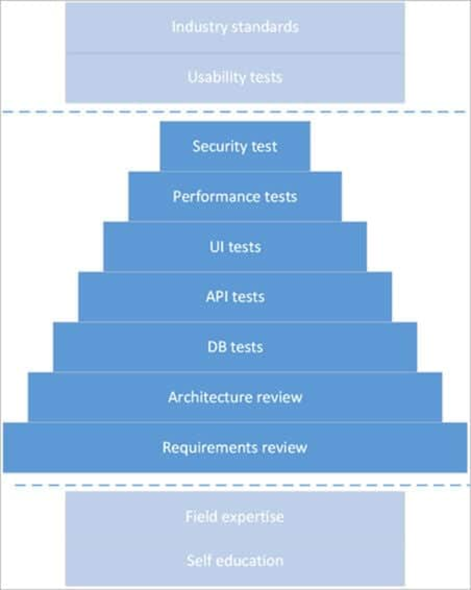
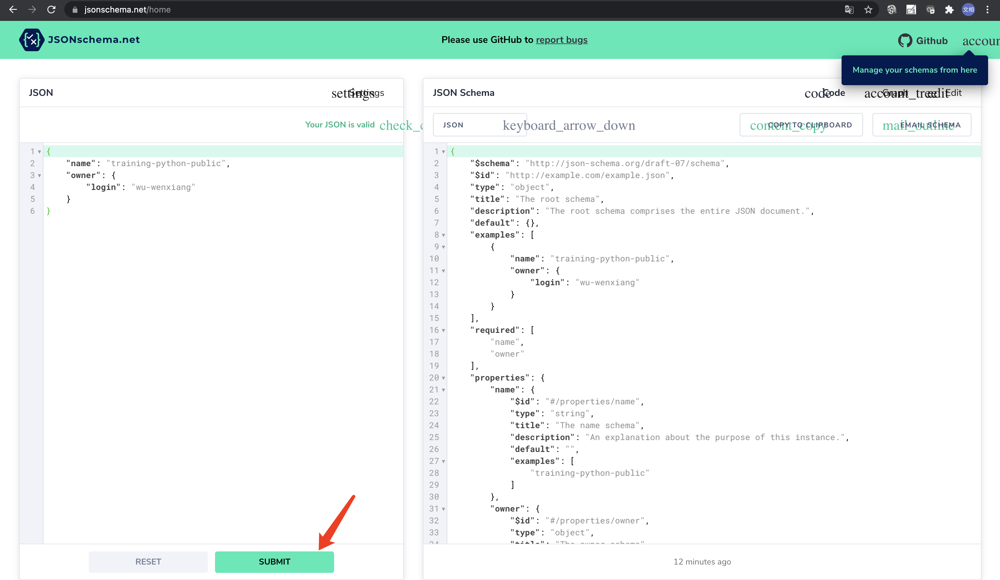

# Python 自动化测试

- 授课时长：
    - 上午：9:00 至 12:00
    - 下午：13:30 至 17:30
- Prerequisite
    - 有计算机语言编程基础
    - 了解 API 测试的基本概念
    - 掌握一种 IDE，比如 VSCode（Remote Plugin）

## 1. 基本概念

### 1.1 软件测试分几类？

- 白盒测试：
    - 单元测试
    - 数据库测试
- 黑盒测试：
    - 功能测试
        - 接口测试（功能测试 / 集成测试）
        - E2E 测试（UI 界面）
    - 非功能测试
        - 压力测试
        - 可靠性 / 恢复测试
        - 伸缩性测试
        - 安全测试

### 1.2 敏捷开发为测试带来了什么挑战？

- 为什么敏捷开发（FullStack）的测试是不够的？敏捷的原则是：功能刚好够用 + 快速迭代 => 随时可交付
- [测试应该在什么阶段介入？]((https://www.softwaretestinghelp.com/maximizing-quality-beyond-full-stack-testing/))

    

### 1.3 参考

1. Six Options for More Efficient Tests: <https://www.testim.io/blog/python-test-automation/>
1. PYTHON TEST AUTOMATION: <https://automationpanda.com/2020/11/09/learning-python-test-automation/>
1. <https://www.activestate.com/blog/the-best-python-tools-for-test-automation/>
1. <https://www.softwaretestinghelp.com/python-testing-frameworks/>

## 2. 单元测试

[Python 单元测试](http://blog.wuwenxiang.net/Python-Unittest)

- Unittest & Green：反射、固件测试、Mock
- Pytest & allure：Assert Error

### 2.1 Unittest 和 Pytest 的差异

1. 用例编写规则
    - unittest 提供了 test cases、test suites、test fixtures、test runner 相关的类，让测试更加明确、方便、可控。使用unittest编写用例，必须遵守以下规则：
        - 测试文件必须先 import unittest
        - 测试类必须继承 unittest.TestCase
        - 测试方法必须以 `test_` 开头
        - 测试类必须要有 unittest.main() 方法
    - pytest 是 python的第三方测试框架，是基于 unittest 的扩展框架，比 unittest 更简洁,更高效。使用 pytest 编写用例,必须遵守以下规则:
        - 测试文件名必须以 `test_` 开头或者 `_test` 结尾（如：`test_ab.py`）
        - 测试方法必须以 `test_` 开头。
        - 测试类命名以 Test 开头。

    pytest 可以执行 unittest 风格的测试用例，无须修改 unittest 用例的任何代码，有较好的兼容性。pytest 插件丰富，比如 flask 插件，可用于用例出错重跑；还有 xdist 插件，可用于设备并行执行。

1. 用例前置和后置
    - unittest 提供了 setUp/tearDown，每个用例运行前、结束后运行一次。setUpClass/tearDownClass，用例执行前、结束后，只运行一次。
    - pytest提供了模块级、函数级、类极、方法级的 setup/teardown，比 unittest 更灵活
        - 模块级 `setup_module/teardown_modul` 开始于模块始末，全局的
        - 函数级 `setup_function/teardown_function` 只对函数用例生效（不在类中）
        - 类级 `setup_class/teardown_class` 只在类中前后运行一次(在类中)
        - 方法级 `setup_method/teardown_method` 开始于方法始末（在类中）
        - 类里面的 `setup/teardown` 运行在调用方法的前后
    - pytest还可以在函数前加 @pytest.fixture() 装饰器，在测试用例中装在 fixture 函数。fixture 的使用范围可以是 function/module/class/session。firture 相对于 setup/teardown 来说有以下几点优势：
        - 命名方式灵活，不局限于setup和teardown这几个命名
        - conftest.py 配置里可以实现数据共享，不需要import就能自动找到一些配置，可供多个py文件调用
    - scope="module" 可以实现多个 .py 跨文件共享前置
    - scope="session" 以实现多个 .py 跨文件使用一个 session 来完成多个用例
    - 用 yield 来唤醒 teardown 的执行
1. 断言
    - unittest 提供了 assertEqual、assertIn、assertTrue、assertFalse。
    - pytest 直接使用 assert 表达式。
1. 报告
    - unittest 使用 HTMLTestRunnerNew 库。
    - pytest 有 pytest-HTML、allure 插件。
1. 失败重跑
    - unittest 无此功能。
    - pytest 支持用例执行失败重跑，pytest-rerunfailures 插件。
1. 参数化
    - unittest 需依赖 ddt 库
    - pytest 直接使用 @pytest.mark.parametrize 装饰器。
1. 用例分类执行
    - unittest 默认执行全部用例，也可以通过加载 testsuit，执行部分用例。
    - pytest 可以通过 @pytest.mark 来标记类和方法，pytest.main 加入参数("-m")可以只运行标记的类和方法

### 2.2 Pytest

1. [pytest 安装及用例执行](https://www.cnblogs.com/hiyong/p/14163263.html)
1. [pytest 的 setup/teardown 方法](https://www.cnblogs.com/hiyong/p/14163271.html)
1. [pytest fixture 用法](https://www.cnblogs.com/hiyong/p/14163280.html)
1. [pytest 参数化用例](https://www.cnblogs.com/hiyong/p/14163287.html)

    ```python
    import pytest
    from functools import reduce


    def sumAny(*args):
        return reduce(lambda x,y: x+y, args)

    # if __name__ == '__main__':
    #     print(sumAny(1, 2, 3, 4))
    #     print(sumAny(1.2, 2.34))
    #     print(sumAny("test", "hello"))
    #     print(sumAny([1, 2, 3], ['hello']))


    class Test_Demo():
        @pytest.mark.parametrize("args, result", [
            ((1, 2, 3, 4), 10),
            ((1.2, 2.34), 3.54),
            (("test", "hello"), 'testhello'),
            (([1, 2, 3], ['hello']), [1, 2, 3, 'hello'])])
        def test_case1(self, args, result):
            ret = sumAny(*args)
            assert ret == result


    if __name__ == '__main__':
        pytest.main()
    ```

1. [pytest + allure 生成测试报告](https://www.cnblogs.com/hiyong/p/14163298.html)

## 3. 数据库操作

[Demo](python-exec-public.py#L1757)：

- DB Driver
- SqlAlchemy ORM 模型
- Pandas 快速处理

## 4. 接口测试

### 4.1 基本概念

- [什么是 Restful API 设计？](https://www.ics.uci.edu/~fielding/pubs/dissertation/rest_arch_style.htm)
    - 客户端-服务器约束：用户界面问题与数据存储分开
    - 无状态约束：会话状态完全保留在客户端
    - [统一接口约束](https://www.ics.uci.edu/~fielding/pubs/dissertation/rest_arch_style.htm#sec_5_2)
- [如何判断服务是否以正确的值响应？](https://restfulapi.net/http-status-codes/)
    - 200 / 201 / 204
    - 400 / 401 / 403 / 419
    - 500 / 503
- Restful API 和 GRPC 接口的自动化测试有哪些异同？gRPC 提供了许多优势，但它有一个主要障碍：浏览器兼容性低。因此，gRPC 的用例一般局限在内部/私有系统

    

- Rest API Demo：[Github](https://github.com/wu-wenxiang/rest_api_demo) & [Gitee](https://gitee.com/wu-wen-xiang/rest_api_demo)，对象s + CRUD

    ```bash
    docker stop rest-api-demo
    docker rm rest-api-demo
    docker run -d -p 9999:8888 --name=rest-api-demo maodouzi/rest-api-demo:3.9.6

    # 访问：http://<外网IP>:9999/api/
    ```

### 4.2 常见工具

- Netmon / Wireshark / tcpdump
- Fiddler
- Postman

### 4.3 Requests

- 准备
    - 参考文档：[中文](https://docs.python-requests.org/zh_CN/latest/) 或 [英文](https://docs.python-requests.org/en/master/)
    - 安装：`pip3 install requests`
    - http 请求响应测试接口：<https://httpbin.testing-studio.com/>，源码：[Github](https://github.com/postmanlabs/httpbin)
- 常见接口请求

    ```python
    >>> import requests
    >>> r = requests.post('http://<外网IP>:9999/api/', json={'name': 'testNewCategories'})
    >>> r.status_code
    200
    ```

    ```python
    >>> import requests
    >>> r = requests.get('https://api.github.com/events')
    >>> r.status_code
    200

    >>> r.text[:50]
    '[{"id":"17531424137","type":"PullRequestEvent","ac'
    >>> r.content[:50]
    b'[{"id":"17531424137","type":"PullRequestEvent","ac'
    >>> r.encoding
    'utf-8'

    >>> r = requests.post('http://httpbin.org/post', data={'key': 'value'})
    >>> import json
    >>> json.loads(r.text)
    {'args': {}, 'data': '', 'files': {}, 'form': {'key': 'value'}, 'headers': {'Accept': '*/*', 'Accept-Encoding': 'gzip, deflate', 'Content-Length': '9', 'Content-Type': 'application/x-www-form-urlencoded', 'Host': 'httpbin.org', 'User-Agent': 'python-requests/2.25.1', 'X-Amzn-Trace-Id': 'Root=1-61145403-5e8bb0f66830a61e47862530'}, 'json': None, 'origin': '101.85.192.4', 'url': 'http://httpbin.org/post'}
    >>> r.json()
    ...

    >>> import pprint
    >>> pprint.pprint(r.json())
    {'args': {},
    'data': '',
    'files': {},
    'form': {'key': 'value'},
    'headers': {'Accept': '*/*',
                'Accept-Encoding': 'gzip, deflate',
                'Content-Length': '9',
                'Content-Type': 'application/x-www-form-urlencoded',
                'Host': 'httpbin.org',
                'User-Agent': 'python-requests/2.25.1',
                'X-Amzn-Trace-Id': 'Root=1-61145403-5e8bb0f66830a61e47862530'},
    'json': None,
    'origin': '101.85.192.4',
    'url': 'http://httpbin.org/post'}
    ```

    ```python
    # XML 请求
    import requests
    xml ="""<?xml version='1.0' encoding='utf-8'?><a>6</a>"""
    headers={'Content-type':'application/xml'}
    r = requests.post('http://httpbin.org/post', data=xml, headers=headers).text

    # 上传文件
    url = 'http://httpbin.org/post'
    files = {'file': open('report.xls', 'rb')}
    r = requests.post(url, files=files)
    ```

- 结构化数据处理

    ```python
    >>> import requests
    >>> import json
    >>> r = requests.get('https://api.github.com/repos/wu-wenxiang/training-python-public')
    >>> json_data = r.json()
    >>> print(json.dumps(json_data, indent=4))
    {
        "id": 100894204,
        "node_id": "MDEwOlJlcG9zaXRvcnkxMDA4OTQyMDQ=",
        "name": "training-python-public",
        "full_name": "wu-wenxiang/training-python-public",
        "private": false,
        ...
    }

    >>> r.json()['owner']['login']
    'wu-wenxiang'
    >>> assert r.json()['owner']['login'] == 'wu-wenxiang'
    >>> assert r.json()['owner']['login'] == 'maodouzi'
    Traceback (most recent call last):
    File "<stdin>", line 1, in <module>
    AssertionError
    ```

- JSONPath
    - 文档：<https://goessner.net/articles/JsonPath/>

        JSONPath 表达式与 XPath 类似，是 XPath 在 json 中的应用，全称 XPath for JSON，用于从 JSON 文档中提取数据。JSONPath 表达式和XPath语法对比如下：

        | XPath | JSONPath | Description |
        | ----- | -------- | ----------- |
        | / | $ | 跟节点 |
        | . | @ | 当前节点 |
        | / | . or [] | 儿子节点 |
        | .. | N/A | 父节点 |
        | // | .. | 子孙节点 |
        | * | * | 匹配所有节点 |
        | @ | N/A | 属性 |
        | [] | [] | 下标操作符 |
        | \| | [,] | 多选 |
        | N/A | [start:eand:step] | 切片 |
        | [] | ?() | 过滤表达式 |
        | N/A | () | script 表达式 |
        | () | N/A | 分组 |

    - jsonpath 库可用于处理 json 数据：<https://pypi.org/project/jsonpath/>，`pip3 install jsonpath`

        ```python
        >>> import requests
        >>> from jsonpath import jsonpath
        >>> r = requests.get('https://api.github.com/repos/wu-wenxiang/training-python-public')
        >>> jsonpath(r.json(), '$..login')[0]
        'wu-wenxiang'
        ```

- schema 断言
    - JSON Schema 可以用来注释和验证 JSON 文档，官网：<http://json-schema.org/>
    - JSON Schema 可用来添加自定义规则，可以自定义数据类型：

        ```python
        schema = {
            "type" : "object",
            "properties" : {
                "price" : {"type" : "number"},
                "name" : {"type" : "string"},
            },
        }
        ```

    - 把 json 格式转成 schema，在线生成 schema 网址：https://jsonschema.net/
    - jsonschema 是使用 JSON Schema 的 Python库，通过 `pip3 install jsonschema` 命令安装。

        ```python
        >>> import requests
        >>> import jsonschema
        >>> import pprint

        >>> r = requests.get('https://api.github.com/repos/wu-wenxiang/training-python-public')
        >>> data = r.json()
        >>> data
        {'id': 100894204, 'node_id': 'MDEwOlJlcG9zaXRvcnkxMDA4OTQyMDQ=', ...}

        >>> schema = {
        ...     "name" : "training-python-public",
        ...     "owner" : {
        ...         "login" : "wu-wenxiang",
        ...     },
        ... }
        >>> pprint.pprint(schema)
        {'name': 'training-python-public', 'owner': {'login': 'wu-wenxiang'}}
        >>> print(json.dumps(schema, indent=4))
        {
            "name": "training-python-public",
            "owner": {
                "login": "wu-wenxiang"
            }
        }
        ```

        可以用 [genson](http://github.com/wolverdude/genson/) 生成 schema：`pip3 install genson`

        ```python
        >>> from genson import SchemaBuilder
        >>> builder = SchemaBuilder()
        >>> schema = {
        ...     "name" : "training-python-public",
        ...     "owner" : {
        ...         "login" : "wu-wenxiang",
        ...     },
        ... }
        >>> builder.add_object(schema)
        >>> pprint.pprint(builder.to_schema())
        {'$schema': 'http://json-schema.org/schema#',
        'properties': {'name': {'type': 'string'},
                        'owner': {'properties': {'login': {'type': 'string'}},
                                'required': ['login'],
                                'type': 'object'}},
        'required': ['name', 'owner'],
        'type': 'object'}
        >>> schema = builder.to_schema()
        ```

        也可以把之前的 json 粘贴到 https://jsonschema.net/ 进行转换，得到 schema

        

        ```python
        # 把网站得到的 json schema 拿过来
        >>> aStr='''{
        ...     "$schema": "http://json-schema.org/draft-07/schema",
        ...     "$id": "http://example.com/example.json",
        ...     "type": "object",
        ...     "title": "The root schema",
        ...     "description": "The root schema comprises the entire JSON document.",
        ...     "default": {},
        ...     "examples": [
        ...         {
        ...             "name": "training-python-public",
        ...             "owner": {
        ...                 "login": "wu-wenxiang"
        ...             }
        ...         }
        ...     ],
        ...     "required": [
        ...         "name",
        ...         "owner"
        ...     ],
        ...     "properties": {
        ...         "name": {
        ...             "$id": "#/properties/name",
        ...             "type": "string",
        ...             "title": "The name schema",
        ...             "description": "An explanation about the purpose of this instance.",
        ...             "default": "",
        ...             "examples": [
        ...                 "training-python-public"
        ...             ]
        ...         },
        ...         "owner": {
        ...             "$id": "#/properties/owner",
        ...             "type": "object",
        ...             "title": "The owner schema",
        ...             "description": "An explanation about the purpose of this instance.",
        ...             "default": {},
        ...             "examples": [
        ...                 {
        ...                     "login": "wu-wenxiang"
        ...                 }
        ...             ],
        ...             "required": [
        ...                 "login"
        ...             ],
        ...             "properties": {
        ...                 "login": {
        ...                     "$id": "#/properties/owner/properties/login",
        ...                     "type": "string",
        ...                     "title": "The login schema",
        ...                     "description": "An explanation about the purpose of this instance.",
        ...                     "default": "",
        ...                     "examples": [
        ...                         "wu-wenxiang"
        ...                     ]
        ...                 }
        ...             },
        ...             "additionalProperties": true
        ...         }
        ...     },
        ...     "additionalProperties": true
        ... }'''
        >>> schema = json.loads(aStr)
        >>> pprint.pprint(schema)
        {'$id': 'http://example.com/example.json',
        '$schema': 'http://json-schema.org/draft-07/schema',
        'additionalProperties': True,
        'default': {},
        'description': 'The root schema comprises the entire JSON document.',
        'examples': [{'name': 'training-python-public',
                    'owner': {'login': 'wu-wenxiang'}}],
        'properties': {'name': {'$id': '#/properties/name',
                                'default': '',
                                'description': 'An explanation about the purpose of '
                                                'this instance.',
                                'examples': ['training-python-public'],
                                'title': 'The name schema',
                                'type': 'string'},
                        'owner': {'$id': '#/properties/owner',
                                'additionalProperties': True,
                                'default': {},
                                'description': 'An explanation about the purpose of '
                                                'this instance.',
                                'examples': [{'login': 'wu-wenxiang'}],
                                'properties': {'login': {'$id': '#/properties/owner/properties/login',
                                                        'default': '',
                                                        'description': 'An '
                                                                        'explanation '
                                                                        'about the '
                                                                        'purpose of '
                                                                        'this '
                                                                        'instance.',
                                                        'examples': ['wu-wenxiang'],
                                                        'title': 'The login schema',
                                                        'type': 'string'}},
                                'required': ['login'],
                                'title': 'The owner schema',
                                'type': 'object'}},
        'required': ['name', 'owner'],
        'title': 'The root schema',
        'type': 'object'}
        ```

        不管用哪种方式（genson 自动生成 / online 网站转换 / 手写）获取到 schema，拿到 schema 之后可以开始验证：

        ```python
        >>> jsonschema.validate(data, schema=schema)
        >>> schema['required']
        ['name', 'owner']
        >>> schema['required'] = ['name', 'owner2']
        >>> jsonschema.validate(data, schema=schema)
        Traceback (most recent call last):
        File "<stdin>", line 1, in <module>
        File "/usr/local/lib/python3.9/site-packages/jsonschema/validators.py", line 934, in validate
            raise error
        jsonschema.exceptions.ValidationError: 'owner2' is a required property

        Failed validating 'required' in schema:
            {'$id': 'http://example.com/example.json',
            '$schema': 'http://json-schema.org/draft-07/schema',
            'additionalProperties': True,
            ...
            }
        ```

- xml 解析断言
    - xml 文件解析可以使用 requests_xml，参考：<https://github.com/erinxocon/requests-xml>
    - 也可以使用 Python xml.etree.ElementTree 模块解析 xml 数据，使用 Xpath 定位

        ```python
        # xml.etree.ElementTree 模块 xml 解析举例：

        import xml.etree.ElementTree as ET
        root = ET.fromstring(countrydata)
        root.findall(".")
        root.findall("./country/neighbor")
        root.findall(".//year/..[@name='Singapore']")
        root.findall(".//*[@name='Singapore']/year")
        root.findall(".//neighbor[2]")
        ```

    - 和 JSON Schema 一样，也有一个 XML Schema，用于解析 xml 文档，文档参考：https://www.w3.org/2001/XMLSchema
    - Python库安装： pip3 install xmlschema
- hamcrest 断言
    - 除了常用的 Assert 断言以外，有一个功能更加强大的断言方法叫 Hamcrest 断言，具有丰富的断言匹配器，支持多种语言，官网地址：<http://hamcrest.org/>
    - PyHamcrest GitHub：<https://github.com/hamcrest/PyHamcrest>
    - 文档：<https://pyhamcrest.readthedocs.io/en/v2.0.2/tutorial/>

### 4.4 Pytest & Requests

- 文档参考：<https://docs.pytest.org/en/6.2.x/usage.html#cmdline>
- 接口测试断言

    ```python
    # a.py
    import requests

    class TestRequest():
        def test_get(self):
            r = requests.get('https://api.github.com/events')
            assert r.status_code == 200
    ```

    ```console
    $ pytest a.py -v
    ================================================================= test session starts =================================================================
    platform darwin -- Python 3.9.2, pytest-6.2.4, py-1.10.0, pluggy-0.13.1 -- /usr/local/opt/python@3.9/bin/python3.9
    cachedir: .pytest_cache
    rootdir: /Users/wuwenxiang/local/test/test2
    collected 1 item

    a.py::TestRequest::test_get PASSED                                                                                                              [100%]

    ================================================================== 1 passed in 0.79s ==================================================================
    ```

### 4.5 Tempest

### 4.6 RobotFramwork

[Github](https://github.com/wu-wenxiang/training-python-public/blob/master/doc/TailoredTraining-Python-RobotFrameWork.md#lab-07-robotframework) 或 [Gitee](https://gitee.com/wu-wen-xiang/training-python/blob/master/doc/TailoredTraining-Python-RobotFrameWork.md#lab-07-robotframework)

### 4.7 更多的 Restful API 测试框架

汇总：<https://github.com/atinfo/awesome-test-automation/blob/master/python-test-automation.md#rest-api-testing>

#### 4.7.1 Gabbi

参考：<https://github.com/cdent/gabbi>

启动 Restful API Demo

```bash
docker stop rest-api-demo
docker rm rest-api-demo
docker run -d -p 9999:8888 --name=rest-api-demo maodouzi/rest-api-demo:3.9.6
```

测试脚本：

```yaml
# test.yaml
fixtures:
  - ConfigFixture
  - SampleDataFixture

defaults:
  ssl: False
  request_headers:
    content-type: application/json
    accept: application/json

tests:
  - name: list categories
    url: /api/blog/categories/
    method: GET
    status: 200
    response_json_paths:
      $.`len` : 3
      $.[0].name: Sci-Fi
  - name: get categories
    url: /api/blog/categories/1
    method: GET
    status: 200
    response_json_paths:
      $.name: Sci-Fi
  - name: post categories
    url: /api/blog/categories/
    method: POST
    data:
      id: 123456789
      name: smith
    status: 201
  - name: list categories
    url: /api/blog/categories/
    method: GET
    status: 200
    response_json_paths:
      $.`len` : 4
  - name: update categorie
    url: /api/blog/categories/123456789
    method: PUT
    data:
      name: smith2
    status: 204
  - name: get categories
    url: /api/blog/categories/123456789
    method: GET
    status: 200
    response_json_paths:
      $.name: smith2
  - name: delete categorie
    url: /api/blog/categories/123456789
    method: DELETE
    status: 204
  - name: list categories
    url: /api/blog/categories/
    method: GET
    status: 200
    response_json_paths:
      $.`len` : 3
```

测试

```console
$ pip3 install gabbi

$ gabbi-run localhost:9999 < test.yaml
... ✓ gabbi-runner.input_list_categories
... ✓ gabbi-runner.input_get_categories
... ✓ gabbi-runner.input_post_categories
... ✓ gabbi-runner.input_list_categories
... ✓ gabbi-runner.input_update_categorie
... ✓ gabbi-runner.input_get_categories
... ✓ gabbi-runner.input_delete_categorie
... ✓ gabbi-runner.input_list_categories


$ gabbi-run -v all localhost:9999 < test.yaml
... #### list categories ####
> GET http://localhost:9999/api/blog/categories/
> content-type: application/json
> accept: application/json
> user-agent: gabbi/2.3.0 (Python urllib3)
< 200 OK
< Content-Type: application/json
< Content-Length: 168
< Server: Werkzeug/0.16.1 Python/3.9.6
< Date: Sat, 09 Oct 2021 08:08:41 GMT
[
  {
    "id": 1,
    "name": "Sci-Fi"
  },
  {
    "id": 2,
    "name": "Politics"
  },
  {
    "id": 3,
    "name": "Tech"
  }
]
```

可以参考：https://gabbi.readthedocs.io/en/latest/jsonpath.html 处理返回。

遗留问题：

1. 输出校验 JSON-Schema
2. 输入复用数据结构 - 变量

#### 4.7.2 schemathesis

<https://github.com/schemathesis/schemathesis>

```bash
pip3 install schemathesis
schemathesis run  http://localhost:9999/api/swagger.json
```

参考：<https://schemathesis.readthedocs.io/en/stable/python.html#lazy-loading>

## 5. E2E 测试

### 5.1 Python & Selenium

### 5.2 Cypress

## 6. 压力测试

检测指标

- 并发数
- 响应时间：3 秒 - 30 秒

### 6.1 工具 JMeter

### 6.2 Rally

## 7. 容错测试

## 8. CI/CD

### 8.1 Jenkins

### 8.2 Zuul

### 8.3 Gitlab

### 8.4 Gerrit
