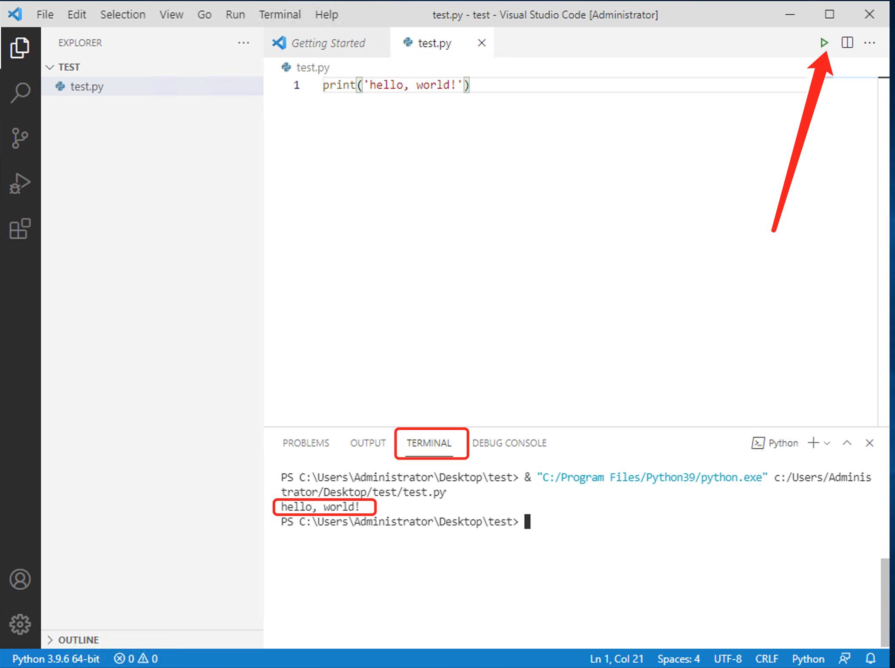
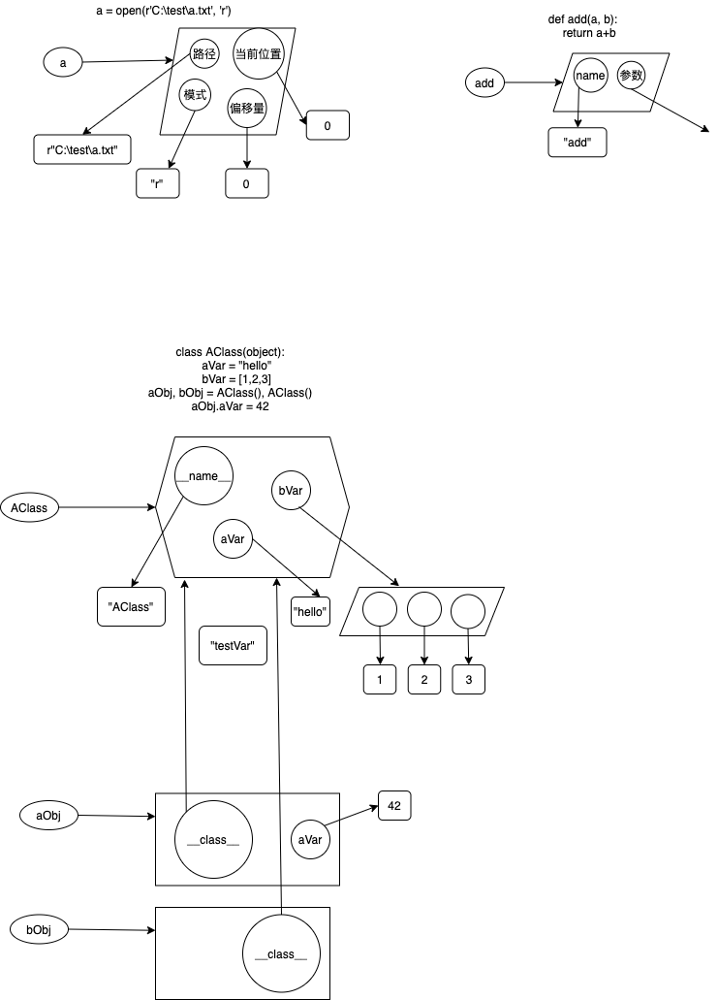
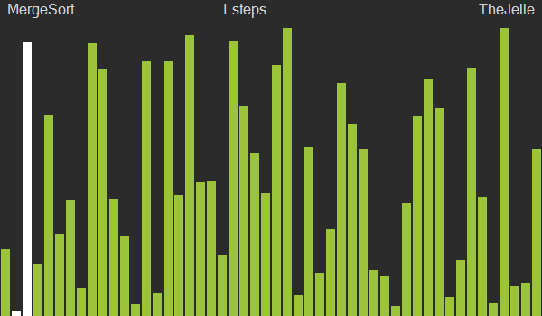

# Python 3 日谈

## 注意 ⚠️

- *斜体表示引用*
- **未经允许，禁止转载**

## 课程目录

| 日程    | 时间 | 课程              | 内容                |
| ------ | ---- | ---------------- | ------------------ |
| 第 1 天 | 上午 | [1. 基础](#1-基础) | [1.1 简介](#11-简介) |
|        |      |                  | [1.2 开发环境搭建](#12-开发环境搭建) |
|        |      |                  | [1.3 变量和对象](#13-变量和对象) |
|        |      |                  | [1.4 基本对象类型](#14-基本对象类型) |
|        | 下午 | [2. 进阶](#2-进阶) | [2.1 高阶函数](#21-高阶函数) |
|        |      |                  | [2.2 类和实例](#22-类和实例) |
|        |      |                  | [2.3 设计模式简介](#23-设计模式简介) |
|        |      |                  | [2.4 正则表达式](#24-正则表达式) |
|        |      |                  | [2.5 异常处理](#25-异常处理) |
| 第 2 天 | 上午 | [3. 开发](#3-开发相关) | [3.1 版本控制](#31-版本控制) |
|        |     |                   | [3.2 自动化测试](#32-自动化测试) |
|        |     |                   | [3.3 自动化任务](#33-自动化任务) |
|        |     |      | [3.4 开发规范](#34-开发规范) |
|        | 下午 | [4. Web](#4-web-开发) | [4.1 MVC 框架](#41-mvc-框架) |
|        |     |                   | [4.2 Restful API](#42-restful-api) |
|        |     |                   | [4.3 服务部署](#43-服务部署) |
| 第 3 天 | 上午 | [5. 算法](#5-算法和设计模式相关) | [5.1 算法复杂度](#51-算法复杂度) |
|        |     |                   | [5.2 算法实践](#52-算法实践) |
|        |     |                   | [5.3 设计模式实践](#53-设计模式实践) |
|        | 下午 | [6. 系统](#6-系统相关) | [6.1 shell 编程](#61-shell-编程) |
|        |     |                   | [6.2 父子进程调用](#62-父子进程调用) |
|        |     |                   | [6.3 文件和目录](#63-文件和目录) |
|        |     |                   | [6.4 并行计算](#64-并行计算) |

## 1. 基础

[返回目录](#课程目录)

### 1.1 简介

[返回目录](#课程目录)

#### 1.1.1 比较流行的程序语言是哪些？

- TIOBE Index：<https://tiobe.com/tiobe-index/>

    *TIOBE 编程社区指数是编程语言流行度的一个指标。该索引每月更新一次。评级基于全球熟练工程师的数量、课程和第三方供应商的数量。Google、Bing、Yahoo!、维基百科、亚马逊、YouTube 和百度等流行搜索引擎用于计算评级。*

    截至 2022 年 1 月，编程语言流行趋势图如下：

    

    *Python 于 2021 年初从 TIOBE 索引的第 3 位开始，将 Java 和 C 抛在后面，成为 TIOBE 索引的第一名。但 Python 的流行并不止于此。目前，它比其他人领先 1% 以上。Java 在 2001 年创下 26.49% 评级的历史记录还很遥远，但 Python 已经成为许多领域事实上的标准编程语言。没有迹象表明 Python 的胜利行军将很快停止。*

    *Python 有没有真正的竞争者？未来可能会竞争的任何新的闪亮语言？如果我们看看过去几年有前途的语言，我们会看到 2021 年的以下变化：Swift 从 #13 到 #10，Go 从 #14 到 #13，Rust 从 #26 到 #26，Julia 从 #23 到#28，Kotlin 从 #40 到 #29，Dart 从 #25 到 #37，TypeScript 从 #42 到 #49。因此，除了 Swift 和 Go 之外，我们预计不会很快有任何新语言进入前 5 名甚至前 3 名。*

- 一种编程语言为什么会流行？
    - 主要原因：**应用广泛（有用）、开发效率高 & 易维护（好用）**
    - 次要原因：性能优异、暂无竞争对手（垄断）

    思考：排名靠前的语言们，它们各自为什么流行？

#### 1.1.2 Python 的起源

- 创始人：[Guido van Rossum](https://baike.baidu.com/item/%E5%90%89%E5%A4%9A%C2%B7%E8%8C%83%E7%BD%97%E8%8B%8F%E5%A7%86/328361)，数学和计算机硕士
- 大龄男青年：1989 年圣诞假期，MAC 笔记本一夜完成
- Python 命名源自 Guido 最英国肥皂剧《Monty Python 马戏团》

#### 1.1.3 什么是 Pythonic 的编程思维？

- **Python 是工程，不是艺术（解决同一个问题用同一种方法）**
    - Python 中的 None 只有一种写法，不能写成 none / null / nul / Null / NONE
    - Python 中的分支结构只有 if/else，没有 switch
    - Python 中的 for 循环也只有一种写法 `for i in items: ...`
- **简单优于复杂**
    - Python 只有很少的语法糖，比如装饰器
    - Python 的对象属性设计基本都是可以自圆其说的
- **明确优于晦涩**（复杂优于难懂，要始终保持代码的易读性，“让易读的代码进行性能优化”远比“让高效的代码变得易读”要容易）

更具体一点：

- 自顶而下的面向接口的设计
- 恰当地使用数据结构、算法和设计模式
- 代码越少越好（尽量用标准库，代码越少 Bug 越少）
- 尽量减少写复杂的嵌套循环和分支结构，善用解析和高阶函数，把一个复杂的大循环拆成多个简单的小循环

#### 1.1.4 新手应该如何学习编程？

- Eric Raymond 推荐的学习路径：**Python -> Java -> C**，参考：[如何成为一名黑客-Eric-S-Raymond.pdf](如何成为一名黑客-Eric-S-Raymond.pdf)
- 选择基础而全面的入门书
    - 官方网站：<http://www.python.org>
    - [Python 学习手册 5th](https://book.douban.com/subject/30364619/)
    - [Python 3 标准库](https://book.douban.com/subject/30346181/)
- 到开源项目中去读代码、提交代码

    Python 开源项目非常多，其中 [OpenStack](https://opendev.org/openstack) 是集 Python 工程实现之大成的 IaaS 云计算项目，囊括几乎所有 Python 的应用相关技术，包括：

    - 基于 MVC 的 Web 网站（Horizon 用了 Django 框架）
    - 基于 Restful API 的 Web Service（Pecan / Webob / Flask / Paste 等框架）
    - Restful API 客户端框架（SDK）
    - 数据库处理（SqlAlchemy）
    - 对接消息队列
    - 对接（缓存处理）
    - 命令行编程
    - 类库打包和动态加载
    - 配置文件解析
    - 日志处理
    - 容器化封装（Kolla）
    - 自动化部署（Ansible）
    - 认证、鉴权和准入
    - 服务注册和服务发现
    - 对接时序数据库
    - 计量和监控（ceilometer 等）

- 程序语言以外的部分
    - 系统（容器、虚拟化）、存储、网络和知识
    - 算法和数据结构
    - 面向对象和设计模式
    - 软件工程和项目管理

### 1.2 开发环境搭建

[返回目录](#课程目录)

#### 1.2.1 Python 如何安装？

参考：[Python 在 Windows 环境上的安装步骤](Installation-Python.md)

> **练习作业**：安装 python。看到下图表示执行成功
>
>   
>
> - 图中的 python 版本不一定是 3.6，更高版本亦可
> - 图中的 pip 安装路径也可能不同，不用关注

#### 1.2.2 Python 程序在命令行窗口中如何运行？

- 交互式运行环境：用于 Debug
    - 在命令行中输入 `python`，进入交互环境
    - 交互环境会自动打印出对象的值，比如 `2*3`
    - 退出交互环境：`exit()`，回车
- 运行单行命令：用于和 Shell 命令交互，比如：`python -c "print(3*5)"`
- 运行脚本，比如：`python test.py`

#### 1.2.3 如何用 VSCode 编写和调试 Python 程序？

参考：[用 VSCode 编写和调试 Python 程序](Installation-VSCode.md)

> **练习作业**：在 VSCode 中运行 python 程序。看到下图表示执行成功
>
>    

#### 1.2.4 Python 体系结构

- Python 虚拟机
    - Python 虚拟机是安装在操作系统上的软件，用来解析和运行符合Python 语法的命令或者脚本
    - 之前安装 python 就是在安装 Python 虚拟机
- Python 语法
    - Python 程序由**模块**组成，模块由**语句**组成，语句由**表达式**组成，表达式建立和处理**对象**
    - 表达式有返回值，语句没有返回值
    - Python 语法基于**冒号**和**缩进**，缩进可以选择用 tab 或者空格，但在整个程序中要保持一致

        ```python
        '''
        Check if input-number > 42
        '''
        aStr = input("Input: ")
        # print aStr
        aInt = int(aStr)
        if aInt > 42:
            print("> 42")
        else:
            print("<= 42")
        ```

        - 多行注释：`"""…"""` 或者 `'''…'''`，也是 PyDoc 的写法
        - 标准输入：`input("Prompt string: ")`
        - 单行注释: `#...`
        - 强制缩进 / 所见即所得
        - 没有大括号 / 小括号 / 分号（其实可以有，但会被鄙视）
        - 标准输出：`print(...)`

#### 1.2.5 帮助文档 Pydoc

- 交互环境：查询 sys 模块的帮助文档：`help(sys)`
- chm 文档（Windows 环境）
- 本地网页，执行 Shell：`python -m pydoc -p 1234`，Web 浏览器访问：<http://localhost:1234>

### 1.3 变量和对象

[返回目录](#课程目录)

#### 1.3.1 变量

- 变量（引用）的概念
    - 变量本身没有类型，对象才有类型，引用可以映射到不同类型的对象
    - 变量要赋值（映射到对象）才能使用
    - 变量只有位于等号左边的时候表示为变量建立映射关系，其他时候都表示其映射到的对象本身。
    - 没有被引用映射的对象会被 PVM 的 GC 机制回收
- 变量的命名规则
    - 由字母，下划线，数字组成，且首字符不为数字
    - 区分大小写

#### 1.3.2 对象的属性 attribute

- 字段（field）属性和方法（method）属性
    - 字段属性用来描述对象的特征
    - 方法属性用来表示对象的行为
- 函数和对象的方法属性
    - 关联到特定对象的函数叫方法
    - 不关联到特定对象的通用方法叫函数
- 反射和自省
    - `id()` 函数，可以查看对象在 PVM 中的 hash（身份证号）
    - `__dict__` 属性或者 `dir()` 函数可以查看对象的属性

#### 1.3.3 对象的可变性

- 不可变（Immutable）对象

    包括：整数，浮点数，字符串，元组，不可变集合

    ```python
    aStr = "haha"
    aStr[2] = "e" # Error!
    ```

    对于不可变对象，通常值相等的在PVM中就只保留一份，所以两个值相等的不可变对象，通常其引用也相同。

- 可变（Mutable）对象

    列表，集合，字典

    ```python
    aList = ['h', 'a', 'h', 'a']
    aList = "e" # OK!
    aList.sort()
    ```

#### 1.3.4 在 PVM 中的存储模型

- 数字、字符串、元组、列表

    

- 文件、类

    

#### 1.3.4 对象的复制

- 重映射
    - 等号赋值
    - 实参传递
    - 函数返回值
- 浅拷贝
    - `copy.copy(aObj)`
    - 绝大多数运算符运算之后都会生产新的对象，比如序列的切片，加法，乘法
    - 对可变对象，`+=` 需要注意（它改变原对象）
- 深拷贝
    - `copy.deepcopy(aObj)`

### 1.4 基本对象类型

[返回目录](#课程目录)

参考：<https://docs.python.org/3/library/stdtypes.html>

#### 1.4.1 整数对象（int）

- 整数对象的写法
    - 默认为十进制：`42`
    - 也可以用八进制或者十六进制书写：`0o52`，`0x2a`
    - 可以认为 Python 中能处理的最大整数只取决于该机器的内存
- 基本运算：加减乘除，乘方，整除，取余：`+ - * / ** // %`
    - Python 2 中 `/` 是整除：`5/2 -> 2`
    - python 3 中 `/` 是小数除法：`10/2 -> 5.0`
- 取整运算

    ```python
    截尾取整 int(3.54) -> 3
    向上取整 math.ceil(3.14) -> 4
    向下取整 math.floor(3.14) -> 3
    四舍五入 round(3.14) -> 3, round(3.54) -> 4
    ```

- 字符串转换成整数

    ```python
    按十进制转换
    int("12") -> 12

    按八进制转换
    int("12", 8) -> 10

    按十六进制转换
    int("12", 16) -> 18
    ```

- 整数转换成字符串

    ```python
    转换成十进制形式
    str(12) -> "12"
    "%d" % 12 -> "12"

    转换成八进制形式
    oct(12) -> "014"
    "%o" % 12 -> "14"

    转换成十六进制形式
    hex(12) -> "0xc"
    "%x" % 12 -> "c"
    "%X" % 12 -> "C"
    ```

#### 1.4.2 浮点数对象（float）

- 浮点数对象的写法，带小数点：`3.1415`
- 浮点数的基本运算：加减乘，乘方：`+  -  *  **`
- 浮点数的除法
    - 浮点数和整数一起运算，返回浮点数：`5.0 / 2`
    - Floor 除法：结果是不大于商的最大整数

        ```python
        5 // 2 -> 2
        5 // -2 -> -3
        ```

> **练习作业**：随机生成两个 10 以内的实数（精确到小数点后两位）并输出到屏幕，要求用户输入它们的和，然后判断用户的输入值，然后输出 True/False。
>
> ```python
> 程序运行后界面上显示 Please input sum for 4.96 + 4.91 =
> 然后用户输入 9.87
> 程序输出 True
> ```
>
> [参考](python-exec-public.py#L117-138)

#### 1.4.3 字符串（str）

- 引号
    - 单引号和双引号效果一样，但是都要成对使用
    - 单双引号可以相互嵌套，以避免使用转义

        ```python
        print('isn\'t')
        print("isn't")
        ```

    - 三个单引号或者双引号可以产生多行字符串
- 单行内容太长，分行输入

    ```python
    h1 = "haha \
                Ok"
    h2 = ("haha"
                "xixi")
    ```

- 转义符：`\', \", \\, \n, \t, \b`
- 原始字符串（不转义）

    ```python
    print(r't\nt')
    print('t\\nt')
    ```

- 二进制字符串（）

    ```python
    >>> '测试'.encode()
    b'\xe6\xb5\x8b\xe8\xaf\x95'
    >>> '测试'.encode('utf-8')
    b'\xe6\xb5\x8b\xe8\xaf\x95'
    >>> '测试'.encode('cp936')
    b'\xb2\xe2\xca\xd4'
    >>> b'\xb2\xe2\xca\xd4'.decode('cp936')
    '测试'
    ```

- 加法和乘法

    ```python
    "hello " + "world!"
    "-" * 20
    ```

- 切片 Slice

    ```python
    aStr = "hello, world!"
    print(aStr[0], aStr[-1])
    print(aStr[2:-1]) # 左闭右开
    print(aStr[2:], aStr[:2], aStr[None:2])
    print(aStr[::2], aStr[-1::-1], aStr[::-1])
    ```

- 字符串的常用方法

    ```python
    replace
    count
    find/index
    capitalize/title
    isalpha/isdigit/isalnum
    isspace
    split
    join
    endswith/startswith
    lower/upper
    strip/rstrip/lstrip
    ```

- 字符串常用函数和操作

    ```python
    len("haha")

    chr(70)
    ord('F')

    for x in "hello":
	    print(x)

    if "he" in "hello":
	    print(True)
    ```

- 格式化字符串

    ```python
    "%d %s" % (5, "world")
    "%06.2f" % 3.1415 # 这里的 0 还可以是 +, -, 空格
    # 格式化输出的种类 %s, %r, %c, %d, %i, %u, %o, %x, %X, %e, %E, %f, %g, %G, %%

    '{1},{0},{1}'.format('kzc',18)
    '{a},{b}'.format(a=18,b='kzc')

    a, b, c = 1, 2, 3
    f'{a} + {b} = {c}'
    ```

> **练习作业**：提示用户输入一个字符串，判断该字符串是否回文（回文是指正读反读都一样，比如 accbcca / 123321 是回文）。
>
> [参考](python-exec-public.py#L252-271)

> **练习作业**：提示用户输入一个句子，去掉行首行末的空白，单词之间的空白统一格式化成一个空格。
>
> ```python
> 输入 "It is      my  book. "
> 输出 "It is my book."
> ```
>
> [参考](python-exec-public.py#L252-271)

#### 1.4.4 元组（tuple）

- 元组的初始化

    ```python
    t = (0, "Ni", 1, 0)
    t = (0,) # 单元素元组的末尾要加上逗号，以区别括号运算符，这里若没有逗号就等于0
    t = (0, "Ni", 1, (4, 5,)) # 元组可以嵌套另一个元组或者其它任意对象
    t = tuple("hello") # 从其它可迭代对象生成元组
    ```

- 元组是**不可变的引用序列对象**
    - 元组是序列，序列元素是引用（临时变量）
    - 元组是不可变对象
- 元组赋值运算

    ```python
    >>> a, b = 4, 5
    >>> (a, b) = 4, 5
    >>> a, b = (4, 5)
    >>> (a, b) = (4, 5)
    >>> (a, b) = (b, a+b)
    >>> a, b = b, a+b
    >>> a, b = divmod(5, 3)
    ```

- 序列的通用表达式和函数

    ```python
    if x in s / if x not in s

    if "ha" in "haha":
        print(True)

    for x in s:
        print(x)

    s + t, s += t
    "hello" + " world!"
    对可变序列对象，s+=t会改变s对象本身

    s * n, n * s
    "hello" * 5

    s[i], s[i:j], s[i:j:k]
    len(s), min(s), max(s)

    sorted()
    sorted([1, 4, 3, 2]) # 排序后生成一个新的列表并返回
    ```

#### 1.4.5 列表（list）

- 列表的初始化

    ```python
    t = [0, "Ni", 1, 3]
    t = [0, "Ni", 1, [4, 5]] # 列表可以嵌套另一个列表或者其它任意对象
    t = list("haha") # 从其它可迭代对象生成列表
    t = list(range(3)) # 生成数字列表：[0, 1, 2]
    ```

- 列表是可变的引用序列对象
    - 列表是序列，序列元素是引用（临时变量）
    - 列表是可变对象
- 列表常用方法

    ```python
    # append / extend
    aList = [1, 3, 2, 4, 7, 6]
    aList.append([4, 5]) # 不生成新的列表对象，而是改变原对象本身
    aList.extend([4, 5])

    # sort
    aList.sort()

    # insert
    aList.insert(1, 4)

    # reverse
    aList.reverse()

    # pop / remove
    aList.pop() # 删除并返回最后一个元素
    aList.remove(1) # 删除指定的元素，没有返回值
    ```

- 列表常用运算

    ```python
    # del L2[i:j]
    del aList[2]
    del aList[0: 1] # 删除变量和映射关系，而非删除对象本身

    # L2[k] = N / L2[i:j] = L3
    aList[2] = 5 # k不可以越界访问
    aList[1:2] = [4, 5, 6] # 等号左边的索引仍然代表一个左闭右开的区间，等号右边的列表表示填入的内容。

    zip()将多个列表合成一个元组对列表
    list(zip([1, 2, 3], ["apple","pear","banana"]))
    ```

- 列表解析

    列表解析的本质是：

    - 遍历可迭代对象的每一个元素
    - 将遍历到的元素代入前端的表达式进行运算
    - 用运算结果生成一个新的列表对象

    列表解析举例

    ```python
    [i**2 for i in range(5)]
    [str(i) for i in range(5) if i > 3]
    [ord(i) for i in "hello"]
    ```

#### 1.4.6 序列和散列

序列和散列都是可迭代对象

- 序列包括：字符串/元组/列表
    - 元素有序排列
    - 元素可以重复
- 散列包括：集合/不可变集合/字典
    - 元素没有顺序
    - 元素（键）不可以重复

#### 1.4.7 集合（set）

- 集合的初始化

    ```python
    x = set("hello") # 从其它可迭代对象生成集合
    ```

- 集合表示一些元素的无序集合

    无重复元素，可以用于剔除序列中的重复元素

- 集合只能包含可以计算哈希值的对象（hashable）

    Python 内建的不可变对象都是 hashable 的，元组是 hashable 的，列表不是

    ```python
    >>> set([range(5), range(3)])
    Traceback (most recent call last):
    File "<stdin>", line 1, in <module>
    TypeError: unhashable type: 'list'
    ```

- 集合的常用运算

    ```python
    x - y # 差集
    x & y # 交集
    x | y # 并集
    x ^ y # 外集
    x < y # 真子集
    x <= y # 子集
    x >= y # 超集
    ```

- 集合的常用方法

    ```python
    aSet.update(bSet)
    aSet.intersection_update(bSet)
    aSet.difference_update(bSet)
    aSet.symmetric_difference_update(bSet)
    aSet.add(x)
    aSet.remove(x)
    aSet.discard(x) # remove if exist
    aSet.pop()
    aSet.clear()
    ```

- 不可变的集合（frozenset），不可变对象

    frozenset 和 set 的关系，相当于 tuple 和 list 的关系

#### 1.4.7 字典（dict）

## 2. 进阶

[返回目录](#课程目录)

### 2.1 高阶函数

[返回目录](#课程目录)

### 2.2 类和实例

[返回目录](#课程目录)

### 2.3 设计模式简介

[返回目录](#课程目录)

### 2.4 正则表达式

[返回目录](#课程目录)

### 2.5 异常处理

[返回目录](#课程目录)

## 3. 开发相关

[返回目录](#课程目录)

### 3.1 版本控制

[返回目录](#课程目录)

### 3.2 自动化测试

[返回目录](#课程目录)

### 3.3 自动化任务

[返回目录](#课程目录)

### 3.4 开发规范

[返回目录](#课程目录)

## 4. Web 开发

[返回目录](#课程目录)

### 4.1 MVC 框架

[返回目录](#课程目录)

### 4.2 Restful API

[返回目录](#课程目录)

### 4.3 服务部署

[返回目录](#课程目录)

## 5. 算法和设计模式相关 TODO

[返回目录](#课程目录)

### 5.1 算法复杂度

[返回目录](#课程目录)

- 时间复杂度和空间复杂度
- 排序算法
    - 选择排序 O(n)=n²

        *searches the smallest value and swap it with the first value, then the same with the next position and with the next, and next and so on...*

        Best case: ，Worst case: O(n)=n²

        

    - 插入排序 O(n)=n²

        *Turn the first card, then turn the others till you find a smaller one and then you would swap them.*

        

    - 冒泡排序 O(n)=n²

        *It compares two neighboring values with each other and swap them if they are in the wrong order. It continues with next position right.*

        

    - 快速排序 O(n)=n*log(n)

        *It chooses a value and order all values which are smaller in front of the pivot and all bigger ones behind it. It does that in a more and more smooth range with more and more pivots.*

        

    - 归并排序 O(n)=n*log(n)

        *It splits up the list in multiple lists with one or two elements. It is ordering them and then it begins to merge the lists again to bigger lists.*

        

    - 不同排序算法用于不同数据集中的情形

        

    通用排序算法的时间算法复杂度极限是 n*log(n)，但非通用算法是可以突破极限的，比如有穷集合的排序。

- 算法全貌

    ```
    各类排序算法
    随机算法
    分治策略
    二叉树
    红黑树
    动态规划
    贪心算法
    摊还分析
    B 树
    图算法
    多线程算法
    矩阵
    线性规划
    快速傅立叶变换
    数论算法
    NP 完全性
    计算几何学
    近似算法
    ```

- 算法的参考资料
    - [算法参考书]()
    - leetcode
    - 习题参考

### 5.2 算法实践

[返回目录](#课程目录)

在工作中，我们不会有太多机会《算法概论》中的各类经典算法，因此这里仅涉及一些工作中可能遇到的算法技巧。

#### 5.2.1 二进制和位运算

- 位运算
    - 运算符：`<<  >>  &  |  ^  ~`
    - 一个数做右移运算时，高位填充 0
    - 一个数与全 0 异或不变，与全 1 异或即为取反
- 例子
    - 判断 x 是否 2 的平方数：`x & (x-1) == 0`
    - flag 置位：`x | flag`
    - flag 清零：`x & ~flag`

#### 5.2.2 序列算法

- 字符串循环左移2位：abcdefg -> cdefgab
- 逐词反转：apple pear orange -> elppa raep egnaro
- 实现 Buffer，写满即覆盖最前面的内容
- 实现最小固定长度队列，若持续向队列推送数据，只保留最小的 N 个以内的值
- 固定长度栈

#### 5.2.3 散列算法

- 计数器（字典唱票算法）：aabbcccdd -> {'a':2, 'b':2, 'c':3, 'd':2,}
- 集合算法

### 5.3 设计模式实践

[返回目录](#课程目录)

#### 5.3.1 装饰器

#### 5.3.2 迭代器和生成器

## 6. 系统相关

[返回目录](#课程目录)

### 6.1 shell 编程

[返回目录](#课程目录)

### 6.2 父子进程调用

[返回目录](#课程目录)

### 6.3 文件和目录

[返回目录](#课程目录)

### 6.4 并行计算

[返回目录](#课程目录)
