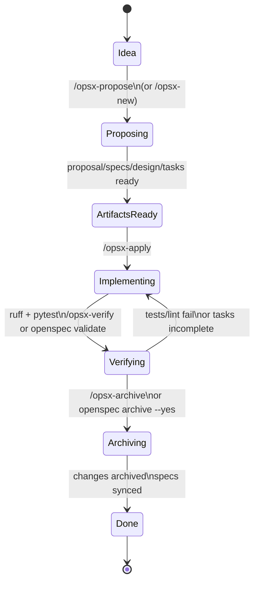

# AI 大模型赋能软件开发

## 注意 ⚠️

- _斜体表示引用或补充说明_
- **未经允许，禁止转载**

本教案教授 AI 大模型赋能软件开发的一般原理、方法论和工具链。AI 大模型可以是私有化部署，也可以是在线服务。串联 **IDE / CLI Router / OpenClaw（或同类 Agent
工具）** 的工程化使用。重心在**可复现的安装配置、连通性验证与全链路实战**。

## 课程目录

| 日程    | 时间 | 课程模块                 | 内容                                                             |
| ----- | -- | -------------------- | -------------------------------------------------------------- |
| 第 1 天 | 上午 | 原理 + 模型接入            | [1.1 课程定位与日程说明](#11-课程定位与日程说明)                                 |
|       |    |                      | [2.1 Agent、Harness 与 Agent 循环](#21-agentharness-与-agent-循环原理)  |
|       |    |                      | [2.2 Vibe Coding 与 Spec Coding](#22-vibe-coding-与-spec-coding) |
|       |    |                      | [2.3 Spec Coding 端到端落地](#23-spec-coding-端到端落地实操清单)             |
|       |    |                      | [3.1 大模型与 AI 编码扫盲（压缩）](#31-大模型与-ai-编码扫盲压缩)                     |
|       |    |                      | [3.2 在线 API 端到端走通](#32-在线-api-端到端走通)                           |
|       |    |                      | [3.3 私有化部署（可选 Demo）](#33-私有化部署可选-demo)                         |
|       |    |                      | [3.4 使用入门与课堂练习](#34-使用入门与课堂练习)                                 |
| 第 1 天 | 下午 | IDE / Router / Agent | [4.1 IDE 对接模型服务](#41-ide-对接模型服务)                               |
|       |    |                      | [4.2 OpenClaw、Router 与冒烟路径](#42-openclawrouter-与冒烟路径)          |
| 第 2 天 | 上午 | 全栈开发实战（技能 + 数据）      | [5.1 OpenSpec 工作流（Spec-Driven）](#51-openspec-工作流spec-driven)   |
|       |    |                      | [5.2 AI 助手技能（Skills）开发入门](#52-ai-助手技能skills开发入门)               |
|       |    |                      | [5.3 Python 数据分析与自动化](#53-python-数据分析与自动化)                     |
| 第 2 天 | 下午 | 云原生与高阶实战             | [6.1 前后端一体化快速开发](#61-前后端一体化快速开发)                               |
|       |    |                      | [6.2 云原生与微服务架构开发](#62-云原生与微服务架构开发)                             |
|       |    |                      | [6.3 高阶技巧与工作流复盘](#63-高阶技巧与工作流复盘)                               |
| 结课    | —  | 自查与扩展阅读              | [7.1 学员自查清单](#71-学员自查清单)                                       |
|       |    |                      | [7.2 延伸阅读与课程衔接](#72-延伸阅读与课程衔接)                                 |
|       |    |                      | [7.3 扩展阅读：AI 编程新进展与工具](#73-扩展阅读ai-编程新进展与工具)                    |
|       |    |                      | [7.4 讲义维护说明（给讲师）](#74-讲义维护说明给讲师)                               |

---

## 1. 课程总览

[返回目录](#课程目录)

### 1.1 课程定位与日程说明

[返回目录](#课程目录)

**课程定位**：面向一线开发、测试与运维工程技术人员，完成「**模型可连（优先在线 API）** → **IDE/Agent 可连** → **Spec/Vibe 选型** →
**技能与场景复制**」的闭环。课程假设学员具备常规命令行、一门后端语言（以 Python 为主）与基础 Web 概念；不展开 Transformer 数学推导。

**教学目标（两天结束后，学员应能）**：

1. **说清楚**：Agent 与 Harness 的概念和分工；代码大模型能力边界；在线 API 与私有化路线的取舍（合规、成本、运维、效果）。
2. **做得出**：任选一家**在线 API**（如 MiniMax / 通义千问 / GLM / Kimi / DeepSeek 云等）完成**注册 → 鉴权 → 最小请求 → IDE
   或脚本验证**；有条件时跟完**私有化最短 Demo**（不要求全员有 GPU）。
3. **接得上**：VS Code / Cursor 等指向可用端点；理解 **CLI Router / OpenAI 兼容网关**；完成 **OpenClaw 或同类 Agent**
   的冒烟路径（读仓库、改文件或跑一条命令）。
4. **方法论**：能说明 **Vibe Coding** 与 **Spec Coding** 的适用场景；能按 **S-R-T-P** 写一页 Spec 并驱动 AI 分任务落地。
5. **扩展开**：最小 Skill（工具契约）+ 数据分析 / 全栈 / 云原生脚手架的人机协同迭代。

**日程与节奏建议**：

- 第 1 天上午：**原理压缩讲清**（Agent/Harness、Spec/Vibe、Spec 端到端清单）+ **在线 API 全员走通** + 私有化**演示或录像**（15–30
  分钟量级，视客户环境而定）。
- 第 1 天下午：**IDE + Router + Agent** 真值闭环。
- 第 2 天：**Spec 驱动下的**技能与场景（数据、Web、云原生），复盘个人工作流。

**教学原则**（与 `we-know-python.md` 中 AI 辅助编程观一致）：

- **人主导决策，模型辅助执行**：架构、安全、合规、上线责任在人；对模型输出做必要性与完备性校验。
- **规范优先于一次性代码**：Spec、OpenAPI、环境变量约定、验收标准应可版本化；与 **Spec Coding** 一致。

### 1.2 环境与物料清单

[返回目录](#课程目录)

**必备（在线 API 路线）**：

- 可访问公网控制台的账号（由组织方指定 1–2 家供应商做标准演示，其余列表供自选）。
- **API Key** 仅放本机环境变量或密钥管理，**禁止进仓库与截图外传**。
- **Python 3.10+**、`httpx` 或 `openai` 兼容客户端；可选 `curl`。

**软件**：

- IDE：**VS Code**、**Cursor**
- CLI：**Cloud Code Router**
- 其它：**OpenClaw** 等

**讲义与代码仓库**（建议组织方提供）：

- 各厂商 **base URL、鉴权头、模型名** 对照表（见 [3.2](#32-在线-api-端到端走通)）。
- 最小 `curl` 与 `hello_llm.py` 模板。
- 空项目模板：含 `AGENTS.md` 或 `specs/` 目录占位，便于 Spec 练习。

---

## 2. 原理篇：Agent、Harness 与编程范式（Spec / Vibe）

[返回目录](#课程目录)

_下列内容与
[we-know-python-coding-with-ai.md §3.1「Agent
是什么」](we-know-python-coding-with-ai.md#31-agent-是什么概念组成与实现)及「两种 AI
编程范式」一致，本教案压缩为课堂版；学员课后可回姊妹篇查细节与代码。_

_下面内容合并自姊妹篇
[§1.2 开发环境与调试 / 1.2.3 AI
编程工具选型与接入](we-know-python-coding-with-ai.md#12-开发环境与调试)（含同节后续「变与不变」与「我们该怎么办」）

技术更新很快，更要分清**变与不变**：以此为依据，才知道 AI **适用于哪些场景、不适合哪些场景**，少被焦虑带着走，也能恰如其分发挥工具价值。

**变与不变：三条参考阅读**（姊妹篇原文脉络，课堂可只讲结论）

1. **本质与上下限**：神经网络路线（连接主义、大数定律）仍在；能力**上限**大体受**样本与数据**约束，**下限**受**算力**约束。因而像围棋这类强化学习场景可以很强，对不适配的学习设定则会明显无力。基于当前范式的模型，也**不能凭空突破人类已有知识的边界**（姊妹篇以文学与科学革命为例说明「超越既有范式」仍属另一回事）。
2. **形式系统与人类视角**：可实现的 AI
   仍可视为**图灵完备的形式系统**，与哥德尔不完备性推论相容：封闭系统难以从自身内部证明一切、也难以彻底替换自身公理。**人类**能具备第一人称视角，站在系统外**观察、批判、重构**——这是与「纯形式主义」结构上的差异。
3. **符号主义 vs
   连接主义**：编程偏**符号主义**传统；当下大模型偏**连接主义**；人的学习也不止连接主义一端。因此即便在软件行业，也不宜得出「人类可被完全替代」的结论。姊妹篇用打字机、十万加文章、好软件是否变多等类比，说明**新工具不自动等于好产出**；对
   AGI 近景的判断也因立场而异（课堂不必展开争论，只记：**结论未尘埃落定，工程上仍按「人机协同」规划**）。

**AI 能做什么（编程场景里值得交给模型的事）**

- **补全样板与机械改写**：重复性结构、接口骨架、命名与格式统一。
- **重构与局部优化**：在明确约束下改写法、拆函数、对齐风格。
- **测试与文档**：生成单测草稿、示例用例、README / 注释初稿。
- **繁而不难的细节**：知道原理后，把实现细节交给模型，人盯验收与边界。

**AI 不能做什么（或不应单独承担的事）**

- **隐性业务与组织约束**：文档里没有写清的规则、历史包袱里的「为什么这样」，模型容易猜错。
- **架构与责任决策**：技术选型、安全合规、上线与回滚谁拍板——仍须人来定。
- **独立承担工程后果**：不能默认模型输出可直接合并、可直接上生产而不经人审与门禁。
- **与上面「三条参考」的关系**：工程上的「不能包打一切」，背后往往也对应数据/形式系统/范式差异等底层原因——**用人设目标与门禁，而不是用对话轮次赌运气**。

**心态：不要太累、不要焦虑**

1. **不要太累**
   - 优先**道**（原理、概念、思维方式）——相对稳定、长期受用。
   - 其次**术**（经验、工具、工作流）——更新快、日新月异。
   - **太累既不能真正学会，也难走得远。**
2. **不要焦虑**
   - **拥抱变化、持续学习**是行业常态；焦虑常来自**未知**（历史上新技术出现时类似）。
   - 识别话术：**贩卖焦虑、标新立异、筛选受众**常见；可对照《乌合之众》等读物保持清醒（姊妹篇原述）。
   - **技术与工具都有适用范围**：彼之蜜糖，汝之砒霜；不同人群、开源与企业的约束也不相同。
   - **新生产力往往把需求蛋糕做大**，而非纯存量零和（姊妹篇以 Amazon 等为例）。
   - **工程阻塞点往往不只在编码速度**（甚至主要不在编码速度）。
   - **问题形态在变，解法也在变**，但生产环境始终需要**真能把事办成**的人；**AI 与人脑总归不一样**。

**我们应该怎么应对**

1. **知其所以然，再谈放权**：基础理论与工程常识要过关；**管理 AI 与管人一样**，外行领导不了内行，因此要**放权给懂的人与对的流程**；**人月神话在 AI
   时代依然成立**（堆对话轮次不等于线性提效）。
2. **善用 AI 做「繁而不难」**：知道轮子该怎么造即可，不必事事手搓；把节省下的注意力放到**软件工程整体面**（架构、风险、协作与交付）。
3. **分工清晰（衔接本课）**：人负责**目标、规格、验收、风险**；模型负责在边界内**生成与改写**；用 Spec、测试、CI 固化「可验收」（与 **Spec
   Coding**、**S-R-T-P** 一致）。
4. **场景判断**：分清「探索 / 原型」与「交付 / 协作」，再选 Vibe 或 Spec，避免对话堆出不可维护的大泥球。

### 2.1 Agent、Harness 与 Agent 循环（原理）

[返回目录](#课程目录)

#### 2.1.1 两个容易混淆的概念

| 概念       | 含义                    | 例子                     |
| -------- | --------------------- | ---------------------- |
| AI 大模型编程 | 用 LLM 帮你写代码（补全、对话、生成） | Cursor、Copilot 生成函数    |
| 实现 Agent | 构建能自主感知、决策、行动的系统      | 读仓库、改代码、跑测试的 CLI Agent |

本课程**侧重前者**：用 AI 编程工具提高写代码效率，同时也讲述原理，帮助同学们理解 **Agent 系统**在工程里如何落地（工具、权限、观测）。

#### 2.1.2 定义与 Harness

- 经典定义（Russell & Norvig）：

> **Agent 是一个能够感知环境并采取行动以实现目标的系统。**

- 四要素：

```
Agent = 感知(Perception) + 决策(Decision) + 行动(Action) + 目标(Goal)
```

- **强化学习传统**：Agent 在环境里通过试错学策略（如 AlphaGo）。
- **大模型时代**：**Agent = 预训练模型（决策核心）+ Harness（感知与行动环境）**。\
  **Harness** 负责：读文件、执行命令、调用 API、管理消息历史、工具注册与安全策略。\
  **Cursor、Claude Code、OpenClaw** 等本质是「模型 + 不同形态的 Harness」。

#### 2.1.3 现代 Agent 组成（课堂版框图）

```
┌─────────────────────────────────────────────────────┐
│                    Agent 系统                        │
│  ┌─────────────┐         ┌─────────────┐            │
│  │   感知层    │────────▶│   决策层    │            │
│  │ Perception  │         │  (LLM)      │            │
│  └─────────────┘         └─────────────┘            │
│                                 │                    │
│                                 ▼                    │
│                          ┌─────────────┐            │
│                          │   行动层    │            │
│                          │ 工具 / Shell │            │
│                          └─────────────┘            │
│  辅助：记忆、工具注册表、权限、日志与可观测性              │
└─────────────────────────────────────────────────────┘
```

#### 2.1.4 Agent 主循环（伪代码）

与姊妹篇一致，核心是：**LLM 决策 → 是否调用工具 → 执行工具 → 结果写回消息 → 再决策**。

```python
def agent_loop(messages, tools, max_iterations=10):
    for _ in range(max_iterations):
        response = llm.chat(messages, tools=tools)
        if response.stop_reason != "tool_use":
            return response.content
        tool_results = execute_tool_calls(response.tool_calls)
        messages.append({"role": "assistant", "content": response.content})
        messages.append({"role": "user", "content": tool_results})
    return "达到最大迭代次数，任务未完成"
```

参考：<https://github.com/shareAI-lab/learn-claude-code/blob/main/docs/zh/s00-architecture-overview.md#%E5%9B%9B%E9%98%B6%E6%AE%B5%E5%AD%A6%E4%B9%A0%E8%B7%AF%E5%BE%84>，单智能体
Claude Code 的简单实现。

参考：<https://github.com/shareAI-lab/claw0/blob/main/README.zh.md#%E8%BF%99%E6%98%AF%E4%BB%80%E4%B9%88>，OpenClaw
的简单实现。

#### 2.1.5 为什么需要 Agent

| 需求   | 传统方案   | Agent 方案       |
| ---- | ------ | -------------- |
| 复杂任务 | 多脚本拼接  | 单一循环内规划 + 工具执行 |
| 交互   | 表单与命令行 | 自然语言 + 可执行动作   |

**一句话**：让模型做**决策**，让 Harness 做**执行与约束**，让人保留**目标与验收**。

符号主义 vs 连接主义

#### 2.1.6 与本课工具链的对应

| 工具              | 类型        | 说明                            |
| --------------- | --------- | ----------------------------- |
| **Cursor**      | IDE Agent | 仓库上下文、编辑、重构                   |
| **Claude Code** | CLI Agent | 终端驱动任务流                       |
| **OpenClaw**    | CLI Agent | 多模型、本地化与国产模型友好                |
| **Router**      | API 网关    | OpenAI 兼容 `base_url` 统一接入多家后端 |

完整对比表与安装链接见
[we-know-python-coding-with-ai.md §3.1.6](we-know-python-coding-with-ai.md#316-ai-编程工具如何高效开发-agent)。

##### 2.1.6.1 Cursor 安装步骤

1. **下载安装包**\
   打开官网 [cursor.com](https://cursor.com/) → **Download**，按系统选择安装包（macOS 为 `.dmg`，Windows 为安装程序，Linux
   常见为 `.AppImage` / `.deb`）。下载完成后按向导安装；macOS 可将应用拖入「应用程序」。

2. **首次启动与系统权限**\
   首次打开若出现「来自身份不明开发者」等提示，可在 **系统设置 → 隐私与安全性** 中选择仍要打开。按需授予**辅助功能**、**文件夹访问**（或「完全磁盘访问」）等权限，否则 Agent
   读写的范围会受限。

3. **登录与订阅**\
   使用 Cursor 账号登录（可用 GitHub 等关联登录）。免费版有基础额度；需要稳定使用内置高级模型时通常需 **Pro** 订阅（资费以官网为准）。在 **Settings →
   Cursor Settings → Models** 中可查看/切换可用模型。

4. **可选：从 VS Code 迁入**\
   若你本来用 VS Code，首次启动时可选择导入扩展与部分设置；也可之后在设置里手动同步键位与主题，降低切换成本。

5. **（可选）自定义 API Key**\
   若希望走自己的供应商而非仅依赖 Cursor 内置额度，在 **Cursor Settings** 中查找 **API Keys** / **OpenAI API Key**
   等项，按说明填入（具体入口可能随版本调整，以当前客户端为准）。

6. **打开课程仓库**\
   **File → Open Folder…** 选择本课的 Git 仓库根目录，确保左侧资源管理器能看到项目文件；需要终端时在 **Terminal → New Terminal**
   打开集成终端。

7. **端到端验收**\
   打开 **Chat** 或 **Agent**（快捷键以菜单栏 **Help** 或 **View** 中说明为准，常见为 macOS 上 `⌘L` / `⌘I`
   等），用自然语言提一个**只读**小问题（例如「概括 `README` 里在讲什么」），确认能引用仓库内文件并得到回答；再试一次**小范围编辑**（例如改一行注释），确认能写回文件。至此「安装
   → 权限 → 账号 → 打开仓库 → AI 可用」闭环完成。

##### 2.1.6.2 Claude Code Router 安装步骤

```bash
# 临时配置 Homebrew 国内镜像（仅当前终端会话有效）
export HOMEBREW_BREW_GIT_REMOTE="https://mirrors.ustc.edu.cn/brew.git"
export HOMEBREW_CORE_GIT_REMOTE="https://mirrors.ustc.edu.cn/homebrew-core.git"
export HOMEBREW_CASK_GIT_REMOTE="https://mirrors.ustc.edu.cn/homebrew-cask.git"

# 重置并强制更新
brew update-reset && brew update

# 安装 Node.js 22+（也有说 20 亦可）
brew install node@22
# 查看 Node.js 版本
node --version

# 使用国内 npm 源
npm config set registry https://registry.npmmirror.com
npm config get registry

# npm 安装 claude code
npm install -g @anthropic-ai/claude-code
# npm 安装 claude-code-router
npm install -g @musistudio/claude-code-router
```

记得切回主目录，检查安装情况

```console
~ wuwenxiang$ cd
~ wuwenxiang$ claude --version
2.1.76 (Claude Code)
~ wuwenxiang$ ccr version
claude-code-router version: 2.0.0
```

完整配置文件 `~/.claude-code-router/config.json` 内容如下

```json
{
  "LOG": true,
  "LOG_LEVEL": "debug",
  "CLAUDE_PATH": "",
  "HOST": "127.0.0.1",
  "PORT": 3456,
  "APIKEY": "",
  "API_TIMEOUT_MS": "600000",
  "PROXY_URL": "",
  "transformers": [],
  "Providers": [
    {
      "name": "vllm",
      "api_base_url": "http://model.demotheworld.com/v1/chat/completions",
      "api_key": "a0ITiOi8nmBj4xvoXVL32zhFniExxxx",
      "models": [
        "DeepSeek-V3.1-Terminus"
      ],
      "transformer": {
        "use": [
          "enhancetool",
          [
            "sampling",
            {
              "temperature": "0.6",
              "top_p": "0.8",
              "top_k": "15",
              "repetition_penalty": "1.05"
            }
          ]
        ]
      }
    }
  ],
  "StatusLine": {
    "enabled": true,
    "currentStyle": "default",
    "default": {
      "modules": []
    },
    "powerline": {
      "modules": [
        {
          "type": "workDir",
          "icon": "󰉋",
          "text": "{{workDirName}}",
          "color": "bright_blue"
        },
        {
          "type": "gitBranch",
          "icon": "🌿",
          "text": "{{gitBranch}}",
          "color": "bright_green"
        },
        {
          "type": "model",
          "icon": "🤖",
          "text": "{{model}}",
          "color": "bright_yellow"
        },
        {
          "type": "usage",
          "icon": "📊",
          "text": "{{inputTokens}} → {{outputTokens}}",
          "color": "bright_magenta"
        },
        {
          "type": "script",
          "icon": "📜",
          "text": "Script Module",
          "color": "bright_cyan",
          "scriptPath": ""
        }
      ]
    }
  },
  "Router": {
    "default": "vllm,DeepSeek-V3.1-Terminus",
    "background": "vllm,DeepSeek-V3.1-Terminus",
    "think": "vllm,DeepSeek-V3.1-Terminus",
    "longContext": "vllm,DeepSeek-V3.1-Terminus",
    "longContextThreshold": 128000,
    "webSearch": "vllm,DeepSeek-V3.1-Terminus",
    "image": ""
  },
  "CUSTOM_ROUTER_PATH": ""
}
```

快速入门

```bash
# 使用 ccr 替换 claude 命令进行使用即可
ccr code

/model vllm,DeepSeek-V3.1-Terminus
# 实际不切换模型也可以，只是显示的时候会显示用的 Claude 的模型
```

然后就可以直接 vibe coding 了。

如果运行 ccr code 报错：`Unable to connect to Anthropic services`，可以修改 `~/.claude.json`,最外层增加下面这个配置：

```ini
"hasCompletedOnboarding": true
```

再次运行就可以了。

##### 2.1.6.3 OpenClaw 安装步骤

参考：<https://docs.openclaw.ai/start/getting-started>

```bash
curl -fsSL https://openclaw.ai/install.sh | bash

# 配置向导会引导你完成：
# 1. 选择 AI 模型提供商：Anthropic (Claude)、OpenAI、Google Gemini、本地 Ollama 等
# 2. 配置 API Key：输入对应提供商的 API 密钥
# 3. 选择消息渠道：Telegram（推荐新手）、WhatsApp、飞书等
# 4. 安装守护进程：使 Gateway 作为系统服务运行
```

大模型可以选自己搭建的

```json
"api_base_url": "http://model.lixueduan.com:8080/v1/",
"api_key": "xxx",
"models": [
  "glm5"
],
```

Channel / Skill / Hook 都可以先跳过

然后

```bash
openclaw gateway status

openclaw doctor

openclaw dashboard
```

### 2.2 Vibe Coding 与 Spec Coding

[返回目录](#课程目录)

_来源：[we-know-python-coding-with-ai.md](we-know-python-coding-with-ai.md)「两种 AI 编程范式」一节。_

**Vibe Coding（氛围编码）**

"Vibe Coding" 一词由 Andrej Karpathy 在 2025 年提出，指**以对话为主**的编程方式：

- **特点**：自然语言描述需求 → AI 生成代码 → 看效果 → 继续对话迭代。
- **适合**：快速原型、探索新技术、个人或小范围试错。
- **风险**：结构漂移、难以审查、大项目易欠技术债。

**Spec Coding（规格编码）**

- **特点**：先写**可验收的规格**（需求、约束、接口、测试标准），再让 AI **按 Spec 实现**，人按 Spec **审查**。
- **适合**：团队协作、需要可追溯与 Code Review 的工程交付。
- **工具**：Cursor、Claude Code、OpenClaw、配合仓库内的 Spec 文件与 CI。

**对比（课堂版）**

| 维度 | Vibe Coding | Spec Coding  |
| -- | ----------- | ------------ |
| 驱动 | 对话          | 规格 / 契约      |
| 场景 | 探索、原型       | 交付、协作、维护     |
| 质量 | 依赖模型与提示     | 依赖 Spec 与验收  |
| 迭代 | 继续聊         | 改 Spec → 再实现 |

> **建议**：探索阶段用 Vibe；**进入多人协作或上线路径时切换到 Spec**。

#### 2.2.1 端到端对照

日志小工具**：读 Nginx/应用日志**脱敏样例**，统计状态码分布与 Top IP，输出 CSV 或终端表格。

- 可选的日志文件：<https://share.weiyun.com/8uK18qGW>
- **API Key 与真实路径不进仓库**（`.cursorignore` / 密钥规范见 [4.1](#41-ide-对接模型服务)）。

**路径一：Vibe Coding**

1. **只讲自然语言**：要做什么、输入大概长什么样、希望输出什么样。此时可以忽略 Python 小版本、单行长度上限等，考虑快速 Demo。
2. **生成 → 本地运行**：IDE / Agent 生成脚本，终端执行；失败则把**完整报错**贴回对话（错误栈回灌）。
3. **2～3 轮对话微调**：仅用聊天改行为（编码、过滤规则、Top N），**不**先写书面规格。
4. 思考：换人怎么维护，怎么知道原始意图（该做成什么样）？哪些需求从未写清、靠模型猜？-- 意图主要在**对话历史与代码**里，**版本化、可审查的规格**薄弱。

**路径二：Spec Coding**

1. **先写一页 Spec**（白板或 `specs/mini-spec.md`），至少包含：
   - 输入 / 输出格式、边界（空文件、非法行、编码）。
   - 固定 **Rules**（如 Python 3.10+、禁止新增重依赖、错误时退出码）。
   - 拆 **Tasks**（2～3 步：如解析单行 → 聚合 → CLI 或单测）。
2. **每次只发当前 Task**：用 **Prompt** 把「上下文 + 本步任务 + **验收命令** + 禁止项」写死；示例：`pytest tests/test_parse.py -q`
   或 `python -m mytool --sample data/sample.log`。
3. **通过再开下一步**：不通过则先判断是 Spec 不清还是实现不对；**不**在对话里堆新需求替代改 Spec。
4. **收口**：意图在**版本化规格**；审查对象 = Spec + 测试 / 命令结果 + 代码 diff。
5. **Spec Kit** slash 链或 **OpenSpec** 仓库内 `openspec/` 结构，说明「流程可工具化」；链接与对照见 [3.4](#34-使用入门与课堂练习) 扩展表与
   [7.3](#73-扩展阅读ai-编程新进展与工具)。

**切换规则（给学员带走）**

- **单人探索、可丢原型**：Vibe 优先。
- **要给别人看、要 PR、要可复现**：至少半页 Spec + **一条可执行验收命令**；再大则团队模板化（**2.3.2**）。

**最简实现**

- Vibe 压到 **2 轮**对话；Spec 至少写清 **S-R-T**，Prompt 仍须带 **一条** `pytest` 或 `ruff check` 类命令。

### 2.3 Spec Coding 端到端落地（实操清单）

[返回目录](#课程目录)

#### 2.3.1 四要素 S-R-T-P（与姊妹篇一致）

| 要素          | 含义      | 示例                             |
| ----------- | ------- | ------------------------------ |
| **S**pecs   | 要做什么    | 解析某格式日志，输出状态码分布、Top IP         |
| **R**ules   | 边界与规约   | Python 3.10+、禁止某依赖、错误处理策略、安全约束 |
| **T**asks   | 当前一步    | 先实现 `parse_log_line()`，附 3 条单测 |
| **P**rompts | 如何告诉 AI | 把 S-R-T 组装成一条可执行指令（含验收命令）      |

**流程**：**Specs → Rules → Tasks → Prompts**；每完成一个 Task，用**命令或测试**验收后再开下一 Task。

**与 2.2.1 对照 Demo 的映射**：**Specs / Rules** 对应 Demo 里「先写的一页 Spec」；**Tasks** 对应分步实现；**Prompts** 对应每一步发给
AI 的指令（**必须含验收命令**）。课堂时间紧时，可只做 **S-R-T**，仍保留「一条命令过关」。

#### 2.3.2 端到端落地步骤（建议写进团队模板）

1. **立项一页纸 Spec**：背景、用户故事、非目标（不做什么）、成功标准（可测）。
2. **技术规格**：目录结构、公开 API（可先用 OpenAPI 草稿）、数据流、环境变量表。
3. **任务拆解**：每个 Task 对应小 PR 或小提交；依赖顺序明确。
4. **Prompt 模板**：固定「上下文 + 当前 Task + 验收命令 + 禁止项」。
5. **自动化门槛**：每个 Task 至少绑定 `lint` / `test` / `build` 之一通过才可合并。
6. **复盘**：Spec 与实现偏差记入「ADR 或变更记录」，更新 Rules。

#### 2.3.3 与第 2 天实战的衔接

- **5.2 Skills**：工具 I/O 即小型 **Spec**。
- **6.1 全栈**：**OpenAPI 契约先行** 即 Spec Coding 的标准用法。

#### 2.3.4 与业界工具的对照（扩展）

- **同一题对照 Demo** 的步骤级脚本见 **2.2.1**；工具化、多 Agent slash 工作流见 GitHub **Spec Kit**（「规格 → 计划 → 任务 →
  实现」），展开见 [7.3](#73-扩展阅读ai-编程新进展与工具)。

---

## 3. 第一天上午：在线 API 为主、私有化可选

[返回目录](#课程目录)

### 3.1 大模型与 AI 编码扫盲（压缩）

[返回目录](#课程目录)

**目标**：约 20–30 分钟，与第 2 节理论互补，不重复展开。

- **输入 / 输出**：上下文窗口内文本进，采样续写出代码、JSON、工具调用等。
- **边界**：擅长样板与转换；弱于隐式业务规则与无文档遗留系统「猜意图」。
- **在线 vs 私有化**：在线低运维、注意合规与密钥；私有化数据可控、运维与算力成本高。详见第 1 天下午 IDE 配置中的**数据出境**提醒。

### 3.2 在线 API 端到端走通

[返回目录](#课程目录)

**本节目标**：每位学员任选一家（或跟讲师统一一家）完成 **控制台 → Key → 最小 HTTP 请求 → 打印回复**；再可选配置到 IDE。

**通用步骤（OpenAI 兼容类）**

1. 在厂商控制台**创建 API Key**，导出为环境变量（示例名 `LLM_API_KEY`，勿提交代码）。
2. 查文档确认 **`base_url`**（是否含 `/v1`）、**鉴权头**（`Authorization: Bearer ...` 或厂商自定义）、**模型 ID 字符串**。
3. **冒烟请求**（二选一）：
   - `curl` POST chat/completions（或厂商等价路径）；
   - Python：`OpenAI(base_url=..., api_key=...)` 或 `httpx` 直连。
4. **成功标准**：HTTP 200，返回中可见模型文本回复；错误时保存**完整错误 JSON** 用于排障课。
5. **IDE**：在 Cursor / VS Code 插件中填入同一 `base_url` + `model` + Key，发一条对话测试。

**国内常用在线 API（课堂对照表）**

_链接与产品线以厂商当前文档为准；讲课时应用「控制台实际菜单」校对。_

| 厂商 / 品牌        | 典型控制台 / 文档入口                                            | 备注                |
| -------------- | ------------------------------------------------------- | ----------------- |
| **MiniMax**    | [platform.minimaxi.com](https://platform.minimaxi.com/) | 长文本等能力因模型而异       |
| **通义千问（阿里云）**  | [dashscope.aliyun.com](https://dashscope.aliyun.com/)   | 模型名与地域以控制台为准      |
| **智谱 GLM**     | [open.bigmodel.cn](https://open.bigmodel.cn/)           | 注意 OpenAPI 兼容端点说明 |
| **Kimi（月之暗面）** | [platform.moonshot.cn](https://platform.moonshot.cn/)   | 上下文长，注意计费与限流      |
| **DeepSeek**   | [platform.deepseek.com](https://platform.deepseek.com/) | 编程场景性价比高，可作默认演示   |

**课堂练习**：填写「API 走通记录表」：厂商、`base_url`、模型名、一条成功请求的截图或脱敏日志、失败时错误码与原因。

**排障速查**：Key 无效、模型名拼写、`base_url` 多写路径、公司代理、地域限制、余额与配额。

### 3.3 私有化部署（可选 Demo）

[返回目录](#课程目录)

**最短路径**

1. 硬件：GPU 与驱动可见性（`nvidia-smi`，国产 GPU 有对应命令）。
2. 交付形态：官方容器或课程 Compose；**监听地址、卷、模型路径**三要素。
3. **验收**：本机 `curl` 推理接口；内网另一台可访问（若需要）。
4. **安全**：不外挂公网、密钥与内网 ACL、日志不落敏感提示词。

下面按**工程可用的开源编程模型**（原则上不用 7B 级「玩具」做主模型）给出 **vLLM 端到端主路径**，并对比
**SGLang**、**Ollama**。显存与命令以常见单节点为基准；**实际以你安装的 vLLM/SGLang 版本文档为准**（见
[vLLM 文档](https://docs.vllm.ai/)、[SGLang 安装与 Docker](https://sgl-project.github.io/get_started/install.html)）。

- **dense 32B 档通常不够**作为「对标顶级闭源、复杂仓库 + 长链路 Agent /
  SWE」的**唯一**内网基座——它更适合：**算力受限时的折中**、**中等复杂度编码**、或课堂**先把 serving / IDE / Router 链路跑通**。
- **要追开源能力上限**（而非仅「能跑」），应把讲义里的**目标模型**抬到：
  - **阿里最新一代编码 Agent 向模型**：[**Qwen3-Coder-Next**](https://huggingface.co/Qwen/Qwen3-Coder-Next)（约
    **80B 总参数、约 3B 激活/token** 的 MoE，256K 上下文；技术报告
    [arXiv:2603.00729](https://arxiv.org/abs/2603.00729)）。
  - **智谱旗舰开源线**：以 Hugging Face
    [**zai-org/GLM-5**](https://huggingface.co/zai-org/GLM-5)、[**zai-org/GLM-5-FP8**](https://huggingface.co/zai-org/GLM-5-FP8)
    等模型卡为准——属于**大规模 MoE 旗舰**（总参、激活参、许可证与下载条款**以官方 Model Card 为准**）。
- **落地分工建议**：**演示链路与全员练习**仍可用 **AWQ 32B / 30B-A3B** 降低门槛；**内网标杆与效果预期**应对齐 **Qwen3-Coder-Next /
  GLM-5** 或**在线旗舰 API**。

#### 编程向模型推荐（开源、可私有化）

| 档位                           | 模型（Hugging Face 示例 ID）                                                   | 定位与硬件粗算（含权重 + KV 余量，随上下文与并发上浮）                                                                                                                        |
| ---------------------------- | ------------------------------------------------------------------------ | ----------------------------------------------------------------------------------------------------------------------------------------------------- |
| **旗舰 / Agent 向（优先讲这个）**      | **Qwen/Qwen3-Coder-Next**                                                | 面向 **coding agents**；总参约 **80B 级、激活约 3B/token**（见模型卡）。**BF16 权重体积大**，单节点常需 **多卡张量并行 + 大显存** 或依赖 **vLLM/SGLang 支持的 FP8/量化变体**；具体以引擎版本与 Qwen 发布的权重分支为准。 |
| **旗舰 / 智谱系**                 | **zai-org/GLM-5**、**zai-org/GLM-5-FP8** 等                                | **大规模 MoE 开源权重**，面向 Agent / 长上下文与复杂任务；**显存与卡数通常明显高于** Next/32B 档，多属**多卡或机房级**规划，以官方部署说明为准。                                                            |
| **中单卡可教（新一代但轻一档）**           | **Qwen/Qwen3-Coder-30B-A3B-Instruct**                                    | MoE，激活约 3.3B；**FP16/BF16 全量**常见为 **60–80GB 单卡**或 **2×40GB TP**；有量化权重时或可压到 **24–48GB** 档（视仓库与引擎支持）。                                                    |
| **legacy / 基线对照（仍实用但不代表上限）** | **Qwen/Qwen2.5-Coder-32B-Instruct** 与 **Qwen2.5-Coder-32B-Instruct-AWQ** | **2.5 代**：文档与范例多，适合对照实验。**BF16**：**2×40GB TP** 或 **80GB 单卡**；**24GB 单卡**优先 **AWQ** + `vllm serve ... --quantization awq`。                             |
| **经典对照**                     | **deepseek-ai/deepseek-coder-33b-instruct**                              | 与 32B dense 同级量级：**80GB 或多卡 TP**；量化版按 HF 与 vLLM 支持情况选用。                                                                                               |

_说明：**Qwen3-Coder-Next / GLM-5** 类旗舰更适合「**效果标杆**」与**有条件的讲师 Demo**；两日课**全员跟做**默认题仍可保留 **AWQ 32B 或
30B-A3B**，但须在口头与 PPT 上与**天花板模型**对齐预期，避免学员以为「32B = 企业内唯一正确答案」。_

#### 软件与驱动基线（讲师机 / 实验机）

- **OS**：Ubuntu 22.04 / 24.04 LTS（或等价服务器发行版）。
- **GPU**：NVIDIA，驱动与 **NVIDIA Container Toolkit** 就绪；`nvidia-smi` 正常。
- **CUDA / PyTorch**：与当前 **vLLM 发行说明**一致（不同 vLLM 版本绑定不同 CUDA；用 Docker 可少踩坑）。
- **Hugging Face**：若模型需许可，提前准备 **`HF_TOKEN`**（勿写入仓库）。
- **磁盘**：模型权重 **数十 GB～百 GB**；缓存目录建议单独卷（如 `/data/hf`）。

#### 方案一：vLLM 端到端（OpenAI 兼容，推荐主演示）

vLLM 对外提供 **OpenAI 风格 HTTP API**，默认监听 **`http://0.0.0.0:8000`**，路径前缀 **`/v1`**（详见
[vLLM Quickstart：OpenAI-Compatible Server](https://docs.vllm.ai/en/latest/getting_started/quickstart.html#openai-compatible-server)）。

**1）安装（二选一）**

- **pip/uv（本机虚拟环境）**：按
  [vLLM Installation](https://docs.vllm.ai/en/latest/getting_started/installation.html) 安装与当前 CUDA
  匹配的 wheel；然后使用 CLI `vllm serve ...`。
- **Docker（推荐课堂复现）**：使用官方镜像（名称以文档为准，常见为 **`vllm/vllm-openai`** 一类），挂载 HF 缓存目录，例如：

```bash
# 默认：全员易跟做 —— Qwen2.5-Coder-32B AWQ（legacy 档，非能力上限）
docker run -d --name vllm-coder --gpus all --shm-size 16g \
  -p 8000:8000 \
  -v /data/hf-cache:/root/.cache/huggingface \
  -e HF_TOKEN="你的token" \
  vllm/vllm-openai:latest \
  --model Qwen/Qwen2.5-Coder-32B-Instruct-AWQ \
  --quantization awq \
  --host 0.0.0.0 --port 8000 \
  --max-model-len 8192
```

_镜像名、entrypoint 与参数以 [vLLM Docker 文档](https://docs.vllm.ai/en/latest/deployment/docker.html) 为准。_

**有条件时（能力 Demo，取代「32B 就够」的预期）**：改为 **Qwen3-Coder-Next** 或 **GLM-5（FP8 等）**，通常需要 **更大显存或多卡
`--tensor-parallel-size`**，有时还需 **`--trust-remote-code`** 或引擎指定的量化参数——**以当前 vLLM 版本 + 模型卡中的 Serving
说明为准**，例如：

```bash
# 示意：多卡跑 Next（TP 大小按显存实测调整；model 名以 HF 为准）
vllm serve Qwen/Qwen3-Coder-Next \
  --tensor-parallel-size 2 \
  --host 0.0.0.0 --port 8000 \
  --max-model-len 65536
```

**多卡张量并行示例（2×GPU 跑 Qwen2.5 dense 32B BF16，作 legacy 对照）**：

```bash
vllm serve Qwen/Qwen2.5-Coder-32B-Instruct \
  --tensor-parallel-size 2 \
  --host 0.0.0.0 --port 8000
```

**2）可选鉴权**

启动时传入 **`--api-key your-secret`**（或环境变量 **`VLLM_API_KEY`**），请求头需带
`Authorization: Bearer your-secret`。

**3）拉起后测试**

```bash
# 列出模型
curl -s http://127.0.0.1:8000/v1/models | head

# Chat Completions（model 字符串与 vllm serve 的 --model 一致）
curl -s http://127.0.0.1:8000/v1/chat/completions \
  -H "Content-Type: application/json" \
  -d '{
    "model": "Qwen/Qwen2.5-Coder-32B-Instruct-AWQ",
    "messages": [
      {"role": "system", "content": "You are a coding assistant."},
      {"role": "user", "content": "用 Python 写一个带类型标注的函数，把 CSV 读成 list[dict]。"}
    ],
    "temperature": 0.2,
    "max_tokens": 512
  }'
```

若服务端加载的是 **Qwen3-Coder-Next** / **GLM-5** 等，把上面 JSON 里的 **`model` 改成与 `vllm serve --model` 完全相同**的
HF 路径即可。

**4）对接 IDE / Router**

- **Base URL**：`http://<内网IP>:8000/v1`
- **API Key**：若未启用可填占位（部分客户端用 `EMPTY`）；若启用则填与 `--api-key` 一致。
- **Model**：与 `vllm serve` 的 `--model` 字符串一致。

**5）验收标准（课堂）**

- `GET /v1/models` 返回 200；
- `chat/completions` 返回可执行级代码片段且无持续 OOM；
- 同网段另一台机器仅能按 ACL 访问（若做内网演示）。

#### 方案二：SGLang（高性能服务，OpenAI 兼容）

[SGLang](https://github.com/sgl-project/sglang) 同样提供 **OpenAI 兼容 API**（文档示例端口常为 **30000**）。适合与 vLLM
**对照评测延迟与吞吐**，部署形态与 vLLM 类似：**Docker + GPU + 挂载 HF 缓存**。

**Docker 示意**（`--model-path` 可换为 **Qwen3-Coder-Next** / **GLM-5** 等，以 SGLang 对该权重的支持列表为准；镜像名以官方为准，如
`lmsysorg/sglang:latest`）：

```bash
docker run --gpus all --shm-size 32g --ipc=host \
  -p 30000:30000 \
  -v /data/hf-cache:/root/.cache/huggingface \
  -e HF_TOKEN="你的token" \
  lmsysorg/sglang:latest \
  python3 -m sglang.launch_server \
    --model-path Qwen/Qwen2.5-Coder-32B-Instruct-AWQ \
    --host 0.0.0.0 --port 30000
```

**测试**：`curl http://127.0.0.1:30000/v1/models` 或打开文档中给出的 **`/docs`、`/openapi.json`**（以当前版本为准）。IDE 中将
Base URL 设为 **`http://<host>:30000/v1`**。

与 vLLM 的选型一句话：**两者都能 serving；同一模型在相同卡上请以实测吞吐与显存占用为准，不先验谁更快**。

#### 方案三：Ollama（本机拉模型、快速试用）

[Ollama](https://ollama.com/) 侧重 **一条命令拉取 Modelfile、本地运行**，对学员友好，但**默认生态是 Ollama 自有 API**；若要对接只认
OpenAI 协议的 IDE，往往需要 **额外网关/适配层**。

**典型流程**：

1. 安装 Ollama（Linux/macOS/Windows 按官网）。
2. 选择**较大编程模型**标签（名称随库更新；**能力优先**时优先查是否已提供与 **Qwen3-Coder-Next** 对应的标签，其次 **`qwen3-coder:30b`**
   等；**qwen2.5-coder:32b** 属旧代但仍常用于本地试跑。均以 [Ollama 模型库](https://ollama.com/library) 实时列表为准）：

```bash
# 示例之一（标签请用 ollama.com 上实际存在的 name:tag）
ollama pull qwen2.5-coder:32b
ollama run qwen2.5-coder:32b
```

3. **本机探测**：另开终端 `curl http://127.0.0.1:11434/api/tags` 或按官方 REST 说明发 **`/api/chat`**。
4. **课堂定位**：适合「**先证明大模型编程可用**」与**无 Docker 环境**的演示；正式内网服务仍建议 **vLLM/SGLang** 统一 OpenAI 接口。

#### 三种方案对比

| 维度               | vLLM    | SGLang | Ollama        |
| ---------------- | ------- | ------ | ------------- |
| OpenAI 兼容 HTTP   | 原生主路径   | 支持     | 需适配或侧车        |
| 大模型工程化（TP、量化、多卡） | 强       | 强      | 偏单机快捷         |
| 课堂推荐             | **主演示** | 选做对比   | **快速体验 / 备选** |

**与在线 API 的关系**：私有化推理服务同样可通过 **OpenAI 兼容适配** 接到 IDE 与 Router；课堂强调**接口形态统一**降低切换成本。

### 3.4 使用入门与课堂练习

[返回目录](#课程目录)

- **Prompt 习惯**：意图 + 约束 + 输出格式 + 验收方式（与旧版 2.3 节相同，课堂快速带过）。
- **最小闭环**：需求 → 生成 → 运行/测试 → 错误栈回灌 → 修正。
- **第一天上午收尾作业**：用已走通的 API 或 IDE 完成「一个小脚本 + README 一条运行命令」。

**Vibe Coding 与 Spec Coding 的扩展阅读**

把「对话式写代码」与「规格驱动、可复用技能」放到同一张地图：

| 方向                              | 要点（课堂可一句话带过）                                                                                                                                                                     | 入口（链接）                                                                                                                                                                                                                                                                                                   |
| ------------------------------- | -------------------------------------------------------------------------------------------------------------------------------------------------------------------------------- | -------------------------------------------------------------------------------------------------------------------------------------------------------------------------------------------------------------------------------------------------------------------------------------------------------- |
| **Vibe Coding**                 | 自然语言驱动、快迭代、错误回灌对话；业界对「少读代码 vs 仍要评审测试」有讨论，**交付线应落回 Spec 与门禁**                                                                                                                     | [Wikipedia: Vibe coding](https://en.wikipedia.org/wiki/Vibe_coding)（术语与引用索引）；教学上对照本节「最小闭环」即可                                                                                                                                                                                                             |
| **Spec-driven + Agent（GitHub）** | **可执行规格**：Specify CLI + 多阶段 slash（如 `/constitution` → `/specify` → `/clarify` → `/plan` → `/tasks` → `/analyze` → `/implement`，**以 [speckit.org](https://speckit.org/) 当前文档为准**） | 仓库 [github/spec-kit](https://github.com/github/spec-kit)；文档站 [speckit.org](https://speckit.org/)；背景 [Spec-driven development with AI（GitHub Blog）](https://github.blog/ai-and-ml/generative-ai/spec-driven-development-with-ai-get-started-with-a-new-open-source-toolkit/)                              |
| **OpenSpec（轻量 SDD）**            | 仓库内 `specs/` 与 `changes/` 分层、提案—实现—归档；强调 **brownfield** 与多工具（含 Cursor、Claude Code 等）                                                                                             | 主页 [openspec.dev](https://openspec.dev/)；仓库 [Fission-AI/OpenSpec](https://github.com/Fission-AI/OpenSpec)                                                                                                                                                                                                |
| **Agent Skills（开放技能）**          | **`SKILL.md`**（YAML 头 + 说明）封装领域流程；**渐进式披露**省上下文；与第 **5.2**「技能＝缩小版 Spec」一致                                                                                                        | 规范 [agentskills.io/specification](https://agentskills.io/specification)；示例 [anthropics/skills](https://github.com/anthropics/skills)；微软生态 [microsoft/agent-skills](https://github.com/microsoft/agent-skills)（含 `AGENTS.md`、MCP 配置；文档 [microsoft.github.io/skills](https://microsoft.github.io/skills/)） |
| **Skills × MCP**                | 任意 **MCP 宿主**加载同一套 Skills 说明（与 Harness「工具插口」同构）                                                                                                                                  | [skills-mcp/skills-mcp](https://github.com/skills-mcp/skills-mcp)                                                                                                                                                                                                                                        |
| **MCP 总线**                      | 工具、资源、提示模板的标准协议；IDE / Claude / Cursor 等常见集成                                                                                                                                      | [modelcontextprotocol.io](https://modelcontextprotocol.io/)；工程向示例 [github/github-mcp-server](https://github.com/github/github-mcp-server)                                                                                                                                                                |

---

## 4. 第一天下午：IDE 与 Router / Agent

[返回目录](#课程目录)

### 4.1 IDE 对接模型服务

[返回目录](#课程目录)

**目标**：对接**第 3.2 节已验证的在线端点**或**私有化 Demo 端点**；不再默认「必须私有化」。

- **VS Code**：OpenAI 兼容类插件配置 `base_url`、模型名、Key；注意公司代理与 `NO_PROXY`。
- **Cursor**：自定义模型 / Override OpenAI Base URL；**`.cursorignore`** 排除密钥与大二进制；说明隐私模式与索引范围。

**练习**：同一任务（如加类型标注 + 单测）用对话完成，并记录是否符合 **Spec**（若上午已写微型 Spec）。

### 4.2 OpenClaw、Router 与冒烟路径

[返回目录](#课程目录)

**目标**：理解 **Agent 循环**（第 2.1 节）在 CLI 中的体现；**Router** 统一多后端；完成一次冒烟。

1. **Router**：配置 `base_url`、`api_key`、模型别名；可选同时指向在线 API 与内网私有化。
2. **OpenClaw（或讲义选定 CLI Agent）**：安装与登录按官方文档；环境变量指向 Router 或直连某厂商 API。
3. **冒烟**：在示例仓库中执行「读 README → 改一小处 → 运行 `pytest` 或 `npm test`」之一，日志无权限事故。

**安全**：默认最小可写目录、敏感命令需确认；生产需审计。

**第一天小结**：在线 API ✓、IDE ✓、Agent 冒烟 ✓；布置预习：带一个想自动化的「小任务」写半页 Spec（S-R-T-P）。

---

## 5. 第二天上午：技能与数据分析

[返回目录](#课程目录)

### 5.1 OpenSpec 工作流（Spec-Driven）

[返回目录](#课程目录)

#### 5.1.1 OpenSpec：What & Why

**What（是什么）**：OpenSpec 是面向 AI 编程助手的 Spec-Driven Development（SDD）工作流工具。核心思想是先把变更意图写成工件，再让 Agent
实现，避免需求只存在聊天记录里。\
官网：<https://openspec.dev/>；仓库：<https://github.com/Fission-AI/OpenSpec>

常见工件（默认工作流）：

- `proposal`：为什么做这次变更
- `specs`：行为层面的需求变更
- `design`：技术方案
- `tasks`：可执行任务清单

**Why（为什么）**：

1. **意图可追溯**：需求、方案、任务都在仓库里可 review；
2. **减少返工**：先对齐再实现，减少“写完才发现偏题”；
3. **利于多人协作**：前后端、测试、运维围绕同一份变更工件协作；
4. **与 Skills 互补**：OpenSpec 管“做什么”，Skills 管“怎么稳定做”。

**Spec 与 Skills 的差异（先讲清）**

| 维度    | Spec / OpenSpec               | Skills                 |
| ----- | ----------------------------- | ---------------------- |
| 解决的问题 | 做什么、为什么做、验收什么                 | 某一步怎么稳定执行              |
| 主要产物  | `proposal/specs/design/tasks` | `SKILL.md` + 可选脚本/参考文件 |
| 生命周期  | 跟随一次变更（可归档）                   | 复用型能力资产（长期维护）          |
| 典型用法  | 先对齐需求再编码                      | 在编码/测试/发布环节按标准动作执行     |

一句话：**Spec 先定方向，Skills 保证动作质量。**

#### 5.1.2 OpenSpec 快速跑通

下面给两条可直接走通的路径（同一个 `openspec-demo` 仓库）：

**A. Cursor 里走通 OpenSpec**

1. 安装并初始化

   **Windows 上先装 Node.js 22 与 npm（任选其一）**

   - **官方安装包（最省事）**：打开 <https://nodejs.org/>，下载 **22.x** 的 Windows 安装程序（`.msi`），一路下一步；安装完成后新开终端执行
     `node -v`（应为 `v22.x`）、`npm -v`（有版本号即可）。**npm 随 Node 一起安装**，不必单独装。
   - **winget**：在「终端 / PowerShell」执行 `winget search OpenJS.NodeJS`，选带 **22**
     的包名安装（不同机器上包名可能略有差异，以搜索输出为准）。
   - **nvm-windows**（需多版本切换时）：从 <https://github.com/coreybutler/nvm-windows/releases> 安装 nvm 后，执行
     `nvm install 22`、`nvm use 22`，再确认 `node -v`、`npm -v`。

```bash
npm install -g @fission-ai/openspec@latest
cd openspec-demo
openspec init --tools cursor
```

2. 用 Cursor 命令格式提出变更（这里直接用 IIS Log 场景）

   **在哪里输入**：`/opsx-propose …` 是 **Cursor 里 AI 对话（Chat / Agent / Composer）** 的斜杠命令，**不是**在 Terminal
   里敲。打开侧栏或面板的对话窗口，输入 `/` 会弹出可用命令，选 `opsx-propose`（或按你本机 OpenSpec
   集成提示的名称），再把后面的自然语言需求贴在同一条消息里发送即可。Terminal 只负责上面的 `npm` / `openspec init` 以及后面的 `ruff`、`pytest` 等
   shell 命令。

   示例（整段作为一条对话消息发送）：

   ```
   /opsx-propose 基于 IIS 日志做慢请求分析：阈值 15 秒；输出总慢请求数量与占比；按分钟统计请求总量与慢请求占比并标记峰值分钟；按源地址聚合慢请求占比并补省份维度；输出 CSV 与 matplotlib 图（都需要能看按分钟的数量统计时序）；补 pytest 覆盖核心统计逻辑。IIS 日志路径通过变量或配置定义，默认指向当前目录下的日志文件。工程约束：在仓库根目录创建并使用本地虚拟环境 .venv；所有 pip 安装与脚本/测试运行均在 .venv 内执行（文档中写明 python -m venv .venv 与激活方式）；依赖写入 requirements.txt 且每条注明兼容版本（与 Python 3.10+ 一致）；README 注明要求 Python 3.10 及以上。
   ```

   **`proposal` / `specs` / `tasks` 写中文合适吗**：**合适。** OpenSpec 工件本质是给人与 Agent 共读的
   Markdown，**团队以中文协作为主时，用中文写需求、验收与任务描述**完全没问题。建议约定：**自然语言说明用中文**；**命令、路径、接口字段名、代码标识符、日志关键字**仍用英文或与代码库一致，避免混在一句里中英随意切换。若仓库要对外开源或跨国协作，可再统一改为英文工件。

   **这些约束写进哪里（课堂口径）**：**验收与交付物**应写进本次变更的 **`specs` + `tasks`**（可 review、可归档、与实现一一对应）。**Cursor Rules
   / 全局 prompts** 只适合固化「团队长期都要遵守」的惯例（例如凡 Python 项目必有 `.venv` + 钉版 `requirements.txt`）；本讲义场景以
   **specs/tasks 为主**，Rules 可选。

> 命令格式差异：Claude 常见 `/opsx:propose`，Cursor 常见 `/opsx-propose`。
> 参考：<https://github.com/Fission-AI/OpenSpec/blob/main/docs/commands.md>

3. 生成并确认工件：`proposal/specs/design/tasks`；在工件里写清验收标准（**其中 Python 环境与依赖须落在 specs/tasks，勿只写在聊天里**）：
   - 慢请求定义：`time_taken > 15000ms`；
   - 产物：`slow_request_summary.csv`、`minute_latency_ratio.csv`、`ip_province_slow_ratio.csv`、`minute_latency_ratio.png`；
   - 测试：`pytest -q` 覆盖解析、聚合、阈值边界；
   - 质量门禁：在 **已激活的 `.venv`** 下执行 `ruff check .`、`pytest -q`（或等价使用
     `.venv/bin/ruff`、`.venv/bin/pytest`）；
   - 运行环境：仓库根目录提供 `.venv`；`requirements.txt` 列出全部依赖并**写明版本**（满足 **Python 3.10+**）；`README` 写明 Python
     版本下限与创建/激活虚拟环境、安装依赖、运行入口命令。
4. 执行实现：`/opsx-apply`。
5. 本地验收并归档：在 `.venv` 下 `ruff check .`（看代码写得规不规范）、`pytest -q`（跑测试验证行为对不对），通过后 `/opsx-archive`。

常用指令（课堂速查）：

- 规划入口（推荐）：`/opsx-propose`（快速创建一次变更及核心工件，适合课堂默认路径）。参考：<https://github.com/Fission-AI/OpenSpec/blob/main/docs/opsx.md>
- 扩展流（可选）：`/opsx-new`（仅建 change
  脚手架）、`/opsx-continue`（按依赖逐步生成下一个工件）、`/opsx-ff`（一次性补齐规划工件）。参考：<https://github.com/Fission-AI/OpenSpec/blob/main/docs/commands.md>
- 实施与核验：`/opsx-apply`（按 `tasks`
  执行实现）、`/opsx-verify`（检查实现是否与工件一致）。参考：<https://github.com/Fission-AI/OpenSpec/blob/main/docs/opsx.md>
- 收尾归档：`/opsx-archive`（完成后归档 change，并将变更沉淀回主
  specs）。参考：<https://github.com/Fission-AI/OpenSpec/blob/main/docs/commands.md>
- CLI 辅助：`openspec instructions ... --json`（给
  Agent/脚本提供下一步结构化指令）、`openspec validate --change <name> --json`（结构与规范校验）、`openspec archive <name> --yes`（非交互归档，便于自动化）。参考：<https://github.com/Fission-AI/OpenSpec/blob/HEAD/docs/cli.md>

OpenSpec 操作状态流转（Mermaid）：



**B. OpenClaw 里走通 OpenSpec**

OpenClaw 常见两种方式：\
1）OpenSpec CLI + Agent 协作（最稳）；\
2）安装 OpenSpec 相关社区 Skill 辅助命令编排。

安装并初始化：

```bash
npm install -g @fission-ai/openspec@latest
cd openspec-demo
openspec init
```

在 OpenClaw 会话里驱动 CLI：

若你用的是带 **Web / 聊天界面** 的 OpenClaw，可以在对话里用自然语言说「请在本机仓库里执行下面的 `openspec` 步骤」，由 **Agent
调终端工具**跑这些命令；本质仍是 **本机 shell 执行 `openspec`**，不是浏览器代替终端。更常见、也最稳的是 **终端里的 OpenClaw
会话**：这里和「普通终端」一样，**最终都是本机 bash/zsh 在执行命令**——你可以 **自己直接粘贴运行**下面代码块里的命令，也可以 **用自然语言让 Agent 代跑**（Agent
同样是通过终端工具调用 shell）；无论哪种，都要保证当前目录已是 `openspec-demo`（或等价仓库根）。

```bash
openspec new change iis-log-latency-analysis
openspec instructions proposal --change iis-log-latency-analysis --json
openspec instructions specs --change iis-log-latency-analysis --json
openspec instructions design --change iis-log-latency-analysis --json
openspec instructions tasks --change iis-log-latency-analysis --json
```

实现 + 验证 + 归档：

```bash
ruff check .
pytest -q
openspec validate --change iis-log-latency-analysis --json
openspec archive iis-log-latency-analysis --yes
```

> 社区 OpenSpec Skill 可参考 `openclaw/skills` 的 openspec 实现；生产启用前建议审计 `SKILL.md` 与脚本。

两条路径共同走通标准：

- 需求与验收写进工件，不只在聊天里；
- 代码改动与任务项一一对应；
- `ruff` / `pytest` 通过；
- 变更说明可回溯到 `proposal/specs/tasks`；
- 至少一次 `validate` / `archive` 成功执行。

### 5.2 AI 助手技能（Skills）开发入门

[返回目录](#课程目录)

#### 5.2.1 Skills 的 What & Why

**What（是什么）**：Skills 是把「某类任务怎么做」封装成可复用说明的能力包，通常是一个技能目录 + `SKILL.md`（YAML 元数据 + 操作说明）。可对应 MCP 工具、CLI
子命令或内部微服务；**输入输出 Schema 即 Spec 的缩小版**。\
参考：Agent Skills 规范 <https://agentskills.io/specification>；示例库
<https://github.com/anthropics/skills>。

**Why（为什么）**：

1. **减少重复 Prompt**：高频任务（lint/test/release notes）写一次反复用；
2. **提高稳定性**：把输入输出、错误处理、验收命令固化；
3. **便于协作与审计**：技能文件可版本化、可 code review；
4. **适合“数字同事”演进**：Skill 是能力模块，后续可被工作流编排。

#### 5.2.1.1 OpenSpec 和 Skill 的关系

OpenSpec 不是 Agent。

1. 而是 **CLI + 仓库里的 Markdown 工件 +（在 Cursor 等里）斜杠命令** 所支撑的 **Spec-Driven 工作流工具**。
2. **Agent** 指 **Cursor / OpenClaw / Claude Code** 这类会对话、读仓库、调工具的执行体。
3. 常见组合是：**OpenSpec 定“做什么、验收什么”**，**Agent 负责实现**；**Skills 定“某一步怎么稳定做”**。

OpenSpec 和 CI / Makefile / 脚本，**都是仓库里的工程工具链一环**（可被脚本或 CI 调用
`openspec validate`、`openspec archive`）。**分工不同**：

1. **Makefile / 脚本**偏「怎么构建、怎么跑命令」
2. **CI** 偏「门禁、发布流水线」
3. **OpenSpec** 偏「这次变更的规格与任务工件怎么生成、校验、归档」，把需求从聊天记录**固化成可 review 的 Markdown**。
4. 三者常**一起用**（例如 CI 里除了 `pytest` 再跑 `openspec validate`），**不是互相替代**。

#### 5.2.1.2 编排指什么？Cursor / OpenClaw 怎么端到端串 Skills？

**「工作流」举例（都是“多步 SOP”，不限定某一种产品）**

- **交付门禁流**：`lint-and-format` → `test-gatekeeper` → `release-notes`（改完代码到可发布说明）。
- **排障流**：`incident-triage` → 最小复现 → 修 patch → 再跑 `test-gatekeeper`。
- **入项流**：`repo-onboarding` → 建 `.venv` / 装依赖 → 跑一遍门禁。
- **变更流（与 OpenSpec 同仓）**：`openspec` 管 **proposal/specs/tasks**；每个 task 的执行方式再用 **Skill** 固化（例如“怎么跑
  pytest、失败输出模板”）。

编排者可以是 **同一个 Agent 多轮对话按顺序做**，也可以是 **CI / Makefile / 脚本** 逐步调用同一套命令；「多类 Agent」（如只读审查 +
可写实现）属于平台或组织配置，讲义里把 **Skill 当作可被任何编排者调用的标准动作**即可。

**OpenClaw 能否编排 Skills？怎么端到端走通？**

- **能**，形态主要是 **会话内按步骤用技能**：把 `SKILL.md` 放在 OpenClaw 识别的技能目录，加载后在新会话里生效（见官方
  <https://docs.openclaw.ai/tools/skills.md>）。
- **端到端（最小）**：安装并配置技能路径 → 打开仓库 → 新开会话 → 用自然语言要求「严格按 `skills/test-gatekeeper/SKILL.md` 跑测试并汇总」→ 再要求「按
  `release-notes` 技能出变更说明」→ 保留终端输出日志。
- **与 OpenSpec 同走**：终端里 `openspec new change …` + `openspec instructions … --json` 生成工件；实现阶段让 Agent
  **一边遵守 tasks，一边按相关 Skill 执行命令**（Skill 不替代 OpenSpec，而是落地动作层）。

**Cursor 能否编排 Skills？怎么端到端走通？**

- **能**，形态主要是 **规则 + MCP + 对话引导**：把 `skills/<name>/SKILL.md` 放进仓库，用 **项目 Rules / `AGENTS.md` / 对话里 @
  该文件** 让模型优先遵循；需要可调用的动作通过 **MCP** 暴露（见 <https://docs.cursor.com/context/model-context-protocol>）。
- **端到端（最小）**：配置 MCP（如跑测试、读 OpenAPI）→ 在对话里明确「先执行 `lint-and-format` 技能里的命令，再执行 `test-gatekeeper`」→
  Terminal 里用 `.venv` 跑通 `ruff`/`pytest` → 产出与 Skill 里写的模板一致。
- **与 OpenSpec 同走**：在 Chat 里用 `/opsx-propose` / `/opsx-apply` 走工件与实现；**Skills
  写在仓库里**，保证每步命令、失败处理、输出格式一致，减少模型自由发挥。
- **Cursor 没有像 OpenClaw/ClawHub 那种「安装后全局自动挂载」的同一套机制**；在 Cursor 里通常把 Skill **当作仓库内文档 + 规则 +
  工具**来用，等价做法如下：
  1. **纳入本仓库**：从 [anthropics/skills](https://github.com/anthropics/skills) 或团队模板 **拷贝** 整个技能目录到
     `skills/<name>/`（或用 **git submodule / subtree** 拉取），保证路径固定，便于 `@skills/.../SKILL.md` 或写进 Rules。
  2. **规则层等价**：把高频、简短的惯例写进 **`.cursor/rules`** 或根目录 **`AGENTS.md`**（与 Agent Skills 规范里的「给 Agent
     的说明」同构，只是 Cursor 的入口不同）。
  3. **动作层等价**：Skill 里若要求「跑某条 CLI / 读某 API」，在 Cursor 侧用 **MCP** 暴露成可调工具，文字流程仍放在 `SKILL.md`。
  4. **社区总线（可选）**：需要「一份 MCP 多份 Skills 说明」时，可看
     [skills-mcp/skills-mcp](https://github.com/skills-mcp/skills-mcp) 一类方案，**生产前务必审计** `SKILL.md`
     与脚本。

**端到端小例**

官方说明见 Cursor 文档 [Agent Skills](https://www.cursor.com/docs/context/skills)；社区步骤拆解可参考论坛帖
[How to use Agent Skills in Cursor IDE?](https://forum.cursor.com/t/how-to-use-agent-skills-in-cursor-ide/149860)（具体菜单名以你安装的
Cursor 版本为准）。

1. 在**项目根**创建目录：`.cursor/skills/pytest-gate/`（目录名用小写字母、数字、连字符）。
2. 在其中新建 `SKILL.md`（YAML 头 + 正文，符合 [Agent Skills 规范](https://agentskills.io/specification)）：

```markdown
---
name: pytest-gate
description: 当用户要验证 Python 改动或说「跑测试」时，用本技能在仓库根目录执行 pytest。
---

# pytest 门禁

1. 使用项目 `.venv`：优先执行 `.venv/bin/pytest -q`（Windows 为 `.venv\Scripts\pytest.exe -q`）；若无 `.venv` 再说明需先创建。
2. 工作目录为仓库根。
3. 若有失败：列出失败用例名 + 每条第一条断言/报错行，不要整段刷屏。
```

3. 保存后**重新打开项目或重载窗口**，让 Cursor 索引技能（与论坛建议一致）。
4. 打开 **Agent** 对话（快捷键以本机 Cursor 为准），输入 **`/pytest-gate`** 触发；或自然语言：「严格按 `pytest-gate` 技能跑一遍测试」。
5. **走通标准**：终端中确实执行了上述 `pytest` 命令；输出格式符合 `SKILL.md` 约定。

**可选进阶（从 GitHub「拉」技能 + MCP）**：仓库
[chrisboden/cursor-skills](https://github.com/chrisboden/cursor-skills) 提供通过 MCP 从 GitHub 导入
`SKILL.md` 集合的示例（需自行配置 `.cursor/mcp.json` 并审计第三方脚本）。课堂默认用上面 **`.cursor/skills/.../SKILL.md`**
手工路径即可。

**一句话对照**

| 角色                | 是什么                                     |
| ----------------- | --------------------------------------- |
| OpenSpec          | 变更规格与任务工件 + CLI / 斜杠命令（**不是** Agent）    |
| Cursor / OpenClaw | **Agent**（对话 + 工具 + 改代码）                |
| Skills            | 可复用的「怎么做」说明包，**被 Agent 或脚本按顺序调用**即构成工作流 |

#### 5.2.2 Cursor 与 OpenClaw 如何对接 Skills

**A. OpenClaw 路线（原生 Skills 体验）**

- OpenClaw
  官方文档：<https://docs.openclaw.ai/tools/skills.md>、<https://docs.openclaw.ai/tools/creating-skills>
- 关键点：Skill 目录内放 `SKILL.md`；可从本地目录或 ClawHub 加载；按环境与依赖筛选；新会话生效。
- 课堂建议：先做一个最小技能（如 `ruff-lint`），再在真实仓库触发一次。

**B. Cursor 路线（通过 MCP / 项目规则接入）**

- Cursor 的核心是 MCP 工具集成：<https://docs.cursor.com/context/model-context-protocol>
- 实操方式：在 Cursor 配置 MCP（UI 或 `.cursor/mcp.json`），把工具能力暴露给 Agent；Skill 说明文本可放仓库文档（如
  `skills/<name>/SKILL.md`）供 Agent 遵循。
- 课堂建议：先在 Cursor 完成一次 MCP 工具调用，再对照 OpenClaw 同类 Skill，比较「工具能力」与「技能说明」的分工。

#### 5.2.3 编程最常用 Skills（整理版）

按“先建设什么最有收益”排序：

1. **`lint-and-format`**：统一代码风格与静态检查（Python: `ruff`，JS/TS: `eslint`）。
2. **`test-gatekeeper`**：统一跑单测/集成测试并汇总失败原因（`pytest` / `vitest` / `jest`）。
3. **`secure-code-review`**：针对注入、鉴权、敏感信息、依赖风险做结构化审查。
4. **`api-contract-check`**：OpenAPI / JSON Schema 与实现一致性检查，提示兼容性风险。
5. **`release-notes`**：从 diff + 测试结果自动生成发布说明与风险摘要。
6. **`incident-triage`**：错误栈/日志归因，输出最小修复建议与排障步骤。
7. **`repo-onboarding`**：新人入项自检（环境、命令、目录、门禁）自动化。
8. **`dependency-security-scan`**：依赖漏洞扫描结果归类，给出修复优先级。

> 建议第一批先做前 5 个，先把「改代码 -> 过 lint/test -> 产出说明」闭环跑稳。

#### 5.2.4 现成可用候选（可直接试）与封装建议

| 目标能力                 | 现成候选（示例）                                                 | 可直接用程度 | 风险提示                                  | 是否建议自建封装  |
| -------------------- | -------------------------------------------------------- | ------ | ------------------------------------- | --------- |
| `lint-and-format`    | 社区 lint/ruff 技能（如 ClawHub/LobeHub 的 ruff-linting 类）      | 中      | 规则集、路径约定、输出格式常与团队不一致                  | **建议**（高） |
| `test-gatekeeper`    | Anthropic `webapp-testing`（思路与流程可复用）<br>OpenClaw 生态测试类技能 | 高      | 不同项目测试命令差异大（`pytest`/`vitest`/`jest`） | **建议**（中） |
| `secure-code-review` | 社区 code-review / security-review 技能                      | 中      | 严重级别定义不统一，误报/漏报差异大                    | **建议**（高） |
| `api-contract-check` | OpenAPI/Swagger 校验类技能（marketplace 常见）                    | 中      | 规范版本、兼容性策略、baseline 管理各不相同            | **建议**（高） |
| `release-notes`      | release-notes / changelog 自动生成类技能                        | 中      | 文风、受众、风险口径通常不符合组织发布要求                 | **建议**（高） |

推荐落地法：

1. 先装一个候选跑通（证明可用）；
2. 再把团队规则固化进 `SKILL.md`（命令、阈值、输出模板、失败处理）；
3. 用 CI 验收命令把技能“卡进门禁”。

#### 5.2.5 编程 Skills 端到端 Demo

**Demo 目标**：在一个小仓库里完成「改代码 + 过门禁 + 出说明」。

场景题目：

- 给 `parse_log_line()` 增加异常输入处理；
- 补 2 条 `pytest`（正常 + 异常）；
- 输出一段可发布的变更说明。

步骤：

1. 准备示例仓库并放入一个故意失败用例：

```bash
mkdir -p openspec-demo/src openspec-demo/tests && cd openspec-demo
```

`src/parser.py`

```python
def parse_log_line(line: str):
    parts = line.strip().split()
    return {"ip": parts[0], "status": int(parts[-2])}
```

`tests/test_parser.py`

```python
from src.parser import parse_log_line


def test_parse_ok():
    row = parse_log_line(
        '127.0.0.1 - - [10/Oct/2025:13:55:36 +0000] "GET / HTTP/1.1" 200 123'
    )
    assert row["status"] == 200


def test_parse_bad_line_returns_none():
    assert parse_log_line("bad line") is None
```

```bash
pytest -q
```

**`lint-and-format`、`test-gatekeeper`、`release-notes` **不是** OpenSpec 或 pytest 的内置子命令，而是 Skills 约定的
**能力模块名**。课堂实操时应理解为：**仓库里已有对应目录**（如
`skills/lint-and-format/SKILL.md`、`.cursor/skills/test-gatekeeper/SKILL.md` 等，路径按你选的 Cursor/OpenClaw
方式放置），让 Agent **按该 `SKILL.md` 写死的命令、输出模板、失败处理**去执行；对话里可说「按 `test-gatekeeper` 技能跑一遍」。若尚未落盘任何
`SKILL.md`，这三步就**退化为**在 Prompt 里手写同等指令（效果类似，但不可版本化、难复用）。可以以此对比「有 Skill 资产」与「纯口头 Prompt」的差异。

2. 实现：让 Agent 按任务改代码（只改目标函数与测试），每次改动后跑 `lint-and-format`。
3. 验收：运行 `test-gatekeeper`，直到 `pytest -q` 通过；失败则输出「失败根因 + 最小修复」再改。
4. 产出：运行 `release-notes` 生成变更摘要、风险点、回滚建议。
5. 复盘：对照 S-R-T-P，检查 Spec、Rules、Task、Prompt 是否可复用。

Demo 成功标准：

- 代码通过 `lint` + `test`；
- 发布说明可对应到实际 diff；
- 全过程至少保留 1 条失败日志与修复记录。

##### 5.2.5.1 实现方案：`lint-and-format` / `test-gatekeeper` / `release-notes`

**名字写在哪**

- **目录名**：一般用 **kebab-case**，与能力名一致，例如 `lint-and-format`、`test-gatekeeper`、`release-notes`。
- **文件名**：每个技能一个目录，目录内**必须**有
  **`SKILL.md`**（[Agent Skills 规范](https://agentskills.io/specification)）；不是根目录下三个独立文件
  `lint-and-format.md`。
- **元数据**：在 `SKILL.md` 顶部的 YAML 里写 `name:`、`description:`，`name` 与目录名保持一致，便于 Agent 匹配与（在 Cursor
  里）`/技能名` 类调用。

**推荐目录（二选一，课堂别混用）**

| 放法                               | 路径示例                                        | 说明                                                                                                                                                                      |
| -------------------------------- | ------------------------------------------- | ----------------------------------------------------------------------------------------------------------------------------------------------------------------------- |
| **仓库通用**（OpenClaw / 协作 / `@` 引用） | `skills/lint-and-format/SKILL.md` 等         | 与工具无关，Git 里一眼可见。                                                                                                                                                        |
| **Cursor 扫描**                    | `.cursor/skills/lint-and-format/SKILL.md` 等 | 与 Cursor 文档 [Agent Skills](https://www.cursor.com/docs/context/skills) 一致；也可用论坛步骤 [Cursor 论坛](https://forum.cursor.com/t/how-to-use-agent-skills-in-cursor-ide/149860)。 |

需要同时兼容时：可以 **以 `skills/` 为真源**，在 `.cursor/skills/` 做 **复制或 symlink**（Windows 可用 junction），避免两处内容漂移。

**最小 `SKILL.md` 长什么样（课堂可复制后按项目改命令）**

`skills/lint-and-format/SKILL.md`：

```markdown
---
name: lint-and-format
description: Python 仓库在每次改代码后跑 ruff 格式与检查；失败时给出可执行修复建议。
---

# lint-and-format

1. 在仓库根、已激活 `.venv` 下执行：`ruff format .` 再 `ruff check .`。
2. 若失败：只输出 ruff 的首个错误位置与规则码，并建议一条最小修改。
```

`skills/test-gatekeeper/SKILL.md`：

```markdown
---
name: test-gatekeeper
description: 用 pytest 做门禁；失败时汇总失败用例与最小根因。
---

# test-gatekeeper

1. 在仓库根执行：`.venv/bin/pytest -q`（Windows：`.venv\Scripts\pytest.exe -q`）。
2. 若失败：列出失败用例名；每条附一行断言/异常摘要；给出下一步最小修复假设。
```

`skills/release-notes/SKILL.md`：

```markdown
---
name: release-notes
description: 基于当前工作区与最近一次提交范围，生成简短发布说明与风险点。
---

# release-notes

1. 执行 `git diff` / `git log -1 --stat`（范围由用户指定，默认本次会话相关改动）。
2. 输出：## 变更摘要 ## 用户影响 ## 风险与回滚建议（各不超过 5 条要点）。
```

**可参考的现成库**（拷贝某个子目录到本仓库后再改名/改
`name:`）：[anthropics/skills](https://github.com/anthropics/skills)（示例多，需按本项目改成
`ruff`/`pytest`）；OpenClaw 生态可在 ClawHub 等搜 `ruff`、`pytest`、`changelog`（**用前审计**）。

#### 5.2.6 Skills 与“数字同事”

**Skill** 是「能力模块 / SOP」；**数字同事**是「岗位化 Agent / 可协作执行体」。

- Skill 管“怎么做一类事”（代码审查、发布说明、故障分诊）；
- 数字同事管“持续把事做完”（目标、上下文记忆、权限、工作流、审计与交接）。

数字同事 = Skills（能力） + Tools/MCP（行动） + Memory（上下文） + Workflow（编排） + Governance（权限与审计）

课堂口径：

- **Spec** 定义「做什么、验收什么」；
- **Skills** 固化「这一步怎么做得稳」；
- **数字同事**在真实流程里把多步任务串起来并可追踪。

常见“数字同事 / Agent”软件（按课堂语境）：

A. 编程与研发助手：Cursor、Claude Code、OpenClaw、GitHub Copilot\
B. 企业办公与流程 Agent：Microsoft Copilot、Google Workspace + Gemini、Salesforce Agentforce、ServiceNow AI
Agents\
C. 自建平台：Dify、Coze（扣子）、n8n + LLM、LangGraph/AutoGen

Hermes Agent（近期可关注）：

- [Hermes Agent](https://github.com/NousResearch/hermes-agent)，文档
  <https://hermes-agent.nousresearch.com/docs>，记忆优化：<https://hermes-agent.nousresearch.com/docs/user-guide/features/memory-providers/>。
- 适合做：研发/运维/知识型岗位的数字同事底座（尤其是长会话、跨会话记忆、可自托管场景），如内部知识问答、文档整理、测试辅助、发布说明。
- 补齐权限边界、审计留痕、流程门禁、数据合规之后可做：代码修改、脚本执行、工单自动化。
- 暂不适合：生产变更审批、财务/法务最终决策、涉及高敏数据外发。

### 5.3 Python 数据分析与自动化

[返回目录](#课程目录)

- [航空客户价值分析](../src/data-analysis/air-customer/README.md)

#### 5.3.1 客户价值模型：MFR 与 LRFMC

- **MFR（通用的客户价值模型）**：`M`（总量
  Volume；在航空场景常用累计里程表示）、`F`（Frequency，乘机频次）、`R`（Recency，最近一次乘机距今时长）。适合先做快速分层与趋势监控。
- **LRFMC（航空领域的客户价值模型）**：在 RFM 基础上，航空行业常扩展 `L`（会员关系长度）与 `C`（平均折扣率），更贴近业务价值评估与运营策略分层。
- 课堂建议：先用 **MFR** 做可解释的监控看板，再在专题课升级到 **LRFMC + 聚类**（如 KMeans）。

#### 5.3.2 五步法：用 OpenSpec + Skills 跑通航空客户价值分析

目标：把过去“人工串行脚本”流程（`step01`~`step05`）升级成 **AI 可复现流水线**：先定 Spec，再让 Agent 按任务实现，最后用 Skills 保证稳定输出。

先把旧流程映射清楚（你现在已有代码）：

- `step01-data-explore.py` -> 数据探索与质量画像（缺失值、极值、字段检查）
- `step02-data-clean.py` -> 清洗规则落地（票价空值/异常记录过滤）
- `step03-zscore-data.py` -> 标准化（Z-Score）
- `step04-KMeans-cluster.py` -> 聚类建模（KMeans）
- `step05-cluster-plot.py` -> 结果可视化（雷达图）

---

**Step 1 - 用 OpenSpec 把“人工经验”写成可执行规格（做什么）**

先建立变更并生成工件：

```bash
openspec new change air-customer-ai-pipeline
openspec instructions proposal --change air-customer-ai-pipeline --json
openspec instructions specs --change air-customer-ai-pipeline --json
openspec instructions design --change air-customer-ai-pipeline --json
openspec instructions tasks --change air-customer-ai-pipeline --json
```

在 `specs/tasks` 明确“端到端验收”：

1. 对应产出 `step01`~`step05` 的等价能力（可重构为模块化脚本）；
2. 同时支持 **MFR 特征** 与 **LRFMC 聚类特征** 两条分析线；
3. 输出 `csv` + `png`，可直接给 Excel / 汇报使用；
4. 补齐 `pytest`（至少覆盖清洗规则、特征构造、聚类输入维度）；
5. `ruff check .`、`pytest -q`、`openspec validate` 全通过。

**Step 2 - 设计 AI 实现结构（怎么拆任务）**

建议让 Agent 不再“按文件名硬写”，而是按模块落地：

- `pipeline/explore.py`：字段探查、缺失率、异常值统计（对应 step01）
- `pipeline/clean.py`：规则清洗（对应 step02）
- `pipeline/features.py`：MFR/LRFMC 特征构造 + 标准化（对应 step03）
- `pipeline/cluster.py`：KMeans 训练、标签输出（对应 step04）
- `pipeline/report.py`：雷达图/趋势图、CSV 导出（对应 step05）

这样写的好处：后续可以被 Skills 复用，不会每次都从零拼 Prompt。

**Step 3 - 用 Skills 固化“高频动作”**

给 Agent 准备最小技能包（先做 4 个就够）：

- `data-quality-check`：输入数据质量体检并输出报告；
- `feature-builder-mfr-lrfmc`：统一特征口径（MFR/LRFMC）与标准化；
- `kmeans-trainer`：统一训练参数、随机种子、聚类结果落盘；
- `analysis-reporting`：统一生成 CSV + matplotlib 图（含命名约定）。

建议把每个 Skill 的输入/输出写死到 `SKILL.md`（例如输入文件路径、输出目录、失败处理），减少模型自由发挥导致的不稳定。

**Step 4 - 在 Cursor / OpenClaw 发起一次端到端执行**

示例 Prompt（可直接贴给 Agent）：

`基于 air-customer 数据，把 step01~step05 重构成 pipeline 模块化实现；保留原规则语义；补 pytest；输出 clean/features/cluster/report 四类结果；通过 ruff 与 pytest；最后给出变更说明。`

执行顺序建议：

1. 先让 Agent 只做 `explore + clean`，确认数据口径；
2. 再做 `features + cluster`，固定随机种子并保存中间结果；
3. 最后做 `report + tests`，确保图表与 CSV 能复现。

**Step 5 - 用 Spec Coding 收口与归档（可追溯）**

```bash
ruff check .
pytest -q
openspec validate --change air-customer-ai-pipeline --json
openspec archive air-customer-ai-pipeline --yes
```

通过标准（课堂打分可直接用）：

- 与历史 `step01`~`step05` 语义一致（不是“换壳”）；
- 关键结果文件齐全（清洗后数据、特征数据、聚类标签、图表、汇总 CSV）；
- 测试覆盖核心规则（过滤条件、特征列、聚类输入）；
- 工件完整可追溯（proposal/specs/design/tasks/归档记录齐全）。

## 6. 第二天下午：全栈与云原生

[返回目录](#课程目录)

### 6.1 前后端一体化快速开发

[返回目录](#课程目录)

- **Spec 驱动**：**OpenAPI 先行的 CRUD**；前后端从契约并行生成再对齐。
- 前端：设计令牌与目录约定；后端：校验、错误码、`request_id` 日志。
- **Demo（可直接跑）**：
  - 仓库（FastAPI + Next.js 全栈模板）：<https://github.com/nemanjam/full-stack-fastapi-template-nextjs>
  - 在线演示（前端）：<https://full-stack-fastapi-template-nextjs.vercel.app>
  - 在线演示（后端
    Docs/OpenAPI）：<https://api-full-stack-fastapi-template-nextjs.arm1.nemanjamitic.com/docs>
  - OpenAPI JSON
    示例：<https://api-full-stack-fastapi-template-nextjs.arm1.nemanjamitic.com/api/v1/openapi.json>

**端到端步骤（OpenSpec + AI）**：

1. 克隆并启动 Demo（按仓库 `docs/running.md`）。
2. 在 `openspec` 中创建变更（例如：新增 `orders` CRUD + 筛选接口），先写 `proposal/specs/design/tasks`。
3. 后端先改：让 Agent 基于 `tasks` 实现 FastAPI 路由、Schema、错误码与 `request_id` 日志，并更新 OpenAPI。
4. 前端并行：从 OpenAPI 生成或更新 TS Client（可用 `openapi-react-query-codegen`），补列表页/详情页/创建表单。
5. 联调验证：前端调用真实后端，验证成功流和错误流（400/401/404）以及 loading/empty/error UI。
6. 回归与归档：`backend pytest`、`frontend test/lint`、`openspec validate`、`openspec archive`。

**课堂实战验收点**：中途改一次需求（例如 `status` 改成枚举 + 新增分页字段），检验是否做到「改 Spec -> 后端更新 OpenAPI -> 前端重新生成 Client ->
测试通过」。

可直接照着走的端到端脚本（一次“中途改需求”）：

1. **先冻结 baseline（改之前）**
   - 记录当前接口契约：保存一次 `openapi.json`（作为对照基线）。
   - 跑一次现有测试：`backend pytest`、`frontend test`，确认起点是绿的。
2. **改 Spec（只改工件，不先改代码）**
   - 在 `openspec/changes/<change>/specs` 里把 `status` 改成枚举（如 `pending|paid|cancelled`）。
   - 在列表接口增加分页参数（如 `page`、`page_size`）与返回字段（如 `total`、`items`）。
   - 在 `tasks` 里新增实现任务与测试任务（后端 + 前端 + 回归）。
3. **后端实现并更新契约**
   - 让 Agent 先实现 FastAPI 的 Pydantic Schema、路由参数校验、分页返回结构。
   - 重新生成/导出 OpenAPI，确认 `/docs` 与 `openapi.json` 已反映枚举和分页字段。
   - 先跑后端测试：`backend pytest`。
4. **前端按新契约重生成 Client 并修页面**
   - 用新的 `openapi.json` 重新生成 TS Client（例如 `openapi-react-query-codegen`）。
   - 修复编译报错（通常集中在 `status` 类型与分页响应结构）。
   - 更新列表页筛选、分页控件、表单枚举选项与错误提示文案。
5. **联调 + 回归 + 归档**
   - 手工验证 3 条主流程：查询列表、创建/更新订单、错误场景（非法 `status`）。
   - 全量验证：`backend pytest`、`frontend test/lint`。
   - 执行：`openspec validate --change <change> --json`，通过后 `openspec archive <change> --yes`。

课堂验收标准（这次改需求算“走通”）：

- 只改 Spec 就能驱动后端与前端同步更新（不是前端/后端各写各的）；
- OpenAPI 中的枚举与分页定义和代码实现一致；
- 前端 Client 是基于新契约重生成，不靠手写类型兜底；
- 自动化测试通过，且至少覆盖一个“旧请求在新规则下失败”的用例；
- 能展示一条完整证据链：`spec diff` -> `openapi diff` -> `code diff` -> `test result`。

#### 6.1.1 Todo List 前后端端到端 Demo（OpenSpec + 前端工具）

目标：做一个可登录/可增删改查/可筛选的 Todo List，全流程覆盖「改 Spec -> 后端实现 -> 前端生成并联调 -> 测试通过 -> 归档」。

参考链接：

- 前端工具（`DESIGN.md` 设计系统库）：<https://github.com/VoltAgent/awesome-design-md>
- 后端模板（FastAPI + Next.js）：<https://github.com/nemanjam/full-stack-fastapi-template-nextjs>
- OpenSpec 命令参考：<https://github.com/Fission-AI/OpenSpec/blob/main/docs/commands.md>

端到端步骤（可执行）：

1. **创建变更与规格（先不写代码）**

```bash
openspec new change todo-fullstack-e2e
openspec instructions proposal --change todo-fullstack-e2e --json
openspec instructions specs --change todo-fullstack-e2e --json
openspec instructions design --change todo-fullstack-e2e --json
openspec instructions tasks --change todo-fullstack-e2e --json
```

在 `specs/tasks` 写清最小功能与验收：

- 实体：`Todo{id,title,done,priority,due_at,created_at}`；
- 接口：`GET/POST/PATCH/DELETE /todos`；
- 筛选：`status(all|done|todo)`、`keyword`、`page/page_size`；
- 错误码：`400/401/404`；
- 验收命令：`backend pytest`、`frontend test/lint`。

2. **后端实现（FastAPI）**
   - 让 Agent 按 `tasks` 实现路由、Pydantic Schema、分页响应结构、`request_id` 日志。
   - 更新并导出 OpenAPI（确保 `status`、分页参数与返回结构在 `openapi.json` 里可见）。

3. **前端实现（使用 `awesome-design-md`）**
   - 从仓库挑一个风格目录，把对应 `DESIGN.md` 放到项目根目录。
   - 让 Agent 按 `DESIGN.md` 生成 Todo 页面骨架（列表、创建弹窗、编辑、删除确认、筛选与分页控件）。
   - 数据层统一走 OpenAPI 生成的 TS Client（避免手写接口类型漂移）。
   - 页面至少覆盖 4 个状态：`loading / empty / error / data`。

4. **联调走通（关键业务流）**
   - 流程 A：创建 Todo -> 列表出现 -> 标记完成；
   - 流程 B：按关键词 + 状态筛选；
   - 流程 C：分页翻页；
   - 流程 D：删除 Todo 后列表刷新。

5. **中途改需求（验证工作流）**
   - 新增字段：`priority` 从可选改为必填且枚举（`low|medium|high`）。
   - 只改 Spec，再做：后端更新 OpenAPI -> 前端重生成 Client -> 修页面与测试。

6. **测试、校验、归档**

```bash
backend pytest
frontend test
frontend lint
openspec validate --change todo-fullstack-e2e --json
openspec archive todo-fullstack-e2e --yes
```

走通标准（课堂打分）：

- 后端 OpenAPI 与前端调用一致，无手写类型兜底；
- 所有核心流程可演示且可重复；
- 中途改需求后仍可在 1 个迭代内恢复到全绿；
- 工件齐全：`proposal/specs/design/tasks` + 测试报告 + Demo 录屏/截图。

### 6.2 云原生与微服务架构开发

[返回目录](#课程目录)

- Dockerfile 多阶段、非 root；K8s 最小清单与探针；CI 阶段拆分；密钥不进库。
- 微服务：契约版本、超时重试熔断的**假设写进 Spec**。

可参考的公开案例（可直接复现）：

- **Google Online Boutique（11
  微服务，K8s/gRPC/Istio）**：<https://github.com/GoogleCloudPlatform/microservices-demo>
- **K8s
  一键部署清单**：<https://github.com/GoogleCloudPlatform/microservices-demo/blob/main/release/kubernetes-manifests.yaml>
- **CI Workflow
  示例**：<https://github.com/GoogleCloudPlatform/microservices-demo/actions/workflows/ci-main.yaml>
- **FastAPI 官方全栈模板（Docker + GitHub
  Actions）**：<https://github.com/fastapi/full-stack-fastapi-template>

端到端 Demo 步骤（课堂可执行）：

1. **选一个案例并拉起 baseline**
   - 微服务线：`microservices-demo`（看多服务协作、K8s 编排、服务探针）。
   - 全栈线：`fastapi/full-stack-fastapi-template`（看 Docker 化、CI、健康检查）。
2. **先写 Spec（不要先改代码）**
   - 用 OpenSpec 写变更：例如“给 `checkout` 增加超时与重试策略 + 统一错误码”。
   - 在 `tasks` 写明验收：探针、日志字段、重试上限、失败回滚策略。
3. **本地容器跑通**
   - 用 `docker compose up --build` 跑 baseline。
   - 验证健康检查端点、关键 API、日志里是否有 `request_id`。
4. **上 K8s 跑通**
   - 按案例清单部署（如 `kubectl apply -f release/kubernetes-manifests.yaml`）。
   - 检查 `kubectl get pods` 全部 `Running`，并做一次端到端下单/调用流程。
5. **注入一次故障并验证韧性**
   - 先注入“硬失败”（最容易课堂复现）：把下游服务缩容到 0，模拟依赖不可用（示例：`recommendationservice`）。

```bash
kubectl scale deploy/recommendationservice --replicas=0
kubectl get pods | rg recommendationservice
```

- 触发一次前台请求（刷新商品详情/推荐位）或压测流量，然后观察是否出现你在 Spec 里定义的行为（超时上限、错误码、降级文案、重试次数）。

```bash
kubectl logs deploy/frontend --since=5m | rg -i "timeout|retry|error|recommendation"
```

- 再注入“慢依赖”（可选进阶）：在目标服务 Pod 内加网络延迟（需要容器里有 `tc`，课堂可选做）。

```bash
POD_NAME=$(kubectl get pod -l app=recommendationservice -o jsonpath='{.items[0].metadata.name}')
kubectl exec -it "$POD_NAME" -- tc qdisc add dev eth0 root netem delay 2000ms 200ms
```

- 验证完成后必须回滚，恢复服务与网络。

```bash
kubectl scale deploy/recommendationservice --replicas=1
kubectl rollout status deploy/recommendationservice
kubectl exec -it "$POD_NAME" -- tc qdisc del dev eth0 root || true
```

- 对照日志与指标，确认“失败可观测、恢复可验证”：错误日志可定位、恢复后流量回稳、用户路径可继续完成。

6. **CI 与归档**
   - 跑单测、集成测试、镜像构建、清单校验（如 `kubeconform` / `kubectl --dry-run`）。
   - `openspec validate` 通过后归档：`openspec archive <change> --yes`。

课堂验收标准（判定“端到端走通”）：

- 本地与 K8s 两套环境都可启动并完成一条完整业务链路；
- 故障注入后行为符合 Spec（超时/重试/降级策略一致）；
- CI 至少覆盖测试 + 镜像构建 + 部署清单校验；
- 变更有完整证据链：`spec -> manifest/code -> runtime logs/metrics -> test/CI result`。

### 6.3 高阶技巧与工作流复盘

[返回目录](#课程目录)

- Bug：最小复现 + 观测数据 + 分诊式提示；遗留系统：小步、可回滚、先补测试再重构。
- **工作流**：每人写一页「默认工作流」——何时 Vibe、何时 Spec、谁 Review、哪些命令是门禁。

可直接走通的公开示例（含链接）：

- **Spec 驱动工作流样例**：GitHub Spec Kit <https://github.com/github/spec-kit>
- **遗留代码小步重构样例**：Theatrical Players Refactoring Kata
  <https://github.com/emilybache/Theatrical-Players-Refactoring-Kata>
- **最小复现规范参考**：Stack Overflow MRE 指南 <https://stackoverflow.com/help/minimal-reproducible-example>
- **分阶段抽离（Strangler）实战思路**：Shopify 工程实践
  <https://shopify.engineering/refactoring-legacy-code-strangler-fig-pattern>

端到端 Demo 步骤（课堂 30 分钟可跑）：

1. **先做 Bug 最小复现（MRE）**
   - 在一个最小仓库里只保留触发问题的最少代码、输入数据、运行命令。
   - 用 MRE 指南检查三件事：可复现、完整、最小。
2. **把“修复目标”转成 Spec**
   - 用 Spec Kit 初始化并生成流程骨架：`specify init . --ai cursor-agent`（或等价入口）。
   - 依次走 `/speckit.specify -> /speckit.plan -> /speckit.tasks`，把修复范围、回归风险、验收命令写清。
3. **先补测试再重构（遗留代码）**
   - 参考 Theatrical Players Kata：先为现有行为补 characterization/approval tests。
   - 然后小步重构（一次一个关注点），每步都可回滚、可评审。
4. **注入一次“中途改需求”验证工作流韧性**
   - 在 `spec` 增加一个新输出或边界规则，再更新 `plan/tasks`。
   - 检查团队是否按流程同步：需求变更 -> 任务变更 -> 实现变更 -> 测试变更。
5. **复盘并沉淀默认工作流**
   - 输出一页团队模板：何时 Vibe（探索）、何时 Spec（收敛）、谁审批、哪些命令是门禁。
   - 最终要有证据链：`MRE -> spec/plan/tasks -> code diff -> test result -> review record`。

---

## 7. 结课、自查与扩展阅读

[返回目录](#课程目录)

### 7.1 学员自查清单

[返回目录](#课程目录)

- [ ] 至少一家**在线 API** 端到端走通（或组织指定供应商），有脱敏记录
- [ ] IDE 指向正确端点，**仓库无密钥**
- [ ] Router / OpenClaw（或同类）冒烟路径可重复
- [ ] 能口述 **Agent vs Harness**，并画出一轮 Agent 循环
- [ ] 完成一页 **S-R-T-P** Spec，并对应至少一个可运行 Task
- [ ] （可选）观看或跟做私有化 Demo 步骤，能说出验收命令
- [ ] 技能 / 全栈 / 云原生任一场景有可运行说明与最小验证

### 7.2 延伸阅读与课程衔接

[返回目录](#课程目录)

- [we-know-python.md](we-know-python.md) — Python 基础与 AI 时代学习观
- [we-know-python-coding-with-ai.md](we-know-python-coding-with-ai.md) — LLM API、工具调用、Agent
  循环完整代码与第三天项目线

### 7.3 扩展阅读：AI 编程新进展与工具

[返回目录](#课程目录)

_下列条目用于讲师备课与学员自学，**链接以官方为准**；产品迭代快，需自行核对版本与条款。_

| 方向                              | 说明                                         | 入口示例                                                                                                                                                                                                                                                                                                 |
| ------------------------------- | ------------------------------------------ | ---------------------------------------------------------------------------------------------------------------------------------------------------------------------------------------------------------------------------------------------------------------------------------------------------- |
| **Spec-driven + Agent**         | 将规格、计划、任务与编码 Agent 衔接的可复现流程                | [GitHub Blog：Spec-driven development with AI](https://github.blog/ai-and-ml/generative-ai/spec-driven-development-with-ai-get-started-with-a-new-open-source-toolkit)、开源仓库 [github/spec-kit](https://github.com/github/spec-kit)、文档站 [github.github.io/spec-kit](https://github.github.io/spec-kit/) |
| **MCP（Model Context Protocol）** | 用标准协议暴露工具与资源，供多编辑器 / Agent 消费              | [modelcontextprotocol.io](https://modelcontextprotocol.io/)                                                                                                                                                                                                                                          |
| **终端 Agent / 多模型**              | 与 OpenClaw、Claude Code、Aider 等同类：长任务、仓库级编辑 | 各项目官方 README（选型看团队习惯与合规）                                                                                                                                                                                                                                                                             |
| **评测与基准**                       | 理解「模型在编码任务上测什么」有助于设验收标准                    | SWE-bench 等公开基准（搜索最新论文与榜单）                                                                                                                                                                                                                                                                           |
| **安全与供应链**                      | Agent 自动执行命令与依赖安装带来的风险                     | 组织内部安全基线 + OWASP LLM / 供应链相关导读                                                                                                                                                                                                                                                                       |
